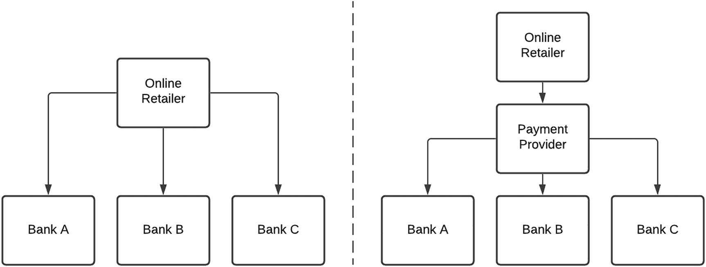
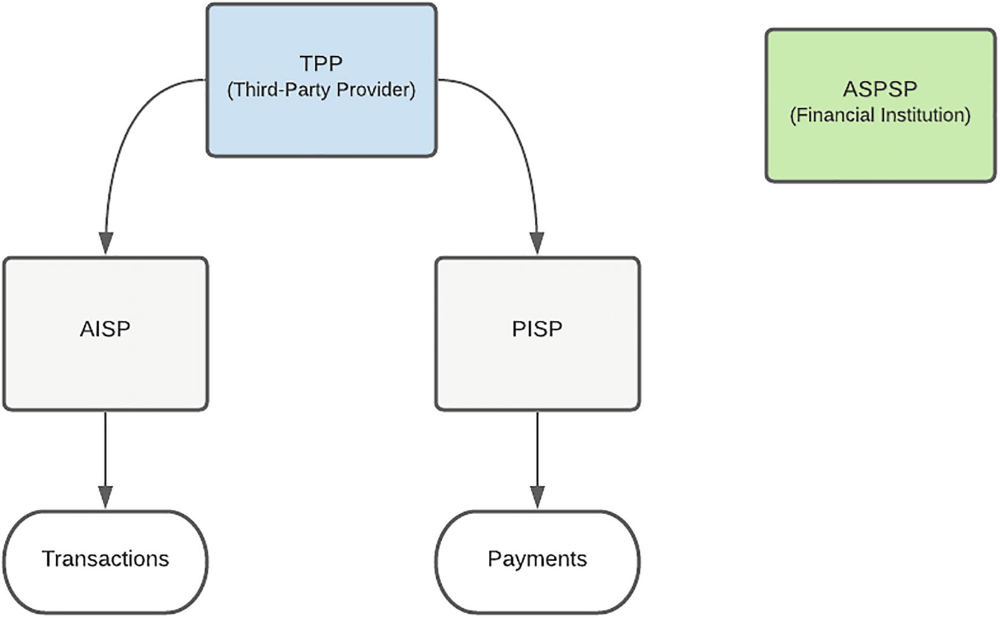

# 规定
> 雷内多拉萨米1
> (1)
> 南非豪登省约翰内斯堡

金融服务 (FS) 行业一直是技术采用方面的开拓者。从自动柜员机 (ATM) 的推出到电话银行业务，再到基于网络和移动应用程序的银行业务，这一点就很明显。鉴于客户数据和相关交易的敏感性，金融服务提供商的网关得到了很好的保护——这是可以理解的。在本章中，我们研究了导致客户数据和金融后端服务与第三方共享的因素，这已经彻底改变了行业。就像构造板块在海洋中央碰撞一样，海啸效应已经被触发，变化的浪潮已经波及全球许多地区。
理所当然地，如果 API Marketplaces 是必需的，并且可以在金融服务等如此严格的行业中建立，那么其他行业，如电信和医疗保健，可以并且将会效仿。在本章中，我们深入探讨 API 对金融服务行业的影响。我们从这次地震事件的中心开始——支付——然后转向开放银行，最后以开放金融的形式检查进一步冲击波对行业的影响。
背景
数字支付服务支撑了电子商务的繁荣。从简单地获取信用卡详细信息到为电子购物篮中的商品付款，该功能已显着提高。从表面上看，交易的参与者应该只是最终用户、在线零售商和金融机构。由于众多银行、复杂的协议和接口机制，创新的金融技术 (FinTech) 公司通过介入抽象复杂性并为在线零售商提供易于消费的服务，将自己确立为一个新的、不可或缺的参与者。
一种这样的服务是付款启动。图 2-1 显示了在线零售商如何简单地集成到单个支付提供商中，该提供商可以利用其接口网络进入各个银行，而不是直接与每个银行集成。

图 2-1 直接与代理集成策略
## 屏幕抓取
借助网银渠道，第三方支付提供商已经能够通过屏幕抓取的实践实现与银行的整合。屏幕抓取是一种使用计算机软件从目标网站读取和提取数据的技术，该软件模拟网络浏览器来提取数据或执行用户通常在网站上手动执行的操作。为了进行支付，客户需要向提供商提供他们的银行凭证（用户名、个人识别码 (PIN) 和密码），提供商将使用这些信息启动一个自动流程来登录用户的在线银行门户，并付款。
最终用户的好处是方便——它节省了连接到在线银行门户、获取零售商的银行详细信息、设置付款和发送付款确认的时间。该流程也被简化以适应结账过程，大多数客户不知道他们正在直接登录他们的网上银行。由于传统的银行间电子资金转账 (EFT) 可能需要几个小时甚至几天才能反映，因此对商家的好处是支付提供商可以实时提供付款确认。由于支付提供商连接到用户的网上银行门户、验证资金并执行交易，商户可以确信支付已经完成——而不是依赖最终用户提供的支付确认，这可能会受到欺诈.
这种做法的固有缺点是，从数据隐私和消费者保护的角度来看，通常发现使用屏幕抓取访问客户的财务信息的安全性较低。由于它对支付系统和客户的完整性、安全性和效率构成风险，银行监管机构越来越多地干预以遏制这种方法。
屏幕抓取允许在源头进行排序。这允许在多家不同银行拥有银行账户的支付提供商对每家银行的支付指令进行分类，并将它们转发给每个相应的银行——后者又将它们作为内部交易进行处理。尽管对源模型进行排序听起来像是降低成本和提高清算速度的最佳方式，但某些监管政策和规则禁止这样做，因为它会减少银行间清算。由于银行业缺乏允许与第三方安全共享客户财务信息的法律框架和政策，屏幕抓取一直是一种流行的支付启动和账户聚合机制。

## 应用程序编程接口 (API)

为了解决这个问题，银行一直在探索 API 作为共享客户财务信息和支持创新支付解决方案的替代方案，以改善客户体验。在传统银行环境中，API 主要集中在内部、专有、非标准化且外部消费者无法访问——被称为“封闭 API”。相反，第三方使用“开放 API”来创建创新的应用程序和产品，从而扩大对客户的影响并改善用户体验。
API 在银行业务中的一个好处是，可以利用它们在征得客户同意的情况下以安全的方式与第三方共享客户数据，而无需共享登录凭据。第三方应用程序可以从公共领域直接连接到银行的系统，以获取账户信息、发起和跟踪支付。如果 API 归银行所有，人们担心这会给银行带来太多权力，因为它控制共享哪些数据。这可能导致银行扮演守门人的角色，这可能会反竞争并抑制创新。 “开放银行”的概念应运而生，第三方提供商可以使用开放 API 安全地从银行获取客户的财务信息，以利用创新技术并改善客户体验。我们将在下一节中更详细地探讨开放银行业务。

## 开放银行
由于客户对访问和控制其数据的需求以及渴望颠覆的第三方供应商的需求不断增加，银行业面临着一场迫在眉睫的革命。开放银行为优雅、可控的过渡提供了机会，更重要的是，银行仍然是新生态系统的重要组成部分。客户可以更好地控制他们的财务数据，使他们能够做出更明智的决策并更好地管理他们的资金。日益激烈的竞争将导致第三方供应商和银行等提供更广泛、更多样化的服务和创新。

### 目标

我们考虑开放银行政策的一些目标：

- 金融稳定性和安全性：必须保护跨平台共享的敏感客户数据，以保持对整个金融生态系统的信心。
- 透明度和公共责任：客户应了解使用其银行凭证所涉及的风险，包括许多第三方提供商接受的有限责任。任何开放银行的实施都应概述允许第三方访问客户选择共享的财务数据的流程和时间表。应禁止与价值链中的其他方共享数据，以保护客户数据权利。
- 标准化和中性技术：必须明确定义 API、数据处理、存储和网络安全的标准，以便轻松集成到多个银行平台，而无需定制开发。
- 促进金融包容性、竞争和创新以及成本效益：开放银行可能有助于为所有利益相关者创造一个公平的竞争环境，以提供服务和解决方案。它应该允许为范围广泛的客户提供银行服务——从为高收入者提供个性化的投资产品到帮助资金不足的客户获得银行服务。从实施的角度来看，较小的银行和第三方应该能够在没有大量投资资本和技术基础设施的情况下参与。

### 术语

在浏览开放银行监管框架时，你可能会遇到许多新的术语和分类。我们考虑最常见的，并讨论它们如何适应框架。

- 账户信息服务提供商 (AISP) 通过汇总和分析来自一个或多个支付账户的交易信息，为客户提供财务状况的综合视图，从而为客户提供帮助。这可以通过检查来自多个来源的收入和支出来帮助客户建立信誉。
- 支付发起服务提供商 (PISP) 通过与账户所在银行不同的平台代表客户发起支付交易。
- 第三方提供商 (TPP) 是一个被授权代表客户访问账户但本身并不运营这些账户的实体。 TPP 的类型包括 PISP 和 AISP。 TPP 的一个例子是金融科技。
- 账户服务支付服务提供商 (ASPSP) 为付款人提供并维护支付账户。这本质上是持有客户账户和资金的银行或金融机构。

图 2-2 提供了术语和分类以及它们如何组合在一起的直观表示。

图 2-2 开放银行参与者的可视化表示
### 好处
开放银行可以为生态系统中的所有参与者提供许多好处。通过利用支付服务，客户可以享受更少管理密集、更简化的在线零售体验。这节省了以前登录银行门户和发送付款确认所需的时间。账户聚合服务允许更容易的比较和切换。与第三方供应商共享交易数据也更安全，因为客户可以细粒度控制共享哪些数据、持续时间和撤销访问的能力。访问账户历史可以让第三方提供个性化的产品和服务，并允许更准确的风险评级。支付方式，例如移动钱包，也可作为卡和交易账户支付的替代方式。消费者还受益于日益激烈的竞争，因为这可能会降低金融服务的费用并提高服务水平。
由于开放银行为非银行提供商创造了公平的竞争环境，第三方提供商拥有更多商机。这将使他们能够提供可以改善客户体验的创新账户和支付解决方案。洞察客户的历史账户数据可以实现更好的风险评级和产品匹配。
尽管乍一看，开放银行似乎会对银行产生负面影响，但可能会带来很多好处。通过提供轻松安全地共享数据和控制资金管理方式的能力，建立透明、开放的关系，可以维护客户信任。通过展示数字能力和采用具有必要安全控制的创新解决方案，为客户提供最佳或优质的产品和服务，也可以增强信心。银行可以通过基于 API 的平台类型业务模型建立新的合作伙伴关系并获得新的收入流。随着第三方供应商的产品和服务可以在更短、更积极的时间范围内覆盖更广泛的受众，银行的覆盖范围也扩大了。
商家还可以增加他们的产品供应，并将触角延伸到以前难以进入的市场。一个例子可能是从交易账户付款的能力，这将允许在没有信用卡的情况下访问客户。其他支付方式也可以降低卡交易成本。开放银行有可能消除卡交易的各种费用要素，这些费用是发卡银行、处理商和计划的商家服务费用的一部分，这对客户来说也是一种好处。
支付系统受益于日益激烈的竞争，因为公平的竞争环境可能会带来创新的支付解决方案。开放银行可以通过消除虚假和欺诈性第三方提供商以及建立技术和数据共享标准来提高支付流程的透明度。它还支持更高效的基础设施，以支持有效清算和结算交易的支付。

### 风险
开放银行的实施存在许多风险。意识和前期缓解是使市场能够应对这些挑战的关键。由于解决方案是数字化的，这可能会导致那些无法访问互联网或智能手机的客户被排除在外。任何进入金融系统的新渠道都会带来欺诈的可能性。客户的财务数据可用于客户未授权的用途。开放银行可能会使客户的数据被盗和被不当使用。由于犯罪活动，薄弱的安全措施可能会导致资金损失。
客户可能不了解共享其财务数据时的风险以及许多第三方提供商接受的有限责任。这可以通过强有力的客户教育活动来解决。此外，在客户同意过程中，消息和警告必须清晰简洁。还应让客户了解可用于查看和撤销第三方访问的机制。
第三方供应商不受与银行相同的监管，可能会因数据处理不当而使银行面临声誉风险。敏感的客户数据可能会通过意外或恶意的员工活动共享。第三方可能更容易成为网络犯罪分子的目标，因为他们的安全机制可能不如银行全面。对第三方系统和/或独立安全评估的初始、预定和现场审查可以确保建立必要的安全控制。根据消耗的 API 产品的性质，这可能是一项强制性要求。
使用开放银行 API 的产品或服务的实施和运营需要新进入者在设计、开发、支持和维护方面进行大量投资。 API Marketplace 产品负责人应将这一点清楚地传达给潜在的供应商。
银行还因欺诈或流氓第三方活动而面临声誉风险。未经授权使用消费者数据会对消费者对银行的信任产生负面影响。这可以通过对希望融入市场的第三方进行彻底审查和筛选来缓解。先发制人的策略是传达强有力的市场信息，确保客户和第三方在整个开放银行旅程中了解安全责任。
银行面临的最重大风险之一是去中介化。第三方供应商可能会削弱银行的作用，可能导致部分客户关系丧失，进而导致收入损失。开放银行与 ATM、在线或基于应用程序的银行一样，是客户用来与银行互动的渠道。牢固的银行与客户关系将有助于建立忠诚度和信任度。银行可以通过任何渠道使用客户数据和活动来更好地了解行为，以提供个性化的产品和服务。去中介化的潜力可以被视为银行提高竞争力以保留客户关系的动力。
开放银行将导致银行业务模式的改变，因为运营基础设施、入职、交易监控和安全检查都发生了重大变化。这可能会增加银行的成本并导致竞争挑战。通过对金融服务领域的前瞻性观点可以最好地缓解这种情况。一个清晰明确的路线图，考虑到其他国家和组织在他们的旅程中进一步发展的经验，将有助于确保银行为启用开放银行做好准备。
如果客户丢失数据或付款被拦截、第三方无法履行财务义务以及源自欺诈活动的交易，商户可能不得不应对声誉风险。如果发生系统故障、人为错误和网络攻击，支付系统可能面临操作风险。这可能会影响支付系统的完整性和信心。访问银行 API 可能允许更多第三方进行源头分类，从而减少银行间清算，这将影响银行间清算所。

### 规定的、便利的或市场驱动的方法
一些国家已采取规定性方法，强制银行共享客户许可的数据，并要求希望访问此类数据的第三方向监管或监督机构注册。英国采取了监管方法，并于 2018 年纳入了开放银行标准，该标准要求作为账户服务支付服务提供商 (ASPSP) 的最大银行开发开放 API，以便为客户账户提供对第三方提供商 (TPP) 的访问。开放银行实施实体 (OBIE) 由竞争与市场管理局 (CMA) 创建，用于提供 API、数据结构和安全架构。欧盟已通过第二版支付服务指令 (PSD2)，该指令利用 API 作为解锁客户数据和支持消费者选择的机制。然而，分析并就最佳解决方案达成一致需要花费大量时间——因为第三方、银行和监管机构有不同的目标、抱负和需要平衡的关注点。因此，英国和欧盟的法规实施需要一些时间，许多银行错过了最后期限。巴林等地区使用 PSD2 风格的法规，建立了一套指导方针和标准，以确保实施的一致性并促进采用。银行也有必须遵守的最后期限。
其他司法管辖区通过发布指南和推荐标准以及发布开放 API 标准和技术规范，采取了更加便利和灵活的方法。开放银行的共同支柱包括同意、数据隐私期望和数据安全要求。监管机构并没有在一开始就强制要求预期的结果，而是允许第三方提供商使用安全的变通方法，直到可以建立基础设施。例如，一些监管机构允许在提供 API 之前通过屏幕抓取操作来访问客户同意的帐户信息。其余地区选择了灵活的、市场驱动的方法，没有明确的法规或标准。在下一节中，我们将回顾不同地区的开放银行活动。

### 全球开放银行业务

表 2-1 到 2-9 提供了一些国家开放银行的时间点状态。需要注意的关键是跨地区采用的策略不同——有些选择了规定性方法；其他人是促进性的或市场驱动的。我们还检查了领导该计划的监管机构、参与的服务提供商、访问类型、产品和当前状态。开始其旅程的国家可以利用多年前开始的国家的见解和经验。

表 2-1 开放银行 – 澳大利亚

| 管辖权     | 澳大利亚                                                     |
| ---------- | ------------------------------------------------------------ |
| 方法       | 规定的                                                       |
| Lead       | 财政部                                                       |
| 服务供应商 | 分阶段方法。 2020 年 7 月——四大银行。 2021 年 2 月 – 其他银行 |
| 访问类型   | API                                                          |
| 产品范围   | 信用卡和借记卡、存款和交易账户、抵押贷款和个人贷款数据       |
| Status     | • 2018 年：澳大利亚政府批准了开放银行框架 • 2020 年 7 月：分阶段实施，法律要求四大银行向消费者提供信用卡和借记卡以及存款和交易账户上的消费者使用数据 • 2020 年 11 月：将共享抵押贷款和个人贷款数据 • 2021 年 2 月：其他银行开始共享数据 |

2-2开放银行——中国

| 管辖权     | 中国                                                 |
| ---------- | ---------------------------------------------------- |
| 方法       | 市场驱动                                             |
| Lead       | 金融科技                                             |
| 服务供应商 | 支付宝、金融科技                                     |
| 访问类型   | API                                                  |
| 产品范围   | 根据消费者（任何财务数据）                           |
| Status     | • 开放银行不是由监管机构推动，而是由金融科技公司推动 |

表 2-3 开放银行——欧盟

|      |      |
| ---- | ---- |
|      |      |
|      |      |
|      |      |
|      |      |
|      |      |
|      |      |

表 2-4 开放银行 – 香港

|      |      |
| ---- | ---- |
|      |      |
|      |      |
|      |      |
|      |      |
|      |      |
|      |      |

表 2-5 开放银行——印度

|      |      |
| ---- | ---- |
|      |      |
|      |      |
|      |      |
|      |      |
|      |      |
|      |      |

表 2-6 开放银行——日本

|      |      |
| ---- | ---- |
|      |      |
|      |      |
|      |      |
|      |      |
|      |      |
|      |      |

表 2-7 开放银行 – 新加坡

|      |      |
| ---- | ---- |
|      |      |
|      |      |
|      |      |
|      |      |
|      |      |
|      |      |

表 2-8 开放银行——南非

|      |      |
| ---- | ---- |
|      |      |
|      |      |
|      |      |
|      |      |
|      |      |
|      |      |

表 2-9 开放银行——美国

|      |      |
| ---- | ---- |
|      |      |
|      |      |
|      |      |
|      |      |
|      |      |
|      |      |

## 从开放银行到开放金融
开放银行只是金融服务行业转型的第一阶段。开放金融这个术语用于描述开放银行数据共享的扩展，也是建立在消费者拥有他们在金融服务提供商平台上创建的数据的原则之上。经消费者同意，数据可与经批准的第三方供应商共享，以开发和提供创新产品和服务。虽然开放银行只关注访问银行交易数据或代表客户付款，但开放金融的范围更广。它包括所有消费者金融服务数据，例如储蓄、债务、投资、养老金、替代贷款和保险。对于保险，来自现有服务提供商的客户数据可用于识别个性化和价格最优惠的保险科技产品，而在替代贷款中，历史交易数据可用于更可靠的信用评分和负担能力分析。它有可能改变消费者和企业使用金融服务的方式。
开放银行之旅中有许多经验教训可用于使开放金融取得成功：
标准化：数据的标准化访问是避免市场分裂的关键。由于电源和电源插座在一个国家/地区保持一致，因此提供标准的 API 定义将使第三方能够专注于为客户提供价值，而不是关注每个服务提供商的不同细微差别。基于规则的数据共享方法——如英国的开放银行——可能比 PSD2 中应用的基于原则的方法更可取。
监管：立法者、监管者和公共当局应注意开放银行的快速发展。尽管屏幕抓取的做法存在共享客户端凭据的固有安全缺陷，但它被允许继续存在多年。开放 API 已迅速成为一种替代方案，并彻底改变了银行业。由于这一浪潮可能会席卷银行业，未来保险等其他行业可能会受到影响。作为强有力的指导，监管机构可以发挥关键作用，需要一个合适的框架来支持行业制定标准和基础设施，以平衡所涉及的不同公共利益。继续现有金融服务提供商、金融科技公司和监管机构之间的合作以帮助促进生态系统也至关重要。
商业模式：开放金融的一个关键考虑因素是融资模式，因为必须考虑生态系统中所有参与者的需求。根据规范，如 PSD2，银行可能不会对数据共享和支付数据收费。鉴于银行为实现这一目标而进行的大规模投资，这可能不是一项在满足核心监管要求之外追求的有吸引力的举措。开放金融可以为超出监管最低限度的竞争和创新腾出空间。使用开放 API 技术的高级 API 可以通过允许跨一系列不同部门共享数据来实现开放金融。
争议机制：由于争议可能对金融服务提供商和第三方造成声誉损害，因此所有利益相关者都必须制定投诉管理流程，以便他们能够处理投诉或提出的问题。为了解决数据隐私泄露和数据滥用问题，可能需要一个责任框架来追究金融服务和第三方提供商的责任。
以客户为中心：客户财务数据是开放金融生态系统的源头成分。由于它在整个生命周期中始终属于客户，因此必须始终以客户为中心。客户应该清楚地知道他们的数据是如何收集、共享和使用的。知情同意是让消费者了解他们同意的条款和条件以及他们的数据将如何使用的关键机制。客户还应有权撤销访问权限，并且“忘记”以前共享的数据。
客户教育是金融服务提供商和第三方的主要责任，将有助于建立信任。如果潜在客户不信任生态系统，他们将不会同意共享他们的数据。可靠的第三方供应商也是确保和保持客户信任的重要因素。

## 示例应用程序
开放银行和金融使银行和第三方提供商能够推出新产品和服务。我们重点介绍其中的一些应用程序——由银行构建的 YOLT、使用尖端人工智能 (AI) 技术的 CHIP、使用开放 API 扩展其现有产品的 bunq、为第三方提供平台功能的 TrueLayer方提供者抽象集成复杂性，以及提供跨银行账户聚合能力的 Revolut。
金融科技的速度、低成本和创新有助于扩展现有能力并构建数字应用程序和平台。

- YOLT：ING 创建了最大的第三方可信实体之一，称为 YOLT（该实体于 2016 年在荷兰开始，现在在英国、法国和意大利）。 YOLT 的应用程序使用开放银行 API 来汇总跨银行的账户信息并向客户提供建议。 YOLT 的使命是“让每个人都拥有精明理财的能力”。他们现在有 +-500,000 个客户；然而，缺点之一是他们的应用程序/功能只是“阅读和建议”。应用程序提出的任何建议都需要在源银行系统中执行。
- CHIP：CHIP 使用人工智能 (AI) 计算你可以储蓄多少，并从关联的往来账户中提取资金，并通过直接借记将其存入由巴克莱银行托管的单独储蓄账户。储蓄百分比（最高 5%）根据你对 CHIP 的社交推广而游戏化——每位注册的朋友额外增加 1%。
- bunq：bunq 早在 PSD2 之前就开放了他们的 API。 bunq 让开发人员构建独特的应用程序，丰富所有 bunq 用户在获得完全许可的银行基础上的生活。使用 bunq API，开发人员可以连接到交易数据、推送通知、支付请求、卡、联名账户以及限额和预算。
- TrueLayer：TrueLayer 的 API 平台可以轻松地将开放银行和支付等金融服务集成到世界任何地方的任何应用程序或任何网站。无论使用何种标准或协议，TrueLayer 都可以连接到整个欧洲的所有银行 API。
- Revolut：借助新功能，德国客户现在可以将他们在 Comdirect、德国商业银行、德意志银行、ING-DiBa 和 Sparkasse 的账户与 Revolut 应用程序连接起来，并在一个地方查看他们的所有财务状况——直接通过与欧洲金融 API（编程接口）提供商，英国金融科技公司 TrueLayer。 TrueLayer 平台的使用确保来自德国主要银行的账户信息在 Revolut 应用程序中安全集成和实时更新。

## 概括
在本章中，我们回顾了开放银行和开放金融如何在金融服务行业脱颖而出。它基本上是由牢记客户的最大利益驱动的。诸如屏幕抓取之类的做法会通过共享凭据危害客户的安全——API 是一种解决此问题的机制。新的支付方式和账户聚合将为客户和个性化服务带来更多便利——PSD2 等规范使第三方能够实现这一点。市场上更多的竞争可以允许更多的客户选择、降低成本并提高服务水平——引入开放银行标准正是为了做到这一点。
我们赞扬了所有参与者的好处——从普惠金融的承诺到全球数十亿没有银行账户的人，再到为第三方供应商提供公平的竞争环境。这种运动并非没有风险——我们强调了一些并提供了潜在的缓解措施。此时非常令人兴奋的是，开放银行的浪潮正在全球蔓延。尽管不同地区在各种产品集上采用了不同的方法，但所有产品的主要目标是客户拥有数据的民主化。
我们还强调，这仅仅是个开始。开放银行是更大的开放金融计划的先驱，它将对金融服务行业的更多部门产生影响。这为重新设计金融服务以实现最大的可扩展性和效率提供了前所未有的机会。将一切联系在一起的金线是监管。监管的一个关键目标是数据共享和开放银行应在风险管理和促进创新的激励之间取得平衡。监管框架应根据市场变化设置明确的角色和职责。
尽管一些组织在构建开放银行业务的能力方面一直很积极，但许多组织并没有做好准备。一个精心策划和执行的 API 平台战略可以为组织提供参与和指导监管咨询过程的先决知识和经验。
注意到单个要求的连锁反应确实很有趣，特别是付款启动，触发下一个更改，即访问客户帐户信息。这带来了监管变化，这实质上迫使组织在客户同意的情况下更改其政策并允许访问第三方。分裂并没有就此停止——这刺激了其他金融服务领域的变化，例如保险和贷款。
如果我们将同一组原则应用于其他行业，例如电信和医疗保健，则用户的移动交易历史或健康信息属于用户，并应在用户同意的情况下可供第三方访问。谷歌和 Facebook 等供应商已将这种功能融入到他们的产品中。与允许用户在迁移到新网络时保留其手机号码的法规通过的方式大致相同，我认为移动交易数据（甚至可能是通话记录）民主化只是时间问题。该行业只需要一个能够引发变革的令人信服的要求。许多国家/地区都计划提供全国性的医疗保健服务。访问来自私营部门的现有患者记录和数据可能只是该行业变革的一个转折点。
一些组织采取了观望态度，将对监管变化做出反应。许多人已经发现了建立平台业务的潜力，并通过尽早开始实施他们的 API 市场来抢先监管或占据战略地位。