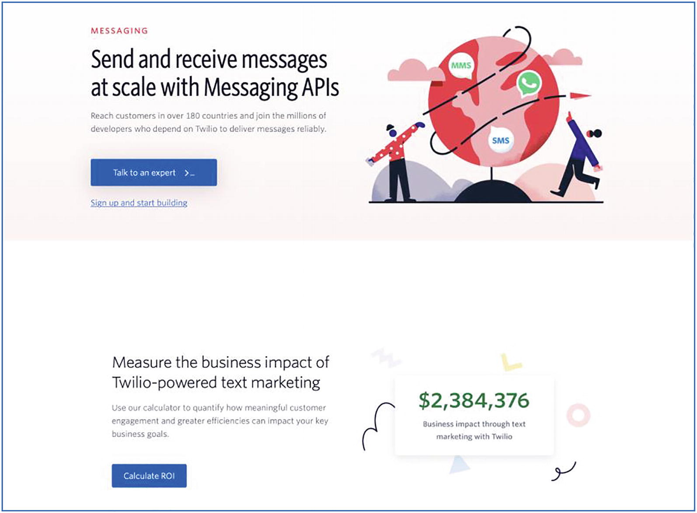
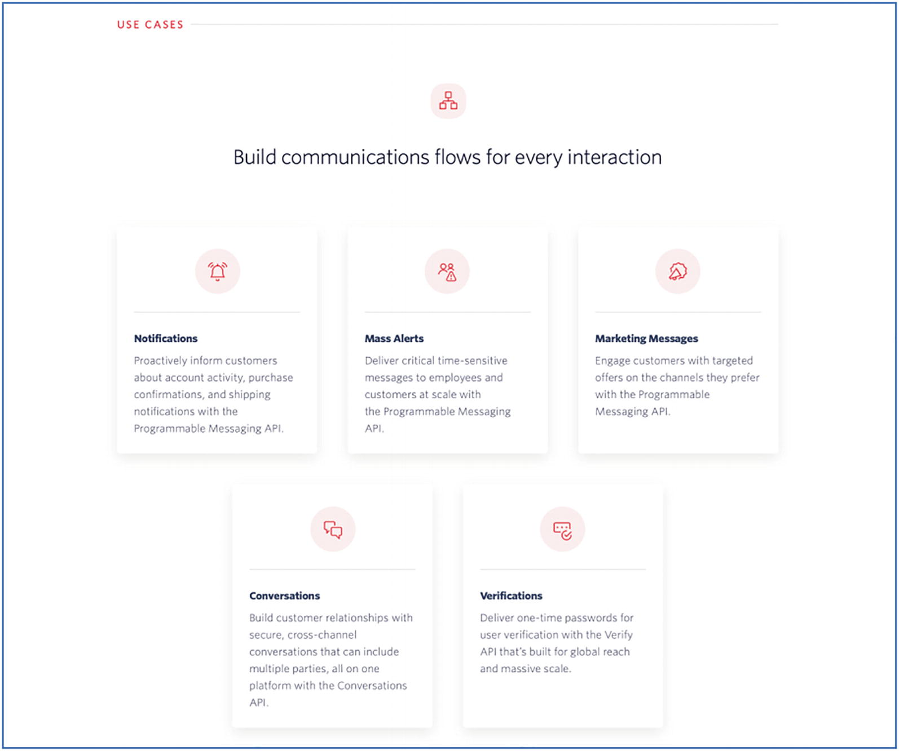
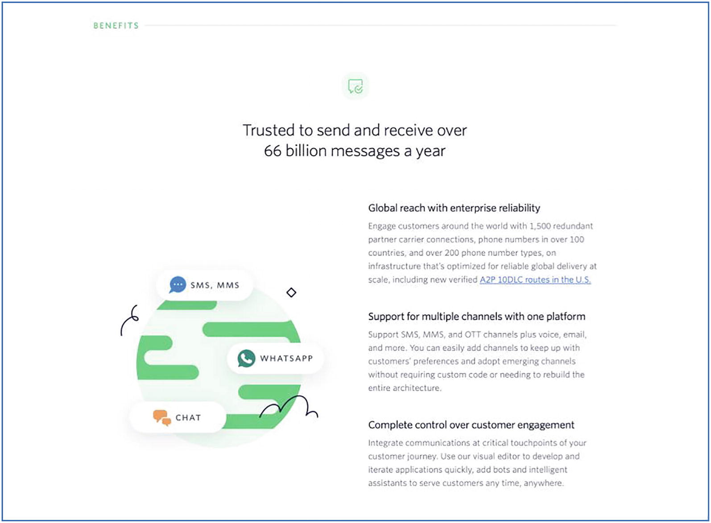
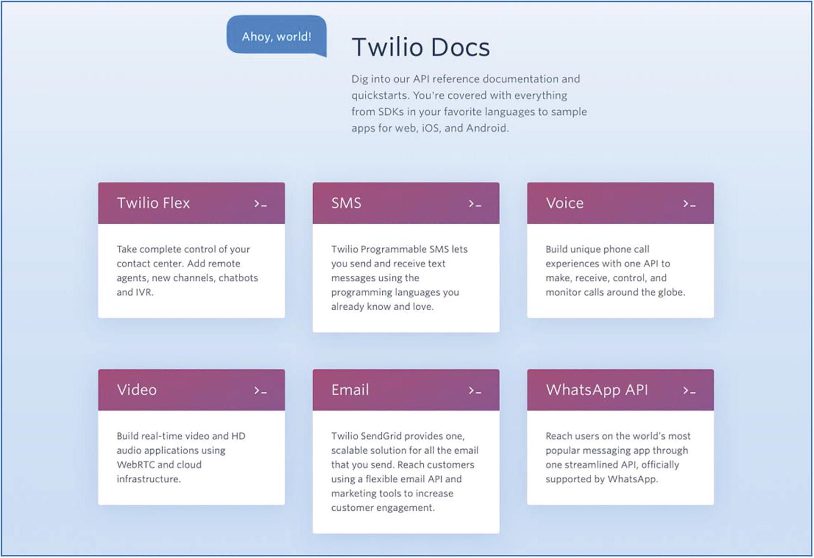
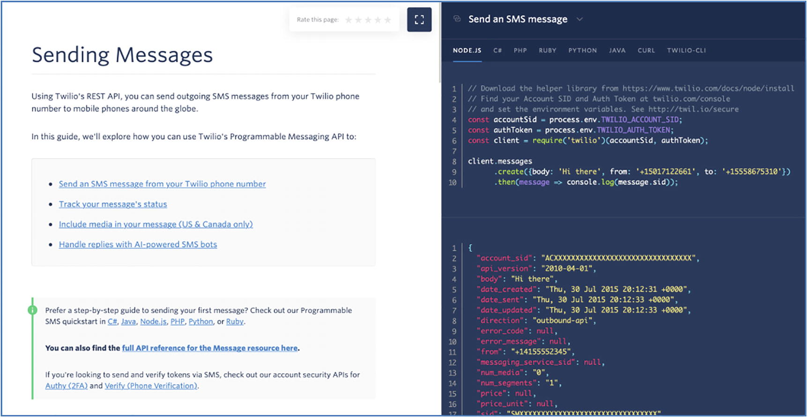

# 消耗
> 雷内多拉萨米1
> (1)
> 南非豪登省约翰内斯堡

需要大量关注的关键领域之一是 API Marketplace 的接口。虽然节目的明星是提供功能的实际 API，但明星需要舞台和剧院来表演。如果舞台太小或剧院太难进入，那么 API 的辉煌就会消失。在整个旅程中始终牢记这一点很重要。没有第三方消费，就没有流量。没有流量就没有收入。收入维持存在以实现愿景的市场。
市场提供可由多个第三方消费的产品。由于法规或对特定功能的需求，某些产品或 API 本质上是自我推销。然而，大多数产品必须积极营销以展示其能力并鼓励采用和使用。我们将在以下部分讨论实现这一目标的机制。

## 市场 API 与内部 API

交付团队应始终牢记 API 市场的上下文。根据我作为集成开发人员的经验，在为内部项目公开或使用接口时，我们受益于消费者和提供者团队之间通过面对面会议、电话或电子邮件的直接沟通，以充实细节之外的细节。接口规范文档。这是可能的，因为集成的性质通常是一个消费者对一个提供者。
一个成功的 API Marketplace 将有许多消费者，尽管有可能，但与每个消费者进行一对一会话以完成集成查询是站不住脚或可扩展的。这也不同于内部集成项目，在内部集成项目中，交付领导会毫不犹豫地根据需要设置尽可能多的会话来解决界面挑战。第三方可以有多个 API 提供者可供选择，如果 Marketplace 没有吸引力或不易于使用，他们通常会继续前进。一个好的市场是抽象和简化后端平台的复杂性并将其打包以便于使用的市场。
API Marketplace 不是典型的工厂运行集成“管道”练习，将一个系统连接到另一个系统。向消费者公开的 API 必须经过深思熟虑和精心构建。正如亚马逊“API 宣言”中提到的：
所有服务接口，无一例外，都必须从头开始设计为可外部化的。也就是说，团队必须进行规划和设计，才能将接口暴露给外部世界的开发人员。没有例外。

## 人物角色
许多组织陷入的一个陷阱是只有一个包含大量三个字母首字母缩略词的技术门户。在我们构建最小可行产品 (MVP) 的竞赛中，我们正是这样做的。当我们专注于技术方面时，我们的登陆页面有一些充满活力的图标和图形以及一些简短的文字。同样，根据经验，团队推出的门户的第一次迭代可能是运行时间最长的，因为团队的重点转向提供新的 API 产品。
由于其性质，很容易将“API 市场”归类为技术性的，并且只关注工程师和集成开发人员。从商业角度考虑市场以及如何利用它来提供商业价值也很重要。公司本质上是在尝试开发新产品和服务，以更高效、更便捷的方式解决旧问题。消费者需要了解 API 市场的意图和好处，以确定他们如何使用它来实现组织的目标。
尽管 API 构造中的用户体验 (UX) 似乎是多余的，但它是市场采用的基本要素。不同角色的用户体验有助于在正确的时间向正确的受众提供相关信息。这可以作为单独的门户或作为单个门户中明确定义的部分来实现。
在接下来的部分中，我们考虑在这些领域实现业务和技术角色的目标：
吸引：吸引平台潜在用户的注意力，迎合广泛的用户——从成熟的组织到金融科技和初创公司。
教育：更详细地了解你的平台将提高使用效率，并可能更广泛地使用各种产品。
建立信任：市场的目的是通过使用内部产品和服务来授权外部组织。你平台的潜在消费者需要对其功能和可靠性充满信心。
透明度：印刷精美和晦涩的信息会影响与第三方的关系，并可能损害你平台在市场上的声誉。
协作：让你的客户参与进来并使用反馈来优化你的平台并推动你的产品路线图。这种关系正在进行中。
领导：域的所有者，负责支持组织内外的其他计划的门户内容。

## 商业价值

贵组织的 API 市场门户网站的第一批浏览者很可能是从业务发展的角度来看的。该个人或团队将审查 API 产品，以确定是否适合作为仍在概念化或构建的产品或服务的基础元素。图 3-1-1、3-1-2 和 3-1-3 是一个很好的例子，说明了 Twilio 如何通过其消息 API 实现这一点。

图 3-1-1 Twilio 消息 API 的非技术概述

图 3-1-2 简单，易于与用例相关联

图 3-1-3 不使用任何技术术语表达的服务优势
在以下部分中，我们将回顾在构建 API 市场的“业务门户”时要考虑的关键领域。

### 吸引力

虽然你可以使用“如果你建立它，他们就会来”的“梦想领域”策略 - 积极营销平台可能更有效。社交媒体上的帖子、发布活动、文章和关于技术、创业和创业网站的采访将有助于吸引潜在用户。你主页上的关键信息，可能是用户看到的第一件事，是你的“电梯宣传”——我们的 API Marketplace 如何帮助你的组织？这可能包括一段 2 到 3 分钟的视频，在高层次上展示，最好是在非技术背景下，市场如何提供可以构建新产品的服务和功能。
一定要赞美收养的好处。这可以通过激励来实现，“通过今天使用我们的平台，你将拥有先发优势来为你的业务提供动力并超越竞争”，或者通过恐惧——“在欧洲，政府已经发布了要求所有银行遵守的法规到 2018 年底支付服务指令。我们的政府正在调查类似的法规。”

### 教育

被授权的第三方将了解平台的目的，并可以将业务能力用于商业用途。你的听众此时可能没有任何技术背景。隐喻和类比对于传达关键信息很重要。详细介绍核心概念的解释视频，例如“什么是 API？”和“你能用它做什么？”将有很大帮助。在与内部后端团队沟通时测试此材料的使用。由于交付团队始终沉浸在细节中，因此可能很容易将 API 的某些概念和功能视为理所当然。请务必记住，API 新手的学习曲线相对陡峭。
详细说明平台用户成功利用 API 推出新产品和服务的过程的案例研究也将帮助潜在客户了解如何使用 Marketplace 来实现业务目的。它还可能有助于提供有关使用该平台所需的时间和精力的详细信息。请务必提供准确的信息，因为过于乐观可能会导致第三方设置不切实际的发布时间表，从而导致集成疲劳。过于悲观可能会导致平台不被使用。鼓励产品的迭代采用。对于消费者和提供者来说，开始和结束使用一种或几种产品比开始使用许多产品然后放弃努力更有益。
专注于商业价值而不是 API 产品。例如，返回客户姓名和地址信息的客户 API 可用于身份验证。它还可用于简化第三方应用程序的注册或注册过程。强调繁琐的注册表会导致潜在用户的大量流失，而客户 API 可以帮助缓解这种情况。同样，Accounts API 可用于确定用户的财务行为，从而提供更好或个性化的服务。在 API 市场的概念才刚刚出现的发展中国家，强调在其他拥有活跃 API 生态系统的市场中创造的价值。
邮件列表和定期博客文章也将有助于保持现有和潜在客户的参与。这也将有助于定义产品路线图。产品负责人可以使用这些通信流来确定对新 API 的兴趣或潜在采用。还可以让第三方了解产品、发行版和补丁的新版本。
由于 API 市场不断发展，客户教育是一项持续的活动。这是在平台上工作的最大回报之一——创新和优化的循环永不停歇。你需要确保平台的用户可以充分利用其潜力。

### 建立信任
从潜在第三方的角度考虑 API 市场。该实体可能将市场用作其业务运营的基本要素。如果平台存在任何稳定性或可靠性问题，对组织的后果可能是灾难性的。极大地帮助我们实施实施的是我们拥有一个全国值得信赖的品牌，在我们的 Marketplace 背后拥有数百万客户。我们团队的成员始终意识到这种关系是互惠的。我们平台的任何问题或易错性都可能影响我们所代表的组织的信任和品牌。我喜欢将通过这种机制获得的信任视为“继承”。本质上，你信任我是因为你了解我的父母。我认为信任也应该是“赢得的”。
这可以通过与你平台的用户建立密切关系来实现。在平台发布的早期或试点阶段，与第三方提供商密切合作。在推出最近的产品时，我们每周，有时每天都会与一位热情的开发人员通话。这种互动不仅帮助我们充实了我们发布的 API 产品的问题，而且提供了对产品使用的深入了解。外部开发团队对产品的信心也显着提高，因为他们可以看到供应商的承诺。 Word 也倾向于在金融科技和初创公司社区迅速传播。
平台的采用将受到正面和负面反馈的影响。来自已建立的第三方的认可，最好用他们自己的话，以客户推荐的形式，可能有助于说服潜在用户使用你的 Marketplace。同样，这些都不容易实现，整个团队可能需要做大量的工作来实现这一目标。参考客户也将有助于建立信任。如果平台的潜在用户看到使用该平台的知名品牌或产品，则可以确保隐式信任。识别和定位一个或多个必须积极参与使用你的 Marketplace 的知名品牌非常重要。我们从关于时间框架的实践经验中学到的一个重要教训是，如果你的目标是在黑色星期五（11 月的第四个星期五）之前使用你的平台，你需要在 6 月之前开始整合活动。
API Marketplace 的一个关键结构是 Marketplace 和第三方提供商之间的合作伙伴关系。如前所述，市场需要平台的消费者才能生存。重要的是要强调另一个关键的合作伙伴关系是在市场和组织的最终用户之间。最终用户信任 Marketplace，只允许他们已授予权限的第三方访问信息或数据。致阅读本文的 API 项目团队 - 请注意，这不仅是需要承担的重大责任，而且是一种难以置信的荣誉，因为你的努力促成了这种三方关系。

### 透明度
牢固、持久的关系需要透明度。尽管第三方是 Marketplace 的消费者，但请务必记住，他们与内部团队一样与平台的成败有着内在的联系。此声明背后的简单推理是——如果市场失败，它将影响他们的组织，可能影响他们继续运营的能力。
诚实对待时间表。市场发布、API 产品功能、可用性和路线图。由于竞争压力，这可能并不总是可行。但始终致力于承诺不足和交付过多。在我们的旅程早期学到的一个重要教训是，我们应该始终领先于我们的开发人员社区。随着我们市场的推出，许多第三方注册使用该平台——远远超出预期。不幸的是，由于需要内部批准，我们 Marketplace 中的某些 API 产品尚未准备好进行商业化。事后看来，从我们的目录中删除这些 API 产品或在我们的门户中明确指出商业可用性的时间表仍有待确定是明智之举。
定价——以成本或激励的形式——应该清晰、明确且没有细则。第三方很可能需要投入时间和金钱来消费 API 市场的产品。此外，第三方还需要了解使用该平台的成本。也就是说，如果成本是每笔交易，则是分层的或扁平的。也可能有诱因以潜在客户或推荐佣金的形式使用市场。从本质上讲，第三方需要尽可能多的财务信息来确定与你的 Marketplace 互动的商业可行性。在 Marketplace 的早期阶段，可能有必要允许免费访问 API 以刺激采用。请务必与消费者沟通，这可能会发生变化，稍后会进行审核。如果由于外部因素根本无法定价，请务必明确说明这一点。
必须明确定义服务水平协议 (SLA) 和解决时间表。固有的好处是可以跨多个提供商使用 SLA。这些可以分层——更高的层次会得到更多的支持和更快的解决——尽管成本更高。前期协议还设定了有关解决方案的正确期望，并将在处理运营查询时极大地帮助市场支持团队。同样，在解决时间方面一定要诚实——因为过于乐观的时间框架会导致对长期中断的信心丧失，而过于悲观的前景可能会影响采用和信心。如果不清楚或仍有待定义，请明确指出并确保在出现操作问题时进行清晰的沟通。

### 合作
考虑提供一个或几个无义务的咨询会议。在发展中市场尤其如此，在这些市场中，潜在客户希望通过面对面讨论问题或场景来获得额外的保证。从经验来看，技术支持团队可能并不最适合在客户旅程的这个阶段为潜在用户提供帮助。在技术团队的支持下，产品负责人应促进这些会议。技术团队将能够协助开发或集成查询。但是，产品负责人将能够定位市场以获得商业成功。
注册你的兴趣潜在客户生成表格是必要的。 24 小时内的后续电子邮件或电话是强制性的。金融科技公司和初创公司以令人难以置信的速度运作，如果不及时跟进，潜在的机会有失去的风险。在跟进过程中，产品负责人将能够确定潜在客户的成熟度、组织所处的阶段以及所需的支持级别和领域（包括问题是商业性的还是技术性的）。
随着市场的发展和采用率的增加，可能有必要提供支持层级。由于交付团队的员工人数可能是固定的，因此可能无法为所有第三方提供相同水平的时间和注意力。更高的付费产品将导致更密切的参与，因为它还可以为专门的服务经理提供资金。虽然 Marketplace 处于早期阶段，但请务必在服务台中捕获每个客户查询（无论是潜在的还是当前的）并进行跟进。

### 带领

这项工作最好由产品负责人 (PO) 领导，因为这将构成面向外部消费者的销售宣传的基础。 PO 还将向内部平台团队宣扬在 Marketplace 中有代表的好处。请始终记住，API 市场有许多消费者——来自外部组织的业务和技术受众。从这些关系中获得的知识还可用于向内部团队和利益相关者展示能力。一定要给予适当的关注和关注。

## 技术开发者门户

凭借在技术行业 20 多年的经验，作为一名自豪的开发人员，我自己在技术信息来源方面有着极高的标准，但容忍度很低。我期望高质量和准确的信息能够吸收产品或服务。尽管所有开发人员最终都会使用 StackOverflow，但如果我必须经常使用这种方法，我对产品功能和成熟度的信心就会下降。如果有合适的信息或资源可用，我不介意花时间和精力学习或理解概念来使用该技术。 Developer Portal 是 API Marketplace 与技术受众建立关系的基础。
图 3-2-1 和 3-2-2 提供了 Twilio 的 Messaging API 技术文档视图。图 3-2-1 通过识别用于发送消息的各种通道来显示下一个详细级别。在图 3-2-2 中，文档提供了 API 使用的低级技术细节。

图 3-2-1 不同消息通道的逐步介绍

图3-2-2API消费的技术说明和代码示例

我们考虑以下领域来构建你的开发人员将信任并忠诚的市场。

### 吸引力

API Marketplace 的技术消费可能是第二波审查的结果，第一波是业务发展评估。技术团队将负责提供影响评估以整合到市场中。将检查文档标准、自助服务、示例代码、测试数据的可用性和开发人员支持等标准。此评估的反馈将有助于确定整合的时间表和成本。
尽管 API 市场的目标是吸引第三方供应商加入该平台，但这需要通过所需的最低技能和经验水平进行调整。在定义目标受众时，请务必牢记这一点。引入新手或初级开发人员的风险在于，团队将不得不提供更多的支持和支持。
用户组和社区会议也可用于揭开 API 市场概念的神秘面纱，并将感兴趣的开发人员介绍给该平台。由于 API 市场的目标是使数据访问民主化，因此可以考虑使用这些产品来启动各种应用程序的企业家。编程马拉松是鼓励参与和激发兴趣的绝佳机制。一个积极的副作用是它们可以帮助你找到有才华的开发人员加入你的交付团队。
我们从实施中观察到的一种新颖方法是外部组织的参与，该组织邀请了一组不同的开发人员参加 3-5 天的训练营。在此期间，开发人员与专家配对以获得支持，并构建了一个使用 API Marketplace 的应用程序。
金融科技公司和初创公司也渴望使用 API 来引导应用程序交付。请务必在此类组织经常光顾的网站上发布文章并鼓励参与。市场是病毒式的，如果开发人员的体验是积极的，消息就会传播开来。建立和培育开发者社区很重要，这需要成为 API Marketplace 的一个关键目标。

### 教育
API Marketplace 的技术消费至少需要中级开发人员经验，最好是 2-3 年的动手编码或集成经验。尽管你可以教育新手开发人员，但我认为门户的目标和材料不应包括有关如何进行 REST API 调用的教程。有很多很棒的在线教程可以帮助开发人员快速掌握 API。
但是，请务必在蓝图中涵盖 API Marketplace 特定概念，例如 OAuth。委托授权是市场的基本原则之一，必须清楚简洁地详细说明。我们有许多新的 API 使用者，他们在可以根据序列图跟踪调用之前，并不清楚流程流。许多集成开发人员只熟悉客户端 ID/秘密模式。
对于每个 API 产品，尝试提供多种编程语言的代码示例。一些基准开发人员门户提供以下示例：Node.js、C#、PHP、Ruby、Python、Java 和 cURL。 API Marketplace 的最大好处之一是访问的中立性——HTTP。一定要利用它来适应广泛的开发人员。从使用来自主要云提供商之一的产品的个人开发经验来看，代码实验室可以产生巨大的影响。代码实验室不同于代码示例，因为它们引导开发人员完成使用 API 的过程。将代码示例视为现成的蛋糕，将代码实验室视为食谱。
随着市场的成熟，考虑提供模式或推荐的集成实践。一个典型的例子是从移动应用程序使用 API。鉴于许多提供商可能在集成方面面临类似的挑战，提供一种模式将有助于缓解集成摩擦并允许更轻松地使用你的 API。答案是，如果你想直接从移动应用程序使用 API，永远不要在应用程序中存储凭据，而是使用用户身份验证的令牌来进行 API 调用。
博客文章和播客也是与开发者社区保持联系的绝佳方式。这些工具可用于分享你的 Marketplace 旅程的详细信息，并让用户了解你的路线图。提出并解决播客中的棘手问题——例如监管时间表以及如何进行相应计划。这些可以更深入地了解平台的内部工作和运营。
随着平台的成熟和扩展，请考虑开发人员认证。它不必是一个广泛的程序——而只是一个基本的理论评估和实践练习，以确保开发人员掌握市场的概念。这可能成为对更敏感的 API 产品的强制性要求。
最后，可下载的 Postman 合集将极大地帮助潜在的开发人员。 Postman 被视为 API 开发的事实上的工具，将在本章后面讨论。请务必包含详细说明集合的每个值的文档以及分步指南。 Postman 收集大约占工作量的 40%。剩下的 60% 是随附的文档。如果可能，请考虑聘请技术作家的服务来帮助编译此材料。不幸的是，一些最好的开发人员不一定最擅长提供文档。

### 建立信任
必须在开发者社区中赢得信任。这可以通过关注细节并坚持高标准的交付来实现。通过帮助开发人员解决他们无法使用可用的技术文献自行解决的挑战，开发人员会感到受到支持。及时响应支持请求也是强制性的。及时反馈——即使是“我们正在调查并将回复你”这样简单的反馈也是必不可少的。考虑到这一点，支持团队中必须有允许升级和处理开发问题的流程。
我想强调的是，开发人员支持是一种平衡行为。尽管我们希望支持开发人员使用我们的市场，但我们希望我们的客户群尽可能自力更生。也就是说——首先应该是Portal的文档，然后如果理解上还有很大的差距，就应该在开发者论坛上提出问题，征求社区的反馈。如果所有其他方法都失败并且消费者确信内部功能存在问题或在没有 Marketplace 团队干预的情况下他们无法解决的问题，则应记录查询。此外，查询应包括他们的故障排除和调查工作的详细信息，以及他们认为这是一个超出其控制范围的问题的理由。这似乎是一项艰巨的任务——然而，拥有强大的开发者社区不仅可以减轻支持团队的压力，还可以提高市场整体标准的标准。也就是说，API 产品的质量将会提高，因为它将受到消费者更具挑战性的审查。
言行一致也很重要。如果 API 市场是访问数据的新数字渠道，那么你的流程也应该是数字化的。对于一个好奇心被激起而无法立即接触的开发人员来说，没有什么比这更令人沮丧的了。一个例子是拥有一个出色的开发人员门户，它通过安排聊天或联系我们表单概述了惊人的功能和能力。自助服务是绝对必要的。我想高度强调这一点，因为它允许从概念到有形的无缝过渡。
通过提供对功能的即时访问，你的 API Marketplace 从“营销/蒸气软件”的分类转变为有形代码。从经验来看，开发人员讨厌蒸汽软件。怀疑立即增加，而在市场盔甲中寻找缝隙的审查也加强了。确保在发布 API 产品时允许立即自助访问，至少是沙盒/模拟环境。

### 透明度
公开、明确地访问信息也是保持开发人员社区信任的一种方式。在竞争压力允许的情况下，尽可能深入地了解 API 产品路线图。第三方可以使用这些信息来相应地计划和安排他们的发布。如果可能，请考虑与第三方就潜在 API 产品进行协商，以确定产品生命周期早期的潜在需求/使用情况。这将有助于直接努力/专注于易于使用的 API。尽管包含数百个 API 产品的目录令人印象深刻，但如果大多数 API 的使用或吸收很少，它只会增加支持和维护的区域，并转移对使用较多的 API 的注意力。
考虑一个允许早期 API 产品访问受信任第三方子集的 Beta 程序。这个过程将使团队能够优化和改进产品——从塑造界面到性能工程，再到在安全划分的“临时”环境中更新文档。 Beta 标签清楚地表明产品仍在构建中。当我们的 Marketplace 向公众推出时，我们的产品负责人巧妙地包含了“测试版”参考，以便我们在推出的早期阶段有回旋余地。在获得信息和网络安全的许可后，还可以将测试版 API 连接到内部质量保证 (QA) 后端，以进行更深入的集成测试。这应该在认真考虑后完成，因为提供第三方访问内部环境可能会打开潘多拉的盒子。
在几个已建立的开发人员门户上观察到的一个新功能是 API 状态页面，它也可用作 API。这使消费者能够利用你的运营平台，并能够在服务或 API 中断时采取先发制人的措施。状态还包括历史数据，以便消费者和运营团队可以快速识别运行不佳的产品，并在内部或后端平台上寻求补救措施。通过提供这种级别的可见性，它向第三方表明你非常重视平台的稳定性和可靠性，并且你正在采取措施在出现问题时提供即时警报/通知。
API 投入生产后，必须在发行说明中清楚记录新功能的任何更新，或者修补或修复问题。这应该成为部署周期的一部分，因为第三方必须随时了解 API 的任何更改。

### 合作
请务必鼓励消费者就 API 产品提供反馈，并在可能的情况下尝试在后续版本中解决这些反馈。一些反馈，例如规定的监管接口太复杂而无法使用，可能无法适应变化。反馈是一种礼物，如果消费者花时间通过反馈发送，从他们的角度来看可能很重要 - 始终确保与用户关闭循环。继续上面的场景——关于复杂的、受监管的接口的反馈将是强调，然后表明监管要求接口，最后提供帮助的建议，例如示例代码或实验室。
在技术开发人员门户上设置一个区域，可能在你的消息论坛中设置一个专门的部分，用于功能请求。由于第三方正在使用你的 API，因此他们处于确定产品差距和潜在改进领域的最佳位置。这是对产品生命周期的极好输入，可以使良好的 API 变得更好。同样，根据 API 的规模和范围，请求的优先级或调度与请求的投票数相关联。这是活跃的开发者社区的最大好处之一——用户可以帮助推动产品路线图向前发展。
对于企业内的集成解决方案，所有服务消费者都会提前通知更改，并且某些治理流程需要所有消费者的批准才能进行更改。由于 API 市场位于组织的边缘，交付团队在更新 API 时可能不会考虑更广泛的影响。也就是说，从责任分配 RACI（Responsible、Accountable、Consulted、Informed）矩阵的角度来看，第三方可能不会被咨询甚至被告知。应遵循轻量级变更管理流程，以确保所有服务消费者至少了解所用 API 的任何维护或发布。

### 带领

这项工作还应由产品负责人 (PO) 在工程团队的重要投入和指导下进行协调。虽然内容本质上是高度技术性的，但可以说最好由技术团队理解和交付。我的反对意见是，技术团队不适合领导这项工作，因为他们可能过于接近细节。产品负责人将从第三方的角度提供视图。由于产品负责人最终要对 API 的成功和采用负责，他们应该领导门户、业务和技术方面的工作，因为它是面向客户的。现在，很明显，产品负责人必须是半技术人员。

## 开发者倡导
即使是具有良好文档的好产品，也需要进行宣传。在学习如何使用新的移动应用程序开发平台时，我观察并欣赏了一家主要云提供商的这种方法。起初，我完全不明白为什么需要它——文档、代码示例和实验室都很棒，即使是新手开发人员也可以在很短的时间内上手并运行。然而，随着我深入该平台，我遇到了任何文档都没有涵盖的场景。那时我才明白开发者倡导者的价值。
尽管他们可能不知道，但我通过观看、重新观看、暂停和编写与他们的视频教程同步的代码，通过名字认识了他们。我惊叹于他们的解决方案比我预期的复杂解决方案更简单、更优雅。除了更多地了解该平台之外，我还学习了如何更有效地使用 Node.js。文档和 Advocate 之间的区别在于后者使用该产品来解决现实世界的场景。
想象一下躺在桌子上的乐高积木块。虽然你可能能够自己组装一个基本结构，但你可能会坚持使用熟悉的部件。看着别人使用一个不熟悉的部分来实现特定的功能将有助于正确看待该部分，并让你有信心在未来使用它。
简而言之——API 市场，尤其是在发展中市场，需要强大的开发者支持。在有趣、易于理解的上下文中涵盖诸如委托授权等概念的视频教程肯定有助于减轻开发人员的焦虑。访问机制允许根据需要随时查看材料，以了解复杂的概念。随着最近在线聚会的蓬勃发展，现在加入用户组比以往任何时候都容易。尽管具有先决经验和愿意学习的心态，但应尽可能多地利用这一点来吸引潜在的开发人员在平台上启动并运行。用户组、会议（面对面或在线）的固有好处是它允许 Marketplace 和开发人员之间进行双向通信。我认为这种互动是互惠互利的。
开发人员可以从 Marketplace 技术交付团队获得实际支持。交付团队还可以直接查看开发人员的观点。有时在象牙塔中开发可能会产生理论上合理但不切实际的产品。此类产品通常会被搁置。 API Marketplace 产品开发的一个关键准则应该是简单、实用和可靠。团队的任何成员都应该有信心轻松地向外部用户解释如何使用产品。
在我们的发布会上，产品团队为 T 恤和马克杯筹集了资金。我对这种努力嗤之以鼻，最初将其归结为营销策略。看到交付团队穿着 T 恤是多么自豪，我感到非常惊讶，那时我才意识到这些代币的重要性。 “赃物”，也称为“商品”，提供与无形实体的物理联系。直到今天，我的桌子上仍然有（未使用的）杯子，因为我为我们取得的成就感到自豪。让我们的开发者社区感受到与 Marketplace 的联系以及同样的归属感和支持感是我们的主要目标之一。

## 开发者支持
与其他集成环境相比，API 市场是独一无二的，因为在开发和运营执行期间需要支持。这似乎使所需的支持能力翻了一番——然而，支持开发人员最终将导致平台的更多操作使用。开发人员支持也不同于运营支持，因为查询的性质不同。
我们最常见的问题是围绕看似复杂的授权模型。为了解决这个问题，该团队研究了可以清楚地说明这个概念的材料。内容是一组简单的图像组合成幻灯片，这可能会让你感到惊讶。我们曾多次成功地将其用于内部和外部开发人员。它帮助构建了最终用户、第三方提供商和我们的组织。当我们逐步完成与 API 消费者、测试人员或解决方案架构师的调用流程时，我几乎能感觉到它点击时的“一分钱一分货”时刻，他们完全理解它是如何工作的。
随着我们 Marketplace 的成长和发展，我们正在完善和优化开发人员支持流程。在我们发布的早期阶段，大多数开发人员查询都由我们的一线支持团队处理。但是，如果一线支持无法提供帮助，则会将查询转移到内部团队以获得更深入的技术或产品支持。对于某些请求，我们尝试通过电子邮件解决它们。然而，十分之九，我们最高的成功率是与第三方开发者的在线讨论。
老实说，这是我们实施的一项正在进行的工作。令人难以置信的是，我们的产品负责人具有非凡的建立关系的能力。当请求在一线支持和后端支持之间转换时，PO 还会与第三方合作，以便能够在在线讨论之前确定需求并缓解任何摩擦。请务必记住，在讨论时，第三方可能会因问题未解决而感到不安，而一线支持则因为他们解决问题的尝试没有成功而感到恼火。
对于在线讨论，我们得到了一线支持工程师的代表，他一直与用户进行互动——为了连续性。高级工程师和产品负责人也参加了会议。我们的目的不是吓唬外部开发人员。恰恰相反。我们想表明第三方对我们很重要，我们整个团队都重视这种关系。
围绕这些互动的第一条规则是倾听。首先，你必须清楚而专心地听取一线工程师围绕该问题进行的分类——为讨论做准备。根据反馈，团队应该准备好相关材料或信息。其次，你必须清楚而专心地倾听外部开发人员的意见。会话初始部分的反馈或查询将帮助你构建一个更好的平台。一旦你确定你已经牢牢掌握了问题或情况，然后提供解决方案。如果你需要进一步调查，请明确指出。尝试在通话后一天左右跟进。这将证明 API Marketplace 真诚地对待开发人员的成功。
一个积极的副作用是与我们的开发人员社区建立更好的个人关系。我们已将声音和面孔置于客户 ID 和电子邮件地址中。我们知道我们的开发人员正在构建的应用程序类型以及我们的 API 是如何使用的。在我们几乎所有的互动中，开发人员都自豪地展示了他们的应用程序。对于新产品发布，我们还邀请了第三方开发人员参加全天会议，以运行端到端集成测试。这有助于我们在将产品扩展到更多第三方提供商之前识别和充实潜在问题。收到的反馈用于更新和更改产品的工作方式。
尽管这些交互不会像运营环境中的那样受到时间压力的影响，但我们仍然尝试以与运营问题相同的注意力和严谨性来处理开发人员支持请求。从优先级的角度来看，操作环境是第一位的。我们的市场字段通过电子邮件和 Slack 支持请求。一线支持工程师将尝试解决配置或简单问题。对于更复杂的问题，会记录服务台请求以进行跟踪并将其分配给团队的相关成员进行调查和解决。如果需要，问题会上报给产品负责人，产品负责人将安排与外部团队的在线讨论。
最后，正如本章前面所讨论的，我们鼓励外部开发团队尽可能自给自足。如果 API 集成存在技术问题，则会请求有关请求和响应的 HTTP 跟踪信息以及可能的代码提取。从本质上讲，这是一种“帮助我帮助你”的参与。 API Marketplace 的一个无私目标是该平台授权、培养和建立我们的本地开发人员社区。我们将在下一节中更详细地讨论这一点。

## 生态系统

我非常幸运地已经在 API Marketplace 实施中工作了几年，并且惊叹于这个生态系统是如何随着时间的推移以及该计划的成熟而演变的。我们从一个小鱼缸开始，只有交付团队的几个成员，目标是交付最小可行产品 (MVP)。最初，与外部世界没有真正的联系，与后端平台的链接也很少。
随着平台为生产工作负载做好准备，我们搬进了一个更大的容器，与不同的企业团队密切合作，以实现更高的稳定性和可靠性。随着我们了解企业能力为我们的实施增加的价值，我们对企业能力的尊重和赞赏与日俱增。在 API Marketplace 生态系统的上下文中浏览内部企业团队可能很容易。我现在认为这是平台的关键支持元素之一，也是我们生态系统的重要组成部分。毫无疑问，以流程和治理的形式与已建立企业的联系有时可能被视为减缓变革步伐的磨盘。事后看来，几乎所有这些要求都造就了一个更加稳定、可靠和企业级的平台。
作为我们的第一个主流消费者，我们非常幸运地拥有一个内部赞助的超级应用程序。我们已经从坦克搬到了大坝。更大的水域，严重得多，但本质上是一个“安全空间”，可以从操作环境中验证平台。随着越来越多的角色扮演者进入我们的生态系统，我们必须平衡超级激进的交付要求和深深植根于后端平台的运营问题。这可能导致市场的最大扩张。在短短几个月内，后端平台的集成数量呈指数级增长。令人难以置信的是超级应用程序的推动力，因为随着主宰打破障碍并打破繁文缛节，我们与更多后端平台的链接能够增长。对于每一次新的集成，我们都必须与后端建立新的关系——不仅是为了开发，也是为了运营支持。
从那以后，我们转向了开放水域。在成功支持高性能内部消费者的负载并在此过程中赢得我们的支持的推动下，我们现在更多地与外部第三方合作。第三方的规模和规模从单一开发商实体到知名金融科技公司再到成熟的在线零售商。但是，我们以同等的尊重和承诺来对待所有人。
令我惊讶的是生态系统的共生性质。没有消费者和企业服务的支持，API 市场就不会存在。然而，它是外部消费者利用企业服务功能的关键组件。我们希望有一天会变成蝴蝶效应的涟漪效应是市场刺激了当地的开发者社区。作为领先的金融服务提供商，我们的 Marketplace 提供的能力支持构建许多创新产品和服务。这些新的增长点需要培育和支持，并将产生成功的第三方，进一步推动市场。 Marketplace 的成功取决于一个活跃、蓬勃发展的生态系统，在这个生态系统中，所有实体都可以共同工作和成长。

## 开发人员参与
API Marketplace 可能会使用不同的策略与开发人员进行交互。一些平台使用基于社区的方法，访问是开放的，成员相互支持以有效利用平台。开发人员之间的互动还可以产生创新的产品和解决方案，其中包括来自不同平台的 API。在这些活动中，开发人员门户本质上是志同道合的开发人员分享想法和协作的交汇点。一些门户网站还提供个人开发人员的经验和专业知识。随着解决方案得到验证和认可，开发人员的排名和可信度会增加。有经验的成员可以充当大使，协助新开发人员。
另一种方法是根据关键的选择标准来选择合作伙伴。目的是让一小部分更有经验、更成熟、志同道合的合作伙伴进入生态系统。封闭生态系统合作伙伴关系用于创建、扩展和改进 API 产品。开发人员可以通过合作伙伴网络获得经济补偿、高级支持和指导，以及早期获得新产品和正式认证。尽管开发人员池较小，但这可能需要平台提供商提供更多管理和支持。
由于来自不同组织的开发人员可能无法直接沟通，因此可能需要合作伙伴经理提供支持并将查询转发给后端技术团队以进行解决。共享信息或帮助其他开发人员也可能是不可能的，因为他们可能认为这是竞争优势的丧失。还应该指出的是，在这种环境中，预期的服务水平要高得多。如果开发人员发布查询、反馈和/或解决方案，则必须在比社区论坛短得多的时间范围内提供。
开发人员参与的性质将由你将构建的 API 市场的性质决定。例如，如果你的 API 有助于在当地社区寻找丢失的宠物，则应使用社区方法。如果你的 API 有助于寻找用于制造核武器的钚来源，你可能希望限制可以访问你平台的合作伙伴。

## 工具

开发人员使用各种工具来完成工作。开发人员工具的范围可以从电子邮件客户端到代码编辑器，再到集成开发人员环境 (IDE) 和 wiki。在本节中，我将重点介绍一些我个人认为在日常交付中非常有用的工具和实践。有许多令人惊叹的工具和产品可用于 API 使用和开发。这不是产品比较或基准。如果你有经验或对其他工具感到满意，请继续使用它。

### cURL

cURL 代表客户端 URL，是一种使用 URL 语法获取和发送文件的命令行工具。它支持多种协议，包括 HTTP 和 HTTPS——这使其非常适合使用 API。它几乎可以在任何硬件的任何平台上运行，并且包含在许多流行的操作系统中。
我使用cURL的原因如下：

- 通用：当我在容器、虚拟机和服务器之间跳转时，我经常无法访问本地机器上强大的图形用户界面 (GUI) 驱动工具。卷曲到端点以检查连接性或模拟/重放来自远程节点的客户端请求的能力，由于网络限制而与 UI 的奢华隔绝，是无价的。
- 简单：我也喜欢使用 cURL，因为它没有多余的装饰和低维护性。它专注于其作为使者在关键参与者（客户端和服务器）之间传输消息的角色。进行各种 API 调用的语法简洁，在线教程或示例很容易获得。
- 中立性：如果一个请求与 cURL 一起工作，或者相反不起作用，这是毫无疑问的。尽管开发人员可能使用不同的工具，但可以在几秒钟内轻松共享和重放 cURL 命令。由于命令行是所有操作系统中最小的公分母，cURL 实现了跨越开发人员边界的普遍公民身份。

### Postman API 客户端

Postman 是一种流行的 API 客户端，可让开发人员轻松创建、共享、测试和记录 API。这是通过允许用户创建和保存简单或复杂的 HTTP/s 请求以及读取他们的响应来完成的。 Postman 具有许多功能。以下并非详尽清单，而是重点介绍了我和我的团队经常使用的元素：

- 快速启动并运行：一旦我们拥有端点并请求详细信息，我们就可以快速使用 API。 Postman UI 很直观，允许以不同的方式发起请求。例如，可以以各种格式指定请求的正文 - 可以从简单的单选按钮界面中选择这些格式。免费版本具有启动和运行所需的所有功能。
- 功能：该工具根据你的需要简单或复杂。 Postman 可以满足广泛的开发人员专业知识——从只想向端点发出请求的新手开发人员，到想要设置复杂自动化测试执行的经验丰富的测试工程师。
- 共享：由于我通常跨机器工作，同步功能提供了极大的可移植性，我可以轻松地在一台机器上开始收集并从另一台机器上继续工作。我们使用最多的功能之一是在团队成员之间共享集合。我们经常遇到这样的情况，呼叫对一个开发人员有效，但对另一个开发人员无效。 API 请求极其复杂，对于复杂的调用，成功与失败之间的差异可能是由于一个参数。通过公共链接导出集合可以轻松实现共享。请注意，这不应用于敏感的 API。这显着增加了协作，并允许开发团队成员之间即时对齐。
- 代码片段：在开发集成解决方案时，从工具使用 API 或端点是在正在进行的活动中赢得一场战斗。下一个战场是通过代码实现相同的结果。代码片段功能非常有用，因为它将 Postman 中的请求转换为多种不同的语言——甚至是 cURL 命令。这非常有用，因为它有助于从工具过渡到代码。
- 变量和环境：作为软件开发生命周期的一部分，解决方案必须在许多环境中过渡——从开发到测试，到登台，再到生产。对话式 API 交互也极为常见，即将一个请求的输出用于下一个请求。变量可用作占位符 - 使用脚本手动设置或更新，可显着加快测试速度。也可以为特定环境配置诸如端点之类的变量。

### Fiddler 

Fiddler 是一种调试代理服务器工具，用于记录、检查和更改计算机与 Web 服务器或多个服务器之间的 HTTP 和 HTTPS 流量。
我们的支持团队最近收到了一位在使用 API 时遇到问题的第三方开发人员的支持请求。这个查询与我们收到的其他查询的不同之处在于它包含有关每个请求和响应的详细 HTTP 跟踪信息。这不仅使我们能够跟踪呼叫流程以确保序列正确，而且还帮助支持团队准确识别哪个请求的哪个参数不正确。开发人员能够通过使用 Fiddler 来提供此跟踪信息，该 Fiddler 拦截了调用并记录了 HTTP 请求和响应。
开发者教育
由于 Marketplace 团队每天都在使用这些工具和技术，因此很容易忘记其他开发人员可能会遇到的学习曲线。技术开发人员门户应具有以下一项或多项作为支持第三方的强制性要素：

1. 每个 API 产品的邮递员集合示例。该集合必须具有预先填充的请求，开发人员必须提供最少的信息（例如凭据）才能进行首次 API 调用。
2. 应如何配置工具的快速演练，特别注意可能导致问题的区域。比如Postman中“Headers”和“Parameters”的区别。
3. 记录支持请求时，请求所需的详细信息以及如何获取。使用拦截器（如 Fiddler）来捕获请求和响应——而不是发送代码提取。

获得授权的开发人员将产生经验丰富的开发人员社区、更少的支持请求以及更详细、更简洁的请求。前期花费时间和精力将在 Marketplace 生命周期的后期获得显着收益，例如需要更少的运营人员和更快的解决方案或响应支持查询。

## 概括

在本章中，我们围绕 API 市场的业务和技术门户讨论了策略。尽管聚光灯在令人眼花缭乱的 API 产品上处于惊人的舞台上，但重要的是要确保开发人员受众的需求保持在焦点上。
每个 Marketplace 实施都将具有 API 产品、门户、开发人员重点和参与策略的不同组合，这将使其独一无二。预先定义这个身份可以帮助团队开辟一条通往最终状态的清晰道路。还可能有必要允许平台的身份随着时间的推移而发展或转变——以响应客户的需求。 API Marketplace 的动态特性确实是其最大的优势之一，因为它的灵活性使其响应速度比现有企业系统快得多。
在下一章中，我们将考虑 API Marketplaces 的货币化。消费模式对平台的货币化方式有重大影响，因为两者有着内在的联系。如果货币化模式是高交易量和低交易成本，则需要更多的开发人员。如果策略是较低的数量、基于订阅的收入，那么目标是一小部分既定的、忠诚的组织愿意并能够支付订阅费用。