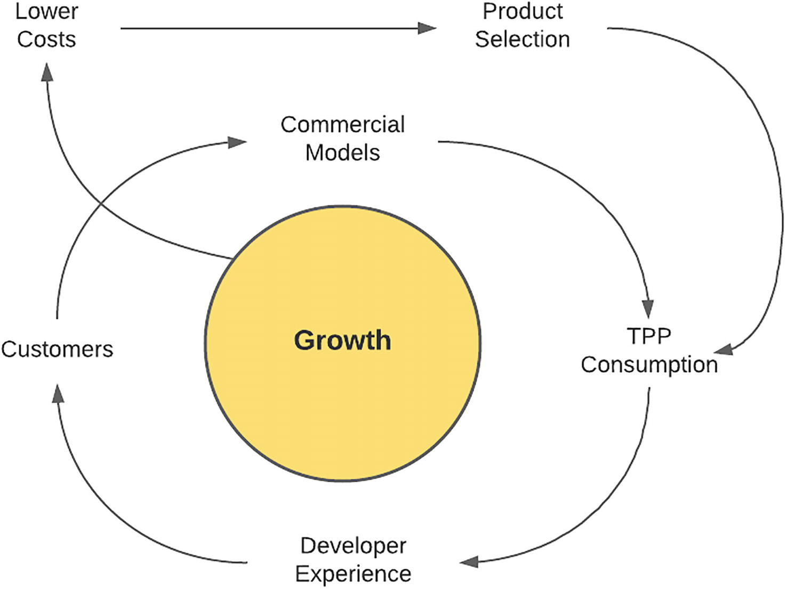
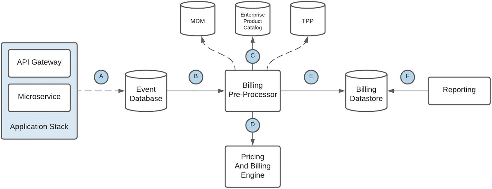
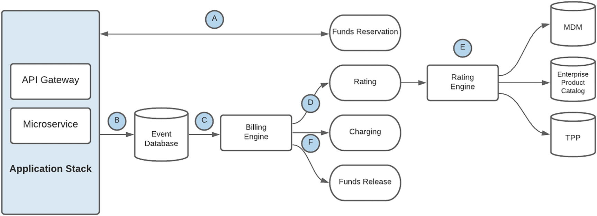
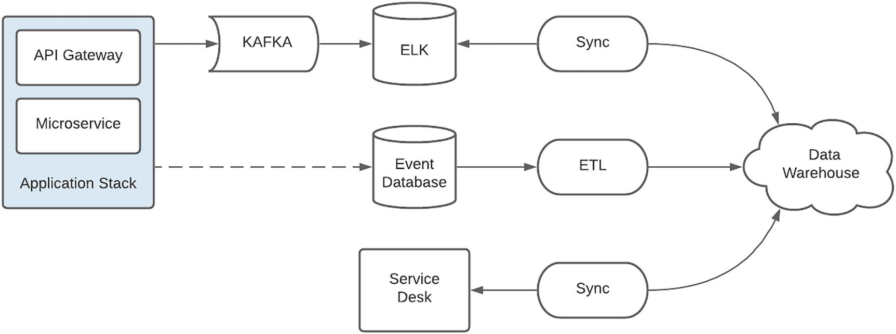
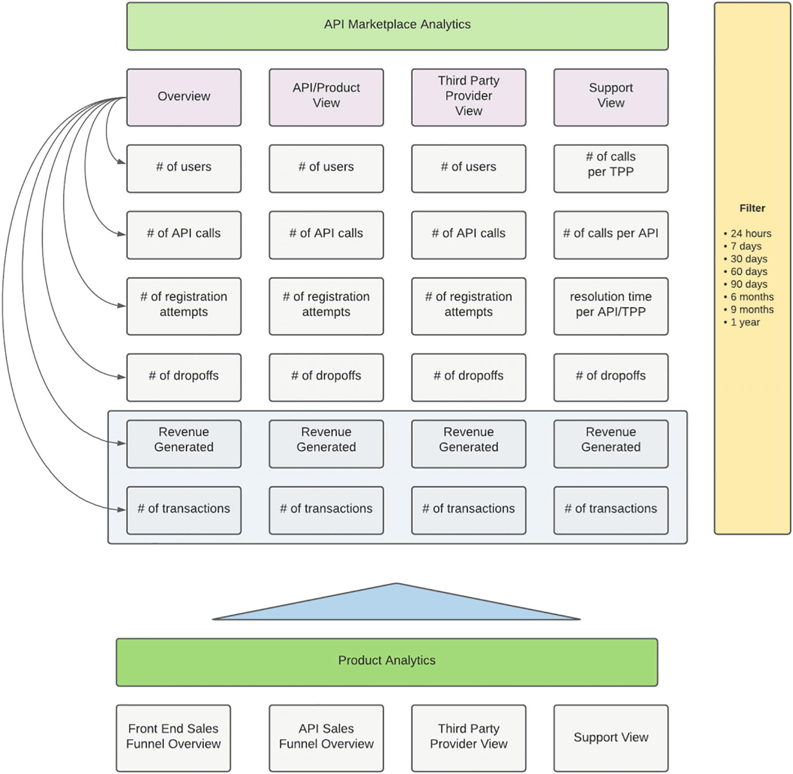
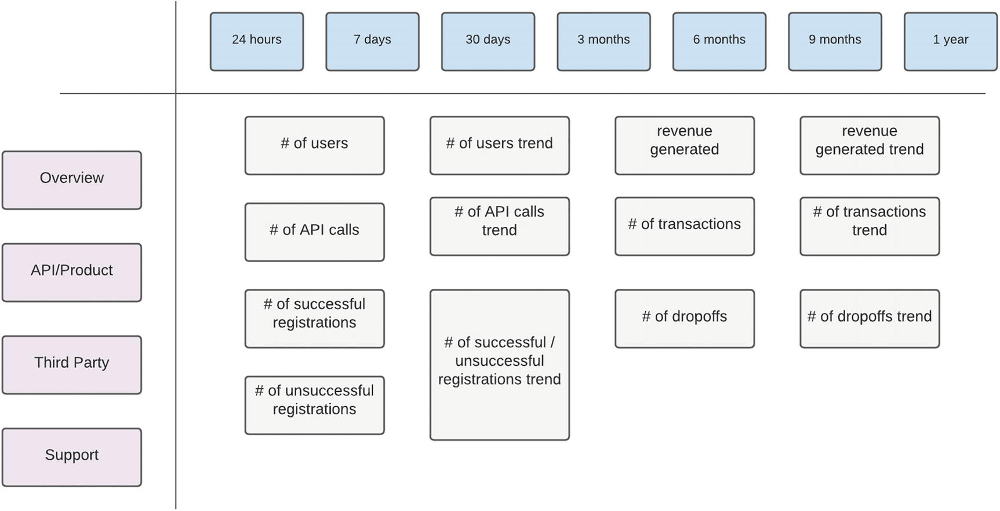
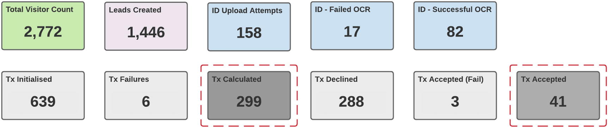

# 货币化
> 雷内多拉萨米1
> (1)
> 南非豪登省约翰内斯堡

我相信工程可能是 API 市场的货币化或商业主张的最大推动者。对于许多有技术倾向的人来说，这似乎是矛盾的，因为领域处于光谱的两端。
请允许我在建造一架新客机的背景下提出这个论点。如果工程团队只关注速度、性能和技术，那无疑是快速且技术合理的。还有许多其他因素需要考虑，例如它可以承载的乘客数量、消耗的燃料、飞机可以覆盖的航程或距离，以及维护和寿命。这些因素决定了飞机的财务可行性。这种情况的一个真实例子是超音速客机协和式飞机的退役，这是一个工程奇迹，但不幸的是，它并不是最经济的。
以同样的方式，技术交付团队对影响 API 市场生命周期的商业轨迹和财务可行性负责。老实说，我将这归类为一种特权，并挑战工程团队在设计和构建解决方案时保持对商业目标的看法。根据对多个 IT 项目的观察，将这个目标留给项目执行人员独自承担，最终会导致技术上合理但不平衡的解决方案。由于不可持续，此类项目通常在接近发布时被搁置或被搁置。
一种对我们的实施非常有效的方法是让团队的任何成员都有机会就 API 产品的商业方面提出问题或提出建议。这是由一位项目主管实现的，他不仅欢迎反馈，而且经常要求团队提供反馈，作为他们在平台中的所有权的信号。关于来自技术防空洞的潜在惊人创收产品的异想天开的宣传通常以令人难以置信的技巧进行，以避免自尊心受伤，因为这些可能超出了组织游戏的规则。
在本章中，我从技术角度考虑货币化的目标，使用以逻辑为重点的镜头，利用未能在概念化过程中幸存下来的产品以及许多已经实现的产品的经验，其中一些现在正在产生收入。我们解开我们平台目前使用的策略，并不断调整以最大限度地发挥财务潜力。本章的基本主题是技术和商业之间的相互依存关系——没有另一个就无法生存。

## API 市场飞轮

从将客户体验置于其增长战略核心的亚马逊飞轮中汲取灵感，为我们的平台提供动力的流程（如图 4-1 中详述）以开发人员体验为基础。这个过程的全部功劳归功于我们的项目主管，我不得不说服他分享这个过程的蓝图，这些蓝图基本上推动了我们平台的运营模式。
在一个新市场中，这无疑是一个大胆的决定，并且是由领导团队的长期展望和明确定义的数字战略支持的。与许多组织不同，我们采用了一种重质量而非数量的方法。为支持此声明，所有 API 产品均按照行业标准构建。自定义定义可以提供更快的交付，但更难采用定义。

图 4-1 API Marketplace 飞轮
我们的策略是通过赢得信任并建立开发人员对平台的亲和力来启动车轮。从第三方消费者的观察来看，我们的 API 为将交付给最终用户的产品或服务的开发提供了重要的支持和加速。在许多情况下，这些用户来自更大的组织可能没有瞄准的细分市场。尽管市场的主要消费者本质上是第三方供应商，但最终用户的活动增加带来了更多的 API 使用，这使得开发改进的、有竞争力的商业模式成为可能，进而导致 API 的额外消费并吸引新的消费者使用该平台。
通过利用规模经济为新客户提供现有基础设施和运营能力的服务和支持，该平台产生更多收入，而不会产生额外成本，从而产生更高的利润。我们采用了与亚马逊类似的策略，并有意识地决定通过降低成本将这一优势传递给我们的客户。正如杰夫贝索斯明智地预测的那样，降低成本会导致流量增加，这总是会加速飞轮的动力。一个观察结果是，较低的成本也降低了进入门槛，该平台引起了小型咨询公司的注意，他们正在使用我们的产品构建创新解决方案。
与快速冲进超市购买一两件商品总是会导致手推车装满额外购买的方式大致相同，从一种 API 产品开始的第三方通常会利用入门流程和技术集成知识来吸收和消费其他产品。我们的市场从一些 API 产品开始，但随着时间的推移，通过现有的消费者需求和新的产品定义，选择稳步增长。虽然我们不能声称拥有最多数量的 API 产品，但我们稳定中的产品提供了真正的业务和客户价值。

## 你的市场身份
在开始为你的组织建立 API 市场的旅程之前，重要的是要清楚地了解 API 的使用方式。 这将指导你的销售和营销策略，还将定义要定位的第三方细分市场，更重要的是，确定衡量平台成功与否的因素。 在表 4-1 中，我通过与实体店的比较来描述组织使用 API 的一些方式。 请注意，这不是一个详尽的或决定性的列表——你平台的方向和重点将根据你组织的需求和理想目标进行定制，并且可能从一个细分市场开始，然后发展到另一个细分市场或可能跨越不同的细分市场。
表4-1市场定位

| 目标         | 描述                                                         |
| ------------ | ------------------------------------------------------------ |
| 最小         | 这是一种只提供基本必需品的商店。没有花哨的物品——只有保持库存流动和保持灯光绝对必要的东西 这种类型的 API 市场只是为了符合法规而构建的。监管机构已经颁布了在特定期限前必须遵守的立法，这是避免处罚所需的最低限度。目前没有战略目标——可能是一种观望的方式 |
| 利基玩家     | 我很想参观的商店之一是 RadioShack。如果你需要任何与电子相关的东西，这是一个梦想的目的地。它只针对特定市场，但它是该类别中任何东西的一站式商店 一个可比较的 API 市场是一个只处理特定类别的 API 的市场。例如，银行可能只提供处理货币的 API——从付款到贷款再到交易数据 |
| 超市         | 超市是世界各地社区的命脉。你可以冲进去购买牛奶等基本必需品，或者寻找灯泡等不太常用的物品。它们迎合了广泛的客户需求，但产品选择是基于流行的产品需求。因此，你可能会找到最常见的灯泡类型，但找不到适合 1900 年代早期古董吊灯的灯泡 这种类型的市场是一个聚合器。它汇集了常用的 API，并允许在一个保护伞下轻松使用。单点联系减轻了与多个提供商维护帐户或关系的需要。固有的好处是，有了规模经济，就需要更少的员工来支持。此外，代表多个消费者的更大实体的组合可能会导致后端提供商提供更具竞争力的定价和服务。超市，可能是连锁店的一部分，从供应商那里得到的价格和服务可能比个人好得多。 |
| 香榭丽舍大街 | 巴黎著名的购物大道是香榭丽舍大街。它拥有完善的商店，是当地人和游客的热门目的地。平方英尺非常宝贵，只有特定品牌受邀参与以保持空间的排他性。虽然每家店都是独立的，但它是由位置的气氛和氛围内在地联系在一起的 这种类型的市场是一个生态系统——没有单一的所有者，而是围绕一个中心主题或结构构建的。消费者和提供者之间存在一对一的关系。对提供商执行能力的信任和信心是通过其在该论坛中的存在来隐式衡量的。也就是说，如果某个服务提供商被允许加入该专有组，则它必须满足特定的质量标准。相反，提供商需要保持高标准的质量以保留该组的成员资格。这种相互信任是随着时间的推移而获得的 |
| 购物中心     | 购物中心是许多顾客的热门景点。商店种类繁多，对潜在租户的最低要求远没有那么严格。更重要的是，有保安、停车场和浴室等公用设施，为客户提供便利，并代表所有租户提供。许多这些中心都有主要租户，这是对客户的主要吸引力 这个市场代表了一个封闭的生态系统。消费者与供应商直接联系，但利用共享功能——通常是安全和支持。通用基础设施还可以托管多租户解决方案，以降低成本并实现规模经济。在这种情况下，锚定租户可能是一个成熟且值得信赖的品牌，例如也参与到这种环境中的知名金融机构。对于那些开始自己的市场并希望通过吸引更多第三方开发人员和支持较小的供应商接触更多受众来刺激增长的组织来说，这可能代表一种自然演变 |

## 价值和收入策略
在我们这个快速发展的世界中，随着技术的发展，今天有新的和新颖的方式来产生收入，这是我们几年前做梦也想不到的。例如——拥有大量粉丝和追随者的社交媒体人物成为有影响力的人，并因其内容的更多观点以及营销和推广产品而获得报酬。职业游戏玩家可以比职业体育玩家赚更多的钱。简而言之，重要的是要理解和欣赏价值可以明确地创造——以硬收入的形式——或隐含地创造，例如，以品牌定位和客户忠诚度的形式。在本节中，我们考虑 API 市场如何产生价值的不同方法——隐式和显式。

### 开发商支付

让我们从让资本家满意的选择开始。毕竟，当 API Marketplace 的概念被提出融资时，它的财务可行性将是一个热门话题。对于这种方法，第三方提供商需要为 API 产品的使用付费。通过对 Twilio 等成功平台的检查，可以通过多种不同的方式实现这一目标：

- 即付即用：这本质上是一个“预付”概念。多年前，当移动运营商向客户提供语音和短信服务时，基本上将“通话时间”加载到他们的帐户中时，它就很流行了。无论如何，我都不是经济学家，但我总是觉得奇怪的是，这些类型的账户的语音单位成本（每秒或每分钟）要高得多——尽管移动运营商的风险要低得多。更奇怪的是，这一立场在很大程度上被订户群所接受，特别是在很长一段时间内。从消费的角度来看，第三方会提前支付积分，这会随着 API 的使用而耗尽。一旦所有积分用完，将不再处理进一步的请求。 API 提供商的好处是预付款、最小化风险，如果资费与移动套餐相似——单位成本更高。 API 消费者的好处是降低了风险——通过这种方法，可以设置特定的预算来防止成本失控，并可以随时灵活地终止关系。
- 免费增值：许多云提供商提供免费计算和积分，以吸引开发人员使用他们的平台。由于这些优惠，我个人使用了许多产品和服务。随着我对 Firebase 等产品越来越熟悉，我转向了提供更多功能的付费选项。如果不是为了促销信用，我会不愿意放弃我的信用卡详细信息进行调查。此模型可用于赢得开发人员的信任。如果使用得当，它可以建立对你的 API 产品的忠诚度。 API 提供者存在一些风险，因为服务本质上是以零成本提供的。在许多情况下，鉴于 API 的性质，这种风险可能很小，因为这可能本质上是服务请求的内部成本。戴上我的开发者帽子，这对我来说无疑是一个有吸引力的选择。
- 分层：在金融服务行业，我们观察到金融技术 (FinTech) 解决方案的蓬勃发展，这些解决方案旨在改善金融服务的交付和使用。这些本质上是具有伟大创意但通常资本投资很少的初创公司。分层产品允许消费者在其组织生命周期的不同阶段以符合他们要求的价格访问你的产品。相反，包的结构可能会降低成本——例如，基础包可能提供有限的支持。层级还提供了有关级别之间差异的可见性，并可用于财务预测，这对初创公司的商业计划非常重要。每一层都可以在定义的时间段内提供指定数量的免费交易，然后是每笔交易的单位成本、不同级别的支持以及服务可用性或对特定 API 产品的访问。由于市场可能因地区、人口统计和消费者行为的不同而存在显着差异，因此产品负责人将需要对包装的结构进行大量研究。在我的职业生涯中，我观察到许多商业模式在一个市场上效果很好，但在另一个市场上却表现不佳。产品必须适合消费市场。
- 积分制：我国最成功的医疗救助计划之一就是基于“积分”的概念。这个想法非常简单，但其操作和影响却很深刻。会员通过健康的生活方式获得积分——更多的锻炼和健身会获得更多积分。随着积分的增加，用户的地位也会上升。然后，会员可以以折扣价购买诸如机票和电影票之类的物品。计划提供者的好处是健康的成员不太可能生病和索赔。这个特殊的计划有很多成员，现在对健身很狂热，并且变得非常成功，以至于该组织现在已经进入银行业——激励是可以通过消费赚取积分。这是一个全面胜利的例子。消费者和供应商双赢，参与该计划的许多外部服务供应商也受益。这种模式在 API 市场中的一个简单实现是消费者通过特定数量的交易获得信用。信用可用于抵消成本或可能用于购买组织中的其他产品。例如，第三方消费者可以兑换通过 API 交易赚取的积分来抵消他们的月度账户费用。这允许产品的异花授粉，这将有助于保留客户。在上述情况下，消费者可能不愿意转移到另一个提供商，因为这会影响每月的账户费用。
- 交易费用：这可能是最简单的实现机制。每个 API 请求都会生成一个事件，该事件被路由到一个引擎，在那里进行中介、评级和计费。在计费周期结束时，会生成报表，然后消费者付款。有大量的复杂性掩盖了实现。发票、收款和计费纠纷是必须考虑的领域。由于在使用后计费，因此存在巨额账单的重大风险，就像云服务或产品意外停止运行将导致天文数字的账单一样。供应商同样面临风险，因为客户可能会拖欠欠款并投入大量时间进行客户教育，以避免此类情况发生并在更长时期内留住客户。虽然是最透明的方法，但我认为这也是最基本和最严格的方法，因为它不鼓励或奖励第三方行为。

在我们继续之前，必须考虑两个关键因素。首先是平台的计费能力，对于上述任何一种方法，都必须是防弹的、透明的，并且没有任何怀疑或不确定因素。利用移动计费的相似性，客户查询可以使用逐项账单立即得到解决。你的计费平台必须能够生成明细帐单，清楚地显示交易何时发生、调用哪个 API 并能够深入挖掘并提供其他信息，例如交易发起、请求和响应有效负载。
要记住的第二个可能也是最重要的因素是 API 产品必须首先为第三方创造价值和收入，这将为你的组织带来收入。很有可能构建和推出 API 产品并为其贴上高价标签，从而提供高价值产品的吹嘘权。然而，如果没有令人信服的价值主张，第三方的采用和使用就会很少，而且它会留在货架上产生很少的收入。

### 开发者获得报酬

这种方法的原则是激励第三方使用组织的 API。所有方法的核心都必须被视为一种伙伴关系，因为一种方法的成功意味着另一种方法的成功。在这里，消费者是组织的延伸，并分享收入的战利品。这让我想起了我与一家初创公司的老板的谈话，他以高价出售了自己的业务。尽管这是许多人希望他们拥有的公式，但他对自己保留了全部所有权感到懊悔，因为拥有更多利益相关者，公司本可以做得更大。
从财务角度来看，分享一块更大的馅饼可能比完全拥有较小的馅饼更有利可图。这是 API Marketplace 的一个关键主题——它允许你的组织通过第三方接触更多客户。如果我们从逻辑上考虑这一点，如果第三方能够从其促成的交易中受益，那么它就是价值链的一部分，并将尽最大努力完成交易。让我们考虑一下实现这一目标的方法：

- 收入分成：这可能是我最喜欢的第三方参与机制之一。它反映了一种双赢的方法，并清楚地表明了组织对第三方是重要合作伙伴的承诺。非洲移动网络爆炸式增长的一个关键因素是，几乎可以从任何街角的小商贩那里购买通话时间。对供应商的激励是任何销售的佣金。移动运营商只是使用完善的、广泛的网络进行通话时间分配。第三方供应商也更有可能推广或展示产品或服务，从而获得更高的收入份额。潜在的收入分配也可能成为第三方构建新产品或服务的商业计划的转折点。
- 附属公司：拥有成熟客户群的第三方也可以作为品牌倡导者参与，以鼓励采用你的 API 产品。与培训合作伙伴协助候选人寻求认证的方式大致相同，有些服务提供商可以构建自定义训练营计划，让潜在开发人员启动并运行你的 API 产品。除了更多地接触 API 之外，一个好处是附属服务提供商和开发人员在有关 API 采用的培训中的直接反馈。尽管此功能可以由内部交付团队承担，但专业组织可能已经拥有成熟的订阅者基础、与开发人员建立剧目的技能，以及最重要的是，新消费者可能不太担心的中立性。与初创企业孵化器的合作伙伴关系，旨在支持发展中企业的计划，也是支持这些计划的好方法，也是在新组织生命周期早期吸引新组织和展示市场价值的绝佳机会。
- 推荐：只需点击数以千计的 YouTube 赞助频道就可以看出这种模式的成功。通过实施一个简单的推荐计划，如果他们的朋友和同事使用他们的代码注册，开发人员就可以获得奖励。这当然有助于为你的市场吸引和建立受众。对于某些 API 产品，客户潜在客户的潜力可能足以补偿第三方供应商。例如，如果潜在客户在考虑购买房屋或车辆时使用金融贷款计算器 API，则第三方可以获得补偿。由于可以在电话中传达客户的详细信息，因此它为组织提供了潜在的销售机会。

### 自由
Free 和 Freemium 之间的主要区别在于，Free API 产品将始终免费提供。在这种情况下，价值创造是隐含的——它推动了 API 的采用并增加了使用你的平台的第三方提供商的数量——随着时间的推移，他们可能会被转换。一个目标是零成本将导致大规模扩散，这将有助于让你的品牌吸引更多潜在客户。
这对第三方来说是一个有吸引力的选择，尽管东道组织可能会勉强提供，但对第三方的潜在影响和价值可能是巨大的。例如，提供收入和职业类型列表的简单数据 API 在企业中可能是理所当然的，但对于需要数据进行注册过程的初创公司来说可能具有重要价值。它还为你的组织提供了通过新渠道访问的机会 - 这些渠道本质上是由第三方构建的应用程序和服务。

### 间接

本着合作精神并巩固双赢模式的基本原则，该战略以最终客户的利益为中心。成功的销售策略是所有参与者都能从交易中获得价值。使用间接策略的价值可以通过以下方式创造：
客户：满足监管要求（例如开放银行）是一个明确的信号，表明客户数据的所有权和共享由最终用户控制。它为用户提供了以你的平台促进的方式安全访问新产品和服务的能力和灵活性。本质上，他们的数据，但根据你的条件。这对用户和组织来说都是双赢的。
企业对企业 (B2B)：允许 API 访问外部合作伙伴扩大了客户可用的解决方案范围。例如，对你的忠诚度和奖励计划的 API 访问可以允许最终客户参与奖励积分交换系统，这不仅扩展了你的计划的覆盖范围，从而导致更多积分兑换，而且还为用户提供了良好的价值主张.
信息性：可以通过使用 API 共享信息来实现客户对不断变化的市场条件的了解。可能共享的信息示例包括外汇汇率、营销活动（如促销）、时效性优惠和组织更新。
声誉：建立新的数字渠道使你的组织成为技术领导者和游戏规则改变者。这可能是将你的组织与竞争对手区分开来并为你的品牌提供重要价值的一个因素。

## 计费工程

在 API 市场中定义了许多计费策略后，让我们现在讨论实际实施的技术工程。 API 产品通常会定义货币化方法——有些可能由第三方支付；其他人可能有收入分成或推荐或免费。这通常由产品负责人在与后端支持系统密切协商后定义。
确定如何向消费者收费也很重要——第三方是否需要为每笔交易收费的账户提供资金，还是稍后对交易进行计费和发票？无论选择哪种机制，重要的是构建一个“计费骨干网”，为平台中的所有 API 提供服务。所有事件，即使是免费的 API，都应出于分析和报告的目的发送到计费管道中，并且不应掉以轻心使用此计费功能。尽可能利用企业能力。如果这是不可能的，请考虑使用托管或托管服务，因为这会对运营产生很大的影响。
事件计费模型的技术流程如图 4-2 所示。

图 4-2 事件计费模型
表 4-2 描述了事件计费模型中的步骤。
表4-2事件计费顺序

| 步骤 | 描述                                                         |
| ---- | ------------------------------------------------------------ |
| A    | 事件由应用程序堆栈中的元素生成，通常是在 API 请求完成后，此时主要来自微服务组件。该事件包含调用的详细信息，包括产品、第三方标识符、完成状态、请求和响应负载以及日期和时间。事件被插入到数据库中——以最大限度地减少呼叫延迟并允许离线处理 |
| B    | 记帐预处理器按批处理计划或触发器读取事件记录。批处理计划允许更有效的处理，因为在特定时间段内处理了许多记录。触发器执行允许近乎实时的事件处理 |
| C    | 该记录补充有来自系统的附加元数据，例如主数据管理 (MDM)、企业产品目录，其中包含产品映射的 API，以及第三方供应商数据库——其中包含有关第三方的附加配置，例如帐户到被计费。由于这是异步实现的，因此没有数据收集的时间压力 |
| D    | 以预定义格式丰富和中介的记录被路由到定价和计费引擎，该引擎作为企业服务提供。此功能将处理计费事件并更新第三方的帐户数据。请注意，有关事件应如何计费的规则包含在记录中。这种方法允许计费预处理器影响事件的计费方式 |
| E    | 中介记录也存储在市场中的业务支持应用程序可访问的数据存储中   |
| F    | 自定义报告使用丰富的中介记录，定期运行以提供平台的近实时计费视图。请注意，这些视图可能不是准确的收入数据——但支持本章稍后讨论的“名义视图” |

实时计费模型的技术流程如图4-3所示。

图4-3实时计费
表 4-3 描述了近实时计费模型中的步骤。
表4-3实时计费顺序

| 步骤 | 描述                                                         |
| ---- | ------------------------------------------------------------ |
| A    | 在处理 API 请求之前调用预留资金。这确保第三方有足够的信用来为请求提供服务。在调用时，可能不知道要计费的确切金额 - 保留了基于 API 产品性质的预定义预算金额。如果无法满足资金预留请求的最低金额，则向消费者返回错误 |
| B    | 事件由应用程序堆栈中的元素生成，通常是在 API 请求完成后，此时主要来自微服务组件。该事件包含调用的详细信息，包括产品、第三方标识符、完成状态、请求和响应负载以及日期和时间。事件被插入到数据库中——以最大限度地减少呼叫延迟并允许离线处理 |
| C    | 事件记录的插入触发对计费引擎的调用。计费引擎在下面详述的组件之间协调调用 |
| D    | 首先需要对事件进行评级。事件记录被路由到评级引擎             |
| E    | 评级引擎缓存来自系统的配置数据，例如主数据管理 (MDM)、企业产品目录，其中包含产品映射的 API，以及第三方供应商数据库——其中包含有关第三方的附加配置，例如在内存数据存储以进行最佳处理。请注意，对于这种类型的账单处理，延迟是一个关键考虑因素。低延迟允许更快地处理事件，从而导致余额更新和额外请求之间的风险窗口期更短 |
| F    | 然后计费元素使用评级事件从第三方的剩余信用中扣除特定金额。评级事件还可以表明不应向第三方收费——例如，如果 API 请求未成功处理，或者产品是否是促销活动的一部分。在这种情况下，预留金额被释放 |

## 分析和洞察力
借助导航数据（最好是尽可能实时和详细），试行 API 市场实施变得更加容易。在典型的工程思维中，本节最初计划包含在详细介绍操作的章节中。经过一番考虑，我发现这表明该船是从机舱而不是驾驶台引导的。与运营指标一样重要的是，经过解释的信息驱动着平台的方向和目标。例如，考虑每秒事务数的操作指标作为速度的指示。如果没有第三方供应商和产生流量的 API 产品等补充数据作为方向指示，这可能等同于在齿轮处于空档的情况下踩油门——高转速但没有前进动力.
本节的目的是强调了解平台的历史路径和进度以及建立一组当前导航数据（例如位置和当前方位）的重要性，这些数据将用于绘制前进的道路。需要注意的是，并非舰桥指挥中心控制面板上的所有仪表和刻度盘在第一天都处于活动状态。当工程团队使用平台或从不同来源收集数据以允许数据流入时，这些就会变得生动起来。如果产品负责人对所需内容有明确定义，则这种自上而下的方法将指导工程团队。另一种选择是一些随机系统指标的自下而上的、技术驱动的视图，它在控制面板上制作了一个漂亮的小部件，但提供了一个无用的业务指标。

### 数据采集

在全速运行时，API 市场的生态系统内有几乎连续的事件流。除了明显的 API 调用之外，潜在的消费者可能会通过原型设计工作来获得支持票，对后端系统的请求可能会减慢，最终用户可能处于完成高价值交易的最后阶段，或者意外的负载可能来自最后一刻的竞选活动。一个关键目标是尽可能多地捕获此类数据——高效、一致且可靠。
凭借在各种集成领域的多年经验，并从医疗分类流程中汲取灵感，我们实施了传感器和探针策略，如图 4-4 所示。对于我们可以直接控制的元素，例如应用程序堆栈，显式传感器已附加到关键流程中。这些发布定义明确的事件，提供有关请求的详细信息——例如第三方标识符和交易价值。当接收到事件时，它仍然需要补充额外的元数据——例如第三方名称的解析，给定标识符。

图 4-4 数据采集策略
在许多情况下，数据是在外部系统中捕获的。对于这些，我们使用探测策略。用于捕获客户交互的服务台包含大量信息，是此类实体的一个示例。来自潜在第三方的访问 API 产品或附加信息的请求是有价值的潜在客户数据。关于服务中断或事务跟踪的支持请求同样重要，因为它们代表可能提供保留价值的交互。由于数据存储在企业托管应用程序中，因此技术团队以自定义应用程序的形式构建了一种探测机制来查询和提取交互。这种方法还用于解析和提取应用程序和审计数据，以在某些迫切需要附加信息的情况下加快访问速度。
调查景观以识别各种参与者和信息来源并定义有关如何收集数据的策略非常重要。

### 数据分析

在我职业生涯的早期，当我的任务是为我的团队支持的集成平台提供分析时，我以技术为导向来完成这项任务。我痴迷于衡量低级指标，例如每个流的请求数，并对平台和应用程序进行检测以留下被摄取到数据库中的数据的踪迹。不幸的是，当我试图构建查询来解释数据以确定任何有意义的模式时，我看到数据流时的兴高采烈和自豪很快被绝望所取代。从这次经历中，我的基本理解是，上下文是分析信息的关键，单个分析数据点通常由几个底层指标组成，如图 4-5-1 和 4-5-2 所示。

图4-5-1分析源

图 4-5-2Analytics 目标
这正是项目执行官要求的分析视图。请注意，对于每个指标，都有多个维度。让我们检查各个维度的一些指标，以确定如何使用它：

- 用户数量：(i) 确定客户采用第三方产品和服务的唯一最终用户请求的数量，(ii) 由第三方提供商对平台的消费者进行排名，(iii) 在定义的时间段内进行预测特定提供商的未来流量。此信息可用于识别可能产生更高流量和收入的提供商。
- 已完成交易的数量：(i) 对于特定的 API 产品，以确定产生的收入，(ii) 由第三方提供商，再次对平台的消费者进行排名，(iii) 在定义的时间段内了解流量是否是爆裂或持续。

这些信息对于从不同角度理解平台至关重要。不仅可以轻松发现高流量 API，还可以深入了解具体操作以了解产品的使用方式。它还可以指导你的第三方获取策略。例如，来自单个消费者的大部分流量可能是一个风险指标，表明平台寿命需要更多的锚点。相反，来自许多消费者的流量很少可能表明该平台尚未在任何第三方内建立深厚的根基。这些假设和猜想是通过在不同时间段的各个维度上提供关键数据而成为可能的。

### 报告

随着平台的成熟、更多高价值的 API 产品以及向关键第三方提供关键任务支持的需求，我们的团队实施了以下机制来提供平台活动的可见性：

- 仪表盘：如图4-6所示，如表4-4所示。与汽车仪表板提供广泛信息的方式大致相同，你的注意力通常集中在车速表上，但会被其他指标所吸引，例如燃油油位，这会影响车辆的速度。乍一看，下面的仪表板似乎有大量的指标。通常，产品或业务负责人将专注于特定指标，如果这不在定义的参数范围内，则将检查其他值以确定它如何影响主要指标。仪表板的价值在于提供平台的关键指标，以及有关可能影响平台的因素或条件的详细信息。
- 电子邮件：仪表板的快照每小时通过电子邮件发送给主要产品利益相关者。此外，还向产品团队发布了成功完成高价值交易的通知。我很惊讶地看到高级商务人员询问是否有技术中断，如果已完成的交易数量少或兴奋，高价值交易的祝贺信息。这表明商业团队确实正在审查和使用定期分发的消息，并且 API 被认为是关键的收入渠道。

来自运营支持团队的双小时即时消息，详细说明系统稳定性和关键 API 产品的成功完成交易。同样，如果数字异常低，则会引发有关支持系统和下游供应商的可用性的问题。

图 4-6 示例仪表板
表 4-4 报告仪表板指标

| 公制           | 描述                                                         |
| -------------- | ------------------------------------------------------------ |
| 总访客数       | 访问应用程序（门户或 API）的唯一用户数                       |
| 创建的潜在客户 | 完成基本信息步骤/表单请求更多信息的用户。 销售代理可以通过电话联系那些没有进一步进行的人 |
| 身份证统计     | 由于 OCR 上传、成功处理和失败的身份证明文件的数量。 询问失败的请求以确定上传的图像是否存在问题或系统故障 |
| 交易统计       | 计算、拒绝、失败和接受的详细交易和关联状态的数量——基于流程执行逻辑 |

成功的报告策略的关键是提供特定的、相关的数据，这些数据可以以目标受众可以快速理解和询问的格式提取（通过网络）或推送（通过电子邮件或即时消息）。

## 名义损益表
名义收益表是我们市场的一个关键结构，它实现了多种功能。在项目主管创造的术语中，它是衡量渠道能力级别的整体盈利能力的指标。由于市场可能拥有一系列产品，其中一些可能会产生收入，而另一些则被监管为免费，因此有助于了解所有产品的价值。
作为做市商，主要是在消费者和供应商之间进行互动，在某些情况下，展示价值可能是一个挑战。毕竟，保持平台运行是需要费用的——基础设施、软件、开发人员、支持工程师、产品负责人和交付线索需要支付。由于交易的收入很可能会被后端服务提供商认可，这可能导致 Marketplace 被归类为内部“成本中心”，不幸的是，建立数字品牌或授权第三方等隐含价值对财务来说意义不大军官们只看底线。
这种现象可能会让团队非常沮丧，因为带来更多收入的业务部门通常会获得更高的预算分配和认可。不满足于简单地被视为“成本中心”并希望组织了解市场计划的贡献和重要性，项目执行官明智地建立了“名义价值”的衡量标准。
收益表镜头的放大倍数增加，以不断审查每个 API 产品的性能。在开始时，产品和业务所有者可能会做出影响构建特定 API 的决定的假设。建成后，需要定期测量以确定产品的健康状况。假设，例如预计的流量或第三方采用，会不断得到验证。平台规模和基础设施也受到关注，以确定这是否会阻碍产品的成功。持续衡量有助于衡量产品是否接近可能需要补救或决定退役的有限回报阶段。
在此细粒度级别了解特定产品可以更深入地了解总体拥有成本 (TCO)。一些可能更成功的产品可能需要更高级别的支持和监控，并且应该承担更高比例的运营成本来运行平台。损益表行的详细信息允许对每种产品进行定量测量。
最后，采用损益表作为我们的标准衡量机制为执行委员会的审查和评估提供了显着优势，这些执行委员会通常具有以财务为中心的心态。这个过程消除了关于市场的定性或“直觉”情绪，并使用定量方法来清楚地了解财务状况。在某些情况下，这可能表明需要进行调整以确保计划的持久性。这将在接下来讨论。

## 转向新的商业模式
我们希望建立的 API 市场的根源最初以第三方提供商的技术准备就绪的形式受到重创。尽管 API 遵循开放标准，并且团队非常乐意协助解决集成挑战，但我们对第三方提供商对 API 的采用率低感到失望。当拥有经验丰富的开发团队的成熟第三方落后于积极的集成项目计划并表示将错过关键交付日期时，情况达到了临界点。
市场的产品负责人立即采取行动，提出了一个激进的解决方案，我们的团队将代表第三方托管应用程序以满足时间表。尽管这一决定表明了对我们交付能力的信心和信念远远超过消费者，但工程团队最初将其归结为一个冲动的决定。毕竟，这是一个 API 市场，而不是应用程序托管市场。根据第一手经验，我还可以向你保证，让集成开发人员构建用户界面 (UI) 就像让超人挖掘氪石一样。
托管应用程序的目标相对简单。它确实需要一些 API 集成——但绝对是最低要求。第三方将实施标准重定向以启动将使用平台中的 API 的应用程序。减轻前端开发压力的是，我们始终忠于我们的目标，并使用 API 来利用内部组织能力。老实说，这种整合模式已经成为平台最大的收入来源之一！
最初是因为技术团队不得不争先恐后地更新部署策略并请求设计和安全批准而开始的怨恨购买，随着团队发现他们现在拥有直接使用 API 的能力 - 以我们一直在尝试的方式，逐渐发展说服第三方一段时间。这种方法还使其他提供商能够通过采用相同的模式来加速他们的集成工作。
在这种情况下，产品负责人完全有权利保持坚定并坚持采用 API，即使冒着错过最后期限的风险。然而，这一支点展示了技术平台的多功能性和灵活性，可以通过适应不同的市场条件来创建新的商业模式。

## 概括

在本章的开头，我提出了这样的论点，即工程能力是 API Marketplace 商业成功的基础。我们还讨论了飞轮过程，一旦启动，就会在平台的各个区域产生连锁反应。通过专注于开发者体验，它吸引了更多的客户，从而降低了成本，并允许积极的新商业模式为更多第三方消费的新产品开发提供资金，从而获得更好的开发者体验。这股永动机为 API 市场的增长战略提供动力。
我们谈到了为你的 API 市场建立身份的必要性，并将其与建立实体店进行了对比。通过提供对比，希望你已经开始制定你想要建立的商店类型以及即将开设商店的新平台。然后，我们讨论了从 API 市场创造价值的方式，并观察了如何隐式、显式甚至间接实现价值。深入细节，我们审查了支持各种计费策略的工程方法。重要的是要注意计费策略是第一位的，并且平台旨在支持它。然后我们转向了货币化的一个关键领域——可见性和衡量。分析和洞察力提供了非常需要的可见性，为用于引导市场的控制面板提供支持。我们审查了数据收集、分析和报告策略。名义收益表是我们用来衡量和确定市场盈利能力的机制。最后，我们展示了一种转向创建新业务模式的方法。
运行 API 市场是一项极具挑战性但有益的活动。团队采用了创业思维，这让我们更高效、更节俭、更精干，并不断寻找新的机会。这是另一个飞轮过程，它驱动着一个永久的工程优化过程。这导致了一个不断发展的平台架构，我们将在下一章更详细地讨论。