# 平台架构
> 雷内多拉萨米1
> (1)
> 南非豪登省约翰内斯堡

我们的市场诞生于后 Netflix 时代的世界，是新建立的数字实践中的首批项目之一。该团队的任务不仅是交付开放银行原型，而且还获得了使用尖端技术的机会和任务。事后看来，这既是福也是祸。使用容器化等新方法的能力为我们的平台提供了高度的灵活性。不幸的缺点是我们比组织的其他成员领先 2 到 3 年，而且我们想要使用的新方法还不值得信任，更不用说理解了。
时间的内在好处是它允许我们的团队发展和优化平台，并通过知识共享和迭代交付与组织的其他部分建立信任。变革的浪潮很快到达了我们组织的边缘，我们正在尝试的概念和方法变得越来越普遍，并受到类似机构的信任。它还使我们能够将 Marketplace 定位为企业级平台，对组织的功能至关重要，而不是卫星安装来完成一个小众角色。
通过这个过程，我们对企业内部的支持系统有了更多的了解。我们还因实施前沿技术的努力而感到谦卑，现在敏锐地意识到人员和流程是最终解决方案的重要组成部分。
在下面的部分中，我提供了我们平台元素的延时视图，它是如何变化的，以及我对它的发展的想法和计划。这样做的目的是希望引导你的实施并分享我们自那时以来建立的一些理想和原则。

## 元素

与元素周期表中的元素一样，图 5-1 详细说明了我们平台架构的组件。有些，如反向代理，是作为原子共享企业服务提供的。其他的，比如我们的微服务，已经过基因工程，这赋予了我们平台独特的身份。这些区块代表了我们 Marketplace 的核心，我们一直在努力优化它们的功能，以使平台更加高效。以下各节将更详细地讨论每个元素。

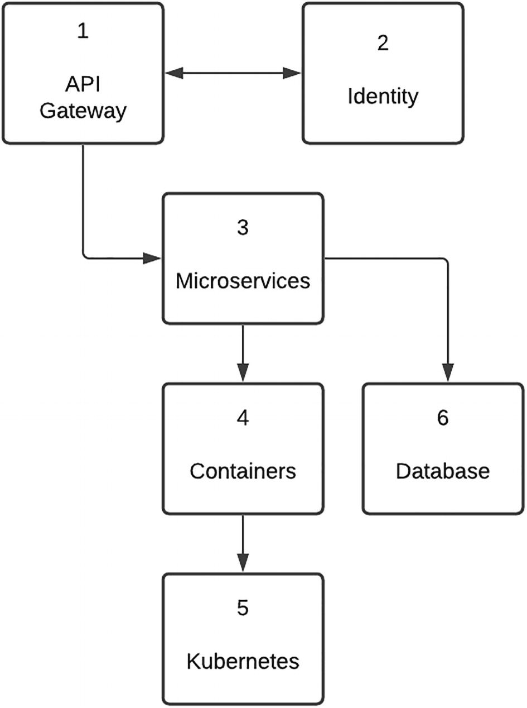

图 5-1 API Marketplace 平台的要素

### API 网关（外部/内部）

API 网关本质上是企业的入口点。在我们的部署中，它驻扎在非军事区 (DMZ) 的边缘，第二个单独的实例被定位为内部服务的入口。核心功能是安全、API 管理和监控。我们组织的一个关键标准是，所有面向内部和外部的 API 都应通过 API 网关访问。 API 网关的一个重要特性是能够限制用户请求。虽然这可以定制开发，但使用现成产品的好处是它减轻了团队的操作工作量。安全配置、证书管理、API 产品更新和版本控制等任务都是开箱即用的。
一些云提供商提供了一个平台即服务 (PaaS) API 网关，可以轻松地进行配置。 PaaS 产品的好处是底层基础设施的扩展和管理由云提供商处理。作为一家成熟的金融机构，我们有一个商业现货产品，由内部团队管理并由软件供应商提供支持。为了让交付团队有一定的自主权，在网关内为我们的 API 产品创建了一个单独的开发人员组织。这本质上是 API 网关基础设施的逻辑分离。我们被允许在开发环境中进行管理访问，但在我们进入生产环境时必须遵守严格的管理。

### 身份

该块承载了许多对 API 市场功能至关重要的功能。其中最重要的一项是访问控制身份验证策略，通俗地说，它是对最终用户进行身份验证的基础。由于它托管包含用于验证凭据的用户配置文件信息的目录服务器，因此在实施开始时做出的一个基本设计决策是我们将利用企业身份验证功能并在市场内构建自定义授权框架。反向代理功能也属于同一保护伞，并充当最终用户请求和服务器端门户应用程序之间的使者。通过物理基础设施、流程和服务来利用企业安全基础设施，极大地促进了我们的实施。已经进行了一些自定义以允许特定于市场的要求，例如允许未经身份验证访问后端 Web 应用程序和滚动刷新令牌窗口的连接。这一决定还帮助我们浏览了架构和设计审批委员会。长期服务的架构师感到欣慰的是，这个前沿的 API 市场可能是一个新的攻击渠道，它使用可信赖的企业安全标准进行保护。
容器平台（托管/非托管）
图 5-2 显示了应用程序部署方式的演变。从右到左，你可以看到三种方法，传统部署、虚拟化部署和容器部署，它们正在迅速普及。

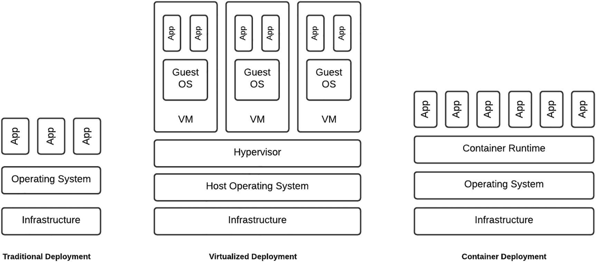

图5-2部署策略演进
我有幸体验过图 5-2 中的所有方法。在我的第一个项目中，我们被分配了一台 Windows 服务器，该服务器在组织管理的数据中心的物理机器上运行。我仍然记得急切地拍摄 CPU 和内存数量的快照并将其发送给我的大学朋友，作为分配给我的新项目的硬件的吹嘘权。即使当我不得不在生产部署的晚上开车到数据中心以物理方式重启服务器时，我也觉得自己就像一个“正确的东西”宇航员在下一次太空任务中走在舷梯上。如图所示，所有应用程序都直接在操作系统上运行，如果其中一个应用程序发脾气导致 CPU 或内存利用率过高，其他应用程序就会受到影响。
几年后，在一个新的中间件平台项目中，我们为我们分配了 Sun Sparc 服务器，每个服务器都有许多具有多线程功能的 CPU 和高达 512GB 的 RAM。服务器架构白皮书在我的床头柜上占有重要位置，因为 NASA 和 JPL 可能使用相同的硬件来发射航天飞机。使用 Sun Solaris 的美妙之处在于，Hypervisor 被嵌入到操作系统中，我们可以将机器分割成几个逻辑 Solaris 区域（虚拟机），每个区域都有自己的操作系统并以以下形式分配特定数量的资源线程和内存。如果应用程序行为不端，Solaris 管理软件将包含它并防止它影响其他区域。我发现自己正在编写一个包含 Solaris Zones 详细信息的电子表格，该电子表格用于各种环境和堆栈组件。
我为电子表格的细节感到自豪，让团队其他成员感到烦恼的是，通过 IP 引用每个区域，就像一些其他人不知道的老朋友一样。由于我负责平台构建，我编写了尽可能多的安装脚本——但最终不得不求助于在不同区域上运行自定义命令，有时是为了解决集群问题，有时是为了解决缺少的依赖关系。再次，我将这些干预措施归为我在保持平台正常运行的艰巨努力中的一部分。当时我几乎没有意识到我也负责创造一个“雪花环境”。环境中的每个区域都与其他区域不同。我现在感到欣慰的是，即使我的配置脚本确实创建了相同的克隆，每个区域也会由于对某些区域而不是其他区域进行操作更改而始终不同步。
虚拟机 (VM) 是朝着正确的发展方向迈出的一步——它们允许更好地利用底层基础架构。缺点是 VM 占用大量资源，VM 配置可能总是不同步，而且它们还鼓励基础设施的垂直扩展，这随着时间的推移是站不住脚的。也就是说，物理主机只能扩展到最大级别，这限制了它可以支持的 VM 数量。
对于我们的 Marketplace 实施，我加入之前的一个早期决定是使用容器方法。我对容器的第一次体验是 Docker，当我浏览清单 5-1 中所示的教程时，我被这个概念的简单性所震撼，并真诚地想知道 2014 年这项技术推出时我生活在哪块石头上。

```doc
FROM node:14
# Create app directory
WORKDIR /usr/src/app
# Install app dependencies
COPY package*.json ./
RUN npm install
# Bundle app source
COPY . .
EXPOSE 8080
CMD [ "node", "server.js" ]
```

清单 5-1 简单的 Docker 配置
就像管理程序是虚拟机的启用元素一样，容器运行时启用容器。有许多很棒的资源提供了有关管理程序和容器运行时如何实现这一点的详细信息。我个人的定义是，容器是软件配置的具体定义，简称镜像。如清单 5-1 所示，该定义指定了一个基本软件元素，你可以向其中添加自定义部署和要执行的命令。从该映像创建的所有实例都是相同的。它允许你专注于应用程序级别和相关的依赖项，而不是从操作系统级别工作。
在烘焙蛋糕的上下文中考虑虚拟机和容器之间的区别。对于虚拟化方法，为厨师提供了一个完整的厨房——不同的炊具、所有电器和一个完整的食品储藏室可供选择。厨师总是只会使用一部分餐具、器具和用品。对于容器方法，厨师只提供他们送蛋糕所需的东西——特定的器具、配料，可能只有一个烤箱。容器方法还迫使部署团队在代码/配置级别进行更改。如果需要包含库或包，则必须更新容器映像配置。容器实例特意是瞬态的。图像也是轻量级的，因为它们不需要完整的操作系统来运行，所以它们需要底层基础设施的一小部分。结果是，与虚拟机相比，可以在基础架构上运行更多容器。另一个好处是这允许基础设施的水平扩展。更便宜但功能较弱的硬件，由于其轻量级的占用空间，可以轻松托管多个容器实例。
托管容器平台（如 Kubernetes）提供自我修复等功能，可重新启动失败的容器并检查容器的健康状况，然后再将其发布给客户端。它还提供自动推出和回滚。为了完全透明，我们早期的项目团队在容器化方面处于未知领域——更不用说必须在本地构建 Kubernetes Managed Container 平台了。我仍然可以看到一个被激怒的项目经理绝望的表情，渴望达到冲刺目标——当常驻 DevOps 工程师在容器期间对一个问题的解决给出“我们不知道我们不知道什么”的反馈时平台搭建。当我们尝试 Cloud PaaS 服务时，我们对内部组织治理和安全限制的失望成倍增长，这些服务可以在几分钟内提供，但无法访问内部系统。我们平台的第一次迭代是单个节点上的单个 pod——必须定期重新启动。一个小小的胜利——但对于我们的项目团队来说，这是人类的一小步，但却是 DevOps 的巨大飞跃！
从那以后，我们对托管容器平台进行了两次主要的迭代，通过我们的进步，现在对 Kubernetes 提供的功能有了更好的理解和欣赏。很容易被容器化的魅力所吸引，尤其是像Kubernetes这样的平台。我已经观察到基础设施即代码的力量，并且因为创建可以在几分钟内改变整个环境的“创世脚本”的可能性而遭受了宏伟的错觉。让我大吃一惊的是，在 API 市场的背景下，托管容器平台是应用程序平台的推动者。从那时起，我得出的结论是，托管容器平台（如 Kubernetes）的真正力量在于它可以淡入到后台并让你专注于应用程序。作为全栈工程师，了解容器平台的元素和功能以及请求如何从入口到服务再到 Pod 是必不可少的。我们的本地 Kubernetes 平台的管理已转移到企业 DevOps 团队。这将进一步过渡到托管云服务。 Kubernetes 即服务提供基础设施管理、网络结构配置的抽象复杂性，并帮助团队轻松实现复杂的目标，例如设置持久卷。

### 微服务
我可能有很大的偏见——但我认为我们的微服务层是我们平台的神奇成分。公平地说，微服务是由容器支撑的。我的观点是容器是最佳配角，而微服务是最佳演员。我并不总是有这种感觉。我职业生涯的大部分时间都在已建立的集成环境中度过，在我加入该项目时，企业服务总线 (ESB)、应用程序和流程服务器等组件都部署在复杂的集群配置中，这些组件都已根深蒂固。我当时的观点是，没有这些元素的集成根本就不是企业级的——可能就像我以前在软件 OEM 工作过的那样。如果我们去掉微服务层，就可以减轻建立本地容器平台的负担，我们可以使用传统的集成机制来连接后端服务。传统意味着安全，我可以回到我在整个职业生涯中完善的集成手册。
当我试图从我们的平台中删除微服务时，我仍然记得与项目发起人的讨论。我提出了一个大胆的论点，宁愿使用集成软件，我将其定位为强大的大炮，它支撑着 API 网关，并且在企业中已经很好地建立起来，而不是 peashooter 微服务方法，这可能在前沿技术之前。由于容器是一个关键目标，我建议我们使用它们——尽管它的作用不那么重要。总之，我强调豌豆射手的豌豆是 NodeJS——我认为它是一种“网络语言”，而不是像 Java 这样的集成语言。我针对微服务积累的案例给我留下了深刻的印象，并让自己放心，我们将在不太密集的项目时间表下追求该技术。当判决返回是无罪时，我惊呆了。提供的理由是微服务层将为平台提供高度的灵活性，更重要的是速度。这是我在职业生涯中观察到的最准确的预测之一。
微服务层赋予我们的平台前所未有的控制力和多功能性，对我们的成功至关重要。早上随便扔的想法是运行组件，准备在下午展示。这使我们能够坚持前进的口头禅，这乍一看似乎是非正统的。如果遇到测试或操作问题，我们会尽力修复而不是回滚。我非常不愿意使用 NodeJS，因为我觉得它缺乏像 Java 这样我非常熟悉的语言的结构和性能。在使用 NodeJS 一段时间后，这种不情愿已经消散，缺乏结构使我们的团队能够以光速交付代码。从表面上看，JavaScript 看起来很简单，但对其事件循环和异步性质的深刻理解使我们能够构建一个可以轻松处理大容量、低延迟请求的平台。并非所有日子都是美好的，有时灵活性（例如在构建期间未捕获的错误定义的变量）可能会导致问题。
NodeJS 非常棒，可以满足我们平台的需求。对于你将要构建的平台，这不是强制性的。考虑贵组织关于开发语言、开发人员和操作技能水平的标准非常重要。也就是说，如果组织主要使用.NET，那么实施NodeJS就等于给企业注入了病毒。重要的是要记住编程语言支持这个概念。可以采用任何编程语言，无论是强类型还是非强类型。这不是你使用什么的问题，而是你如何使用它的问题。
当我们在一家成熟的企业中构建我们的 API 市场时，我们经常发现自己处于管理良好的 API 网关的压力板和风险不利的“如果它不坏，不要修复它”的 IT 能力之间.微服务是我们的减震机制，可以缓冲影响并使我们能够在极其激进的项目时间表上交付。
我们将在本章后面深入探讨微服务架构。

### 数据库
数据库是任何平台的基本元素，因为它用于持久化事务，对我们来说更是如此，因为它启用了无状态微服务架构。我们最初的方法是在容器平台上运行数据库。这在提交给内部解决方案对齐论坛的初始设计中占有突出地位。不幸的是，我们的 DevOps druid 技能不够强大，无法征服 Kubernetes 集群上的持久存储卷，而是采用了新的设计策略，即我们的 Kubernetes 集群不会有任何持久存储。我希望这个职位能激励读者写一本关于“Kubernetes 持久存储虚拟指南”的书，我保证会买一本。
然而，这个决定是经过激烈的讨论和考虑后做出的。帮助解决问题的决定性因素是数据库管理永远不会成为我们团队的核心职能。我们可以轻松地构建一个数据库容器，但是让它具有高可用性和容错性会使我们的容器集群配置变得更加复杂。我们的平台现在使用企业提供的服务，从观察数据库管理的各个领域，我确信我们做出了正确的决定。澄清一下，我们的团队拥有这些数据。企业服务团队拥有数据库。

## 整合策略

如下图所示，我们的微服务集成策略随着时间的推移而演变。我觉得很了不起的是，在特定阶段开始时，一个想法或方法似乎非常棒，以至于你迫不及待地将它推广到堆栈中的每个组件。随着采用这种方法的太阳落山，随着团队堆积技术债务项目以转移到下一种方法，反向意识形态开始发挥作用。我考虑了从猿到人的进化，就像我多年来调查我们的整合方法一样。在我们的辩护中，事后的好处提供了这种崇高的观点。这也提供了一些安慰，因为我们当前的集成策略可能会随着我们发现更优化的解决方案而发展。
图 5-3 显示了用于我们的第一代微服务的集成方法，它支持了我们的 MVP。该团队对微服务采取了纯粹的观点，封装和隔离的原则是如此神圣，以至于每个组件都分配给了不同的开发人员。结果是每个开发人员都构建了自己的集成逻辑并将其嵌入到分配给他们的微服务中。从事后的角度来看，这绝对是一个面对面的时刻。在 MVP 的热潮中，地理分布的开发团队和每个开发人员都在努力远离食物链的底部以实现他们的 sprint 目标，这是一个非常可能的场景。后来人们发现，一个开发人员为检索帐户列表而集成到的平台与另一个开发人员为检索映射参考数据而调用的平台相同。

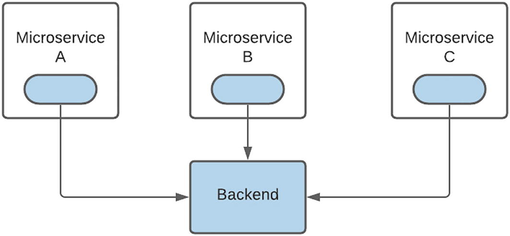

图 5-3 嵌入式集成逻辑
一个好处是团队达到了 MVP 目标。不幸的是，这就是好处停止的地方。代码重复、不同的集成方法、更大更重的部署足以让任何优秀的集成团队感到羞愧。
图 5-4 显示了我们进化之旅的下一站。那时我们的代码库没有今天那么大，在灵感的时刻，我将所有集成逻辑整合到一个共享库中。我对我的努力感到特别满意，因为共享库将允许微服务和后端集成逻辑之间的进程内通信。这种解决方案不仅具有超强的性能，而且还消除了代码重复的恐惧。我非常喜欢共享库的概念，我称它为“框架”。这个珍贵资产的家是一个 git 子模块，每个微服务都引用它。

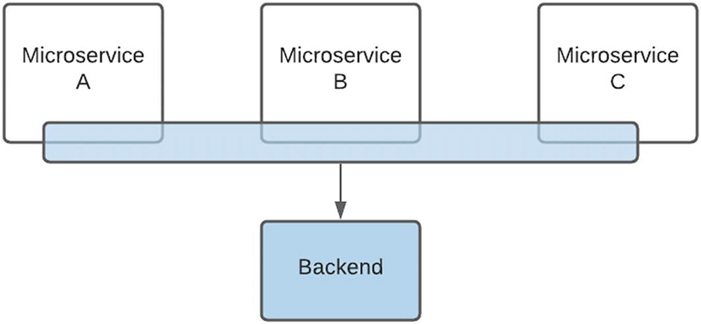

图5-4共享集成库
不幸的是，随着团队中微服务开发人员数量的增加，框架变得越来越碎片化。子模块概念还导致每个微服务引用框架的特定变体。如果开发人员需要新的集成功能或操作，他们只需拉下子模块，添加新逻辑，然后将该版本嵌入到微服务中。阅读本文的 git 管理员和爱好者可能会翻白眼，想知道这怎么可能发生。同样，对于地理上分散的团队，具有不同技能水平和敏捷交付目标的开发人员，即使是优秀的开发人员也可以通过做坏事来实现可交付成果。
直到今天，当我打开这个时代尚未迁移的代码元素时，我仍然不寒而栗。从那以后，我们提出了一个补救计划。 git 子模块脐带已被切断，每个微服务都有共享库的本地副本。这可能是让你发笑的一个原因，因为我们为摆脱代码重复的邪恶而努力的王国没有成功，它的失败因每个微服务与“框架”的本地副本而倍增。一些开发团队可能会争辩说，重复但隔离的集成代码组件并不是一种糟糕的方法，尤其是在敏捷环境中——因为它允许分隔和组件独立部署，并且没有更新共享元素可能会准确地破坏依赖于的组件的负担。它。这也可以消除回归测试的需要，因为只需要测试主机微服务。其他微服务将继续，不受变化的影响。
作为一名开发人员，我坚信，如果一个代码元素被多次编写，则必须将其重新编写为单个元素以服务于多个消费者，尽管具有不同的界面。一个重复的框架，每个微服务中都嵌入了副本，按照我的分类，这类似于灾难性的世界末日事件。正如一个星球上的外星种族会迅速耗尽资源来维持其居民的生活，他们会为新家发出探索性探测器，我们的研发团队也在寻找新的集成方法，因为框架碎片化威胁到我们的交付速度并返回我们的每个微服务的自定义集成逻辑的黑暗时代。
图 5-5 说明了现在支持我们的平台集成策略并确保我们进化生存的解决方案。基本前提是集成组件被提取、外部化，并且只能通过定义良好的接口访问。

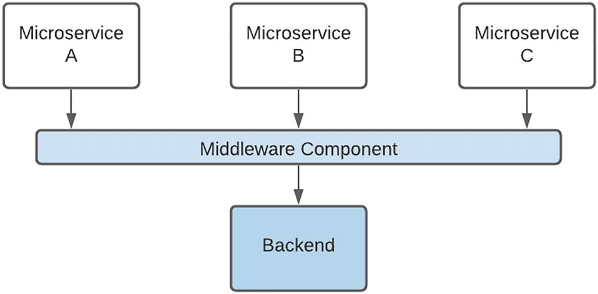

图5-5专用集成适配器
这导致在我们的平台中创建了一种新的微服务类别，我们将其标记为“中间件组件”。本章稍后将讨论我们平台中微服务的各种分类。
固有的好处是这减少了代码重复，并导致更精简、更精简的微服务部署。也就是说，不是将框架的一个版本打包在微服务中，而是框架功能被外部化并通过接口访问。不幸的是，这为进程外执行的潜在性能缺陷打开了大门。我们用来最小化这种影响的解决方案是 Google RPC (gRPC)，下一节将对其进行更详细的讨论。
谷歌远程过程调用 (gRPC)
老实说，当提出使用 gRPC 的建议时，我的下意识反应是尽快将其关闭。我将 RPC 等同于 Microsoft 组件对象模型 (COM)/分布式 COM(DCOM) 和复杂的公共对象请求代理体系结构 (CORBA) 配置的黑暗时期。虽然我很喜欢分布式组件的概念，但我让它工作的经历是痛苦的。我不想让我们的平台受到这种复杂性的影响，因为它会成倍地增加运营开销。所以，我选择坚持走最常走的安全路径。本质上，微服务通信将使用良好的旧 HTTP 实现。毕竟，我们手头有很多可变元素，比如本地 Kubernetes 集群，一想到要在堆栈中添加一个新的、当时相对未经证实的技术元素，我就不寒而栗。
仅仅在 6 个月后，当我浏览了一个基本教程时，我发现 gRPC 有可能彻底改变我们的平台架构。开始教程几分钟后，我难以置信地盯着屏幕，因为一个终端窗口中的客户端请求神奇地出现，最重要的是，很容易出现在另一个终端窗口中。该技术有许多优点，我将很快加以赞扬。我最欣赏的是它的简单性。 gRPC 的核心是一个简单的服务定义，它使用协议缓冲区来定义请求和响应对象。 gRPC 负责处理组件、不同语言和环境之间通信的复杂性。 .proto 定义是客户端和服务器之间唯一的共享组件。这也为我们提供了在我们的堆栈中使用不同语言的机会，这是我们迄今为止从未使用过的。通过大多数语言的客户端库的可用性，这变得更加容易。 gRPC 是使我们能够从共享集成库（图 5-4）过渡到使用专用集成适配器（图 5-5）的关键技术。由于使用了较晚的 HTTP 标准及其传输协议，gRPC 的性能远高于 REST。
远程过程调用 (RPC) 有四种类型：

1. 一元 RPC：客户端发送单个请求并获得单个响应。例如，客户端向服务器请求当前时间。我们的大多数平台组件都使用这种通信方式。我的建议是先从这里开始，如果需要，可以按需探索其他机制。
2. 服务器流式 RPC：它类似于一元 RPC，不同之处在于服务器返回消息流以响应客户端的请求。例如，要从服务器下载二进制文档，客户端会发起对该文件的请求，该文件在服务器上被拆分为块，然后流式传输到客户端进行重新组装以进行处理。我们使用这种机制从企业内容管理系统中检索文档。
3. 客户端流式 RPC：它也类似于一元 RPC，不同之处在于客户端向服务器发送消息流而不是单个消息。例如，要将图像上传到服务器，文件被拆分成块，然后以流的形式发送到服务器，服务器重新组合图像进行处理。我们使用这种方法上传图像以进行光学字符识别 (OCR) 处理。
4. 双向流式RPC：客户端和服务器可以任意顺序读写消息。例如，图像可以由不同的光学字符识别 (OCR) 引擎处理，来自每个引擎的响应在不同的流中返回。

gRPC 是如何简化技术以鼓励大规模采用的一个主要例子。我还认为这次特定的旅程是一个明确的提醒，即对新概念和方法持开放态度，并与先入为主的观念作斗争以发展我们的平台架构。从那以后，我向那些最初建议使用 gRPC 并正确地将其发现和介绍归功于他们的恼怒工程师道歉。话虽如此，我仍保留将技术“武器化”并将其从研发结构带入运营环境的主张。

### 端口转发的力量

由于我们的业务逻辑组件可以利用多个集成微服务来实现特定功能，因此组装解决方案变得越来越具有挑战性。 DevOps 持续集成 (CI) 管道可用于将代码部署到服务器。 CI 流程非常适合在环境之间转换，但对于初始开发任务，我考虑使用 CI 管道，例如与遥远星球上的某人进行对话。你说些什么，等待一段时间，直到收到消息并得到回复，然后再继续。作为一个缺乏耐心的开发人员，我要求能够立即做出和观察变化。这只能使用本地开发环境来实现。
我建立它的第一步是在本地启动每个微服务，在一个单独的终端中，每个在不同的端口上。每个开发会话都需要花费相当多的时间来设置它，但前期时间投资节省了几个小时，因为我不必等待 CI 管道。我为这个设置感到相当自豪，并在打开每个终端选项卡并启动微服务时拍拍自己的背。
来自一位开发人员的专业提示让我震惊了残酷的现实，即我正在努力工作，而不是更聪明。解决方案是使用 Kubernetes 命令行工具 kubectl 的端口转发功能来启动本地侦听器，该侦听器将请求路由到在 Kubernetes 集群中运行的 gRPC pod。这个概念如图 5-6 所示。

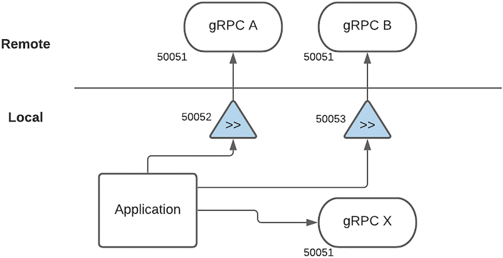

图5-6端口转发连接
这允许开发人员基于以下策略使用本地和远程组件的混合来构建解决方案：

- 远程 gRPC 微服务 pod（A、B）正在侦听端口 50051。这是可能的，因为每个都在单独的容器实例中执行。
- 本地 gRPC 微服务 (X) 侦听端口 50051。由于它在我的本地计算机上运行，因此没有其他本地进程可以使用此端口。
- 本地端口转发进程侦听端口 50052 和 50053，它们分别将流量路由到 gRPC A 和 B。
- 应用程序配置为在端口 50052 上使用服务 A，在端口 50053 上使用服务 B，在 50051 上使用服务 X。

### 分类

并非所有的微服务都是一样的，随着时间的推移，我们创建了不同类别的组件。从以前担任技术架构师的角色开始，我以创建定义明确的分层架构而自豪。每个组件都适合特定的层，就像军事指挥链一样，执行严格的协议——一个组件只能接收来自上层的请求，并且只能将请求转发到下层。尽管架构图很棒，但从开发和执行的角度来看，它们并没有很好地转化。集成到新后端、添加或更新业务逻辑需要对各个层进行更改，这会减慢交付速度并增加运营开销。在解决方案时，在架构中添加新元素也会引起严重的焦虑和架构猜想。
基于试图将组件划分为层的战斗伤痕，我们特意采用了一种相当“松散”的架构模式。就像我们的团队组织结构图一样，我们有一个扁平的结构，没有硬性规定，即只有某些类型的组件才能与其他组件交互。组件之间的关系，如图 5-7 所示，已经有机地演变。重点是功能，核心原则之一是可重用性。

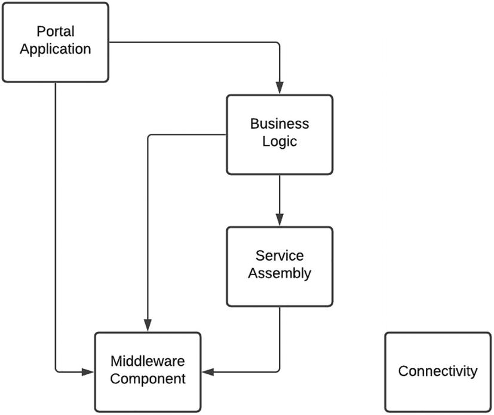

图5-7微服务分类
我们的平台有以下几类微服务：

- 中间件：这些组件的主要目标是将集成封装到后端平台。微服务抽象了 REST、SOAP、本地或基于云的服务，并向消费者提供了一个标准的、基于 GRPC 的接口。这允许我们实施更改，例如移动到更高版本，而不会影响微服务的消费者——只要我们维护服务合同（gRPC 原型定义）。对后端或支持系统的所有访问都必须通过中间件组件完成。这方面的一个例子是数据库访问。与允许任何组件访问数据库的第一代微服务架构相比，只有特定的中间件组件可以集成到我们的数据存储中。这为我们提供了能够轻松切换数据库提供程序以及从文档到关系数据库的吹嘘的权利。后端系统的凭据和配置在各种环境中都包含并隔离在特定的中间件组件中。我们还尽最大努力维护中立的服务合同，不允许将后端数据结构“泄露”给消费者。该组件的一个关键功能是解析、处理特定于系统的响应并将其转换为中性的 gRPC 响应。
- 连接性：这种类型的微服务用作协议通信桥。该组件旨在接受格式 A 的请求并将其转换为格式 B。例如，我们使用 Connectivity 组件来使用来自 Kafka 主题的消息并准备将其写入数据存储。这些组件通常基于事件，并针对高吞吐量、低延迟处理进行了优化。
- 服务组装：这是一个“高阶”微服务，是我们集成平台有机演进的一个例子。在解决新需求时，该团队发现某些逻辑在多个业务逻辑微服务中重复。这提出了一个独特的挑战，因为这不是后端集成逻辑，而是与我们消除代码重复的口头禅相冲突。为了解决这个问题，我们使用了与后端集成相同的流程。也就是说，我们提取了重复的逻辑，将其隔离并具体化为一个新组件，可通过 gRPC 访问。此类组件的分类是集中式服务编排。关键规则是对于特定请求只能使用一个“服务组件”。这是为了最小化微服务之间通信的性能影响。
- 业务逻辑：该微服务负责编排下游组件以实现特定的业务功能。如果必要的工作在前期完成并且下游中间件和服务组件元素使用正确的接口正确构建，那么这些组件的组合速度非常快。话虽如此，不要过度设计支持组件的接口。一个好朋友曾经开玩笑说，一些组织的通用数据模型非常复杂，如果外星人在 3000 年登陆，他们就可以毫无问题地进行交互。我个人的看法是，这为界面增加了不必要的复杂性，希望使其可重用。新用户很有可能会发现界面过于复杂而无法使用并完全绕过它。而是从最小的界面开始，并在必要时进行扩展。如果采用这种方法，则需要调整/更新支持组件的接口以实现新的业务功能。由于记录了有关“业务交易”的信息，因此通常从该组件完成审计。这也是你要为业务活动监控点击的层。例如，业务逻辑组件可以触发“业务级”事件以创建客户帐户，而中间件组件可以发送“系统级”事件以在支持系统中配置请求。

尽管我想声称这种结构从一开始就是我们的目标，但它已经有机地发展了。老实说，随着元素的编写和重新编写，已经有很多开发人员的人日损失了。随着基础结构的建立，引入我们生态系统的新元素会被快速分类和收获。我们有一个相当灵活的架构愿景，以关键原则为基础，最终导致相对统一的部署。

## 平台即服务

图 5-8 中显示的平台即服务 (PaaS) 概念在我们的平台部署中产生了共鸣，我想花一点时间来详细说明。

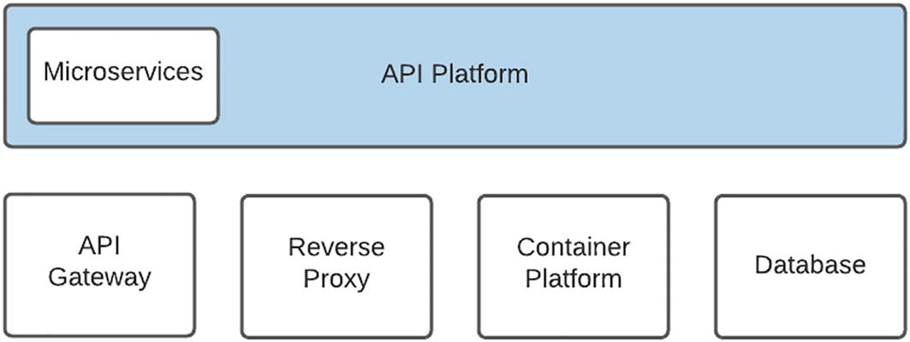

图5-8部署策略演进
正如本章前面提到的，我们在实施之初采用的技术比组织的其他成员领先两到三年。我们在数字实践中的地位以及我们建立新平台的目标为我们提供了这个机会。随着企业缓慢而稳定地迎头赶上，他们理解、整合和管理新应用程序元素的能力也在提高。我也可以毫不掩饰地说，在操作环境中，他们支持它的能力超过了我们自己。原因是焦点。
作为 API Marketplace 团队，我们的主要目标是交付 API 产品。例如，尽管调试数据库可能是特定时间段的风格，但我们可能不会给予数据库真正需要的长期关注。我们敬业的企业团队确实关注这一点，并且在类似工作的组织中拥有更广泛的视野，并且能够更好地协商统一的许可协议，例如，与软件供应商。同样的方法适用于我们软件堆栈中的几乎所有支持元素。数字实践与技术组之间的协议是后者更适合在企业级别支持软件元素。
同样，老实说，放弃其中一些元素一直很困难。就像父母整夜护理新生儿并自豪地看着蹒跚学步的孩子迈出第一步一样，我们也这样做了，并且仍然对环境中的元素有同样的感觉。深夜挖掘神秘的配置文件，试图了解为什么请求没有正确路由，然后自豪地监控平台处理第一个生产流量。同样，帮助我们放弃对这些元素的控制的是他们意识到他们会去一个更好的家，在那里他们会得到必要的关注和支持。一个更有能力与经验丰富的主题工程师和精心规划的未来一起处理他们的需求。

## 平台服务
开发商是雪花。作为自己的开发人员，我怀着最大的敬意说这句话。每个开发人员都是独一无二的，如果我们让三个开发人员构建一个日志记录解决方案，我们很可能会得到四种不同的解决方案——总有那些想要通过提交多个选项来留下深刻印象的超级成功者。从创造力的角度来看，这太棒了。从支持的角度来看，这是一场噩梦，因为操作环境中的一致性和结构是支柱。平台服务是通过提供共享库或包来实现以下目标的连接开发和操作世界的重要机制：

- 日志记录：在 API 环境中，日志与金块一样宝贵。使用容器的一个挑战是日志被写入容器的本地文件系统。如果实例重新启动，这种情况极有可能，或者如果一个容器有多个实例，查找日志就变得非常困难。我们精心打造的日志平台服务的一个关键功能是将日志条目路由到 Elastic Logstash 平台，然后将其编入索引以进行搜索和分析。
- 审计：这可能与大多数开发人员的文档一样受欢迎。良好的审计对于客户支持和报告至关重要。必须对关键业务级别事件（例如支付交易）进行审计以满足组织取证要求。审计实用程序函数或库为所有开发人员提供了一种机制，可以轻松地进行审计，更重要的是，始终如一。
- 错误处理：从操作的角度来看，拥有一个用于错误处理的中心位置非常有用。这提供了一致地处理事件、升级或降级特定条件以及向支持人员触发警报的能力。更高级的功能还可以包括复杂的事件处理，它允许根据指定时间范围内的一系列事件触发更高级别的错误条件。另一个好处是它允许以 HTTP 状态代码、错误代码和消息的形式向消费者提供一致的返回消息。如果我们考虑如果每个开发人员都必须实现自己的错误响应可能会导致碎片化，那么这将是最先实现的平台服务之一。
- 属性管理：属性管理和更新运行时配置的能力是堆栈中最重要但被低估的平台服务之一。例如，考虑后端平台的 API 端点。由于消费应用程序将在从开发到测试到预生产到生产的各种环境中进行，因此后端可能存在不同的端点。这必须针对每个环境进行更新。如果端点配置是静态配置的，那将是糟糕的形式。一个更优雅的解决方案是能够在运行时指定配置。请注意，有不同程度的优雅 - 可以在 Kubernetes 配置映射中指定配置数据。由于你的部署可能由多个微服务组成，每个微服务都有自己的配置映射，这可能会导致配置数据分散在配置映射中。端点只是一个例子。凭证、超时和税收百分比值也应该在运行时进行配置。通过为开发商提供平台服务，间接为运营团队提供了一致的物业管理机制。
- 跟踪：如果你花时间支持集成平台，你就会知道圣杯是跟踪事务从入口、堆栈、后端平台到退出的能力。让我向你保证，在微服务架构中，一个事务可能需要多次跳转才能完成。追溯交易步骤的能力是 API 平台的关键要素。有现成的应用程序性能管理 (APM) 产品可帮助使用探针和在运行时注入跟踪信息来跟踪请求。这些工具非常适合应用程序性能调整和确定系统中断，但不是事务跟踪的灵丹妙药。一个好的跟踪和记录策略本质上是一条金线，它将帮助运营团队通过平台跟踪交易路径。

## 部署架构
我们尝试了上述元素的各种组合来确定最佳配置。这可能是我们部署架构中最有价值的元素之一，因为乐高积木方法使我们能够灵活地以各种形式组装堆栈。自成立以来，我们一直受限于本地基础设施和系统。在下面的部分中，我详细介绍了迁移到云基础架构和托管服务的路线图和关键目标。每次迭代都会增加对下一次的支持，我们已经在每次部署上测试并进一步推动了组织的边界。应该指出的是，我们企业信息和网络安全团队的高度宽容和耐心是我们成功的关键。

### 启动配置

图 5-9 说明了支持我们的 MVP 的启动部署配置。就像孩子们在糖果店里放松一样，我们不顾一切地使用尽可能多的技术元素，并根据需要通过尽可能多的跃点来路由请求以到达目的地。如果企业策略不允许特定系统的防火墙访问，我们采用反弹方法，直到找到替代方法。虽然这肯定会在一个顽强的团队中奏效，但最终结果并不如预期的那样理想。

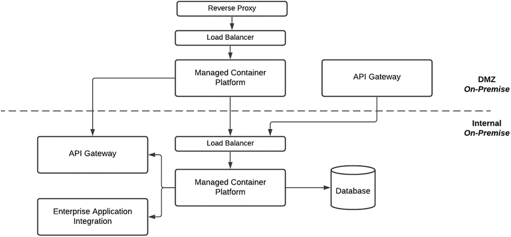

图5-9启动配置
如果构建本地 Kubernetes 集群还不够挑战，我们选择构建两个——一个在内部网络中，另一个在非军事区 (DMZ) 中。我们组织的 DMZ 可以比作一个偏远星球上的监狱殖民地。仅允许通过“跳转框”进行访问，这本质上是一种远程桌面连接。如果幸运的话，你可以获得两个会话中的一个，否则你必须等到现任用户上厕所时可以劫持会话。我仍然记得当一位新的 DevOps 工程师发现他没有 GUI 访问权限来运行他的安装脚本时绝望的表情。在我们的 DMZ 中，就像一个真正的监狱，有不同的安全级别。在我们刚开始的时候，Containers 和 Kubernetes 被认为是极其危险的，一个比其他区域更受限制的新区域是专门为我们构建的。我们在尝试连接 DMZ 内的元素时了解到这一点。解决连接问题的焦点会议类似于在潜艇上发出的命令——请求从测试员转发到协调员，再到网络工程师，再到 DevOps 工程师，然后一直返回。尽管这种经历有时很痛苦，但它也是一个巨大的学习机会，因为它提供了了解组织的网络拓扑结构，更重要的是，如何驾驭它的课程。详细说明请求负载平衡的节点和防火墙访问端口的配置对于使解决方案起作用并将其外包给基础设施设计人员至关重要，虽然可能，但需要数天甚至数周才能完成。
我们选择的方法是卷起袖子，在内部完成第一遍，然后与设计师一起审查，他会纠正并教我们应该如何做。从专业的角度来看，我们通过这次参与与基础设施项目经理、设计师和支持团队建立了良好的关系。通过与这些团队密切合作，我们更好地了解了内部流程、它们存在的原因以及企业中支持团队所承受的巨大压力。我们对内部团队看似很长的解决时间的烦恼很快变成了对他们努力的同情和尊重，并最终为我们的暴躁行为感到尴尬。我们没有抱怨我们认为拖慢了我们的流程和治理，而是选择理解它并与之合作。值得称赞的是，该组织还致力于简化其运营，以更加敏捷地将解决方案推向市场。这种经历虽然令人谦卑，但却是最有价值的经历之一，因为它需要与支持团队建立关系才能实现部署目标。
加速我们交付的一个因素是允许从 DMZ 中的 API 网关实例直接访问我们的微服务（尽管是通过负载均衡器）。企业标准是所有内部 API 都将通过内部网关访问。这将导致定义发布两次，内部和外部。这也会对性能产生影响，因为请求必须遍历另一个停靠点。多节点托管容器平台在 DMZ 中托管了单个授权门户容器应用程序。这种精心部署的理由是，它有助于承受平台启动时的高流量。当我回想起我们最初的前景以及基于情感而非现实做出的设计决策时，我仍然会笑。

### 原样配置
图 5-10 反映了一个更加成熟和负责任的团队的部署配置。实现 MVP 的激动人心的日子已经一去不复返了，我们在平台的技术元素和支持的企业系统方面更加贴近现实。我们也非常幸运地有两位经验丰富的 DevOps 工程师加入我们的团队，他们实际上“知道我们不知道的事情”。凭借他们的经验，一个更加稳定和企业级的 Kubernetes 集群很快就建立起来了——第三次迭代。

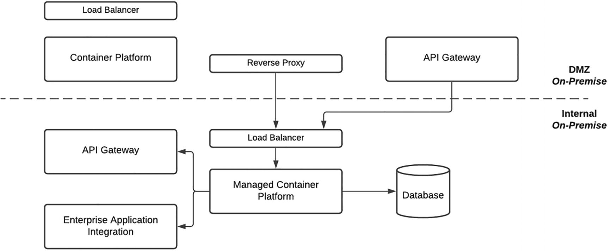

图 5-10As-Is 配置
提出的第一个问题之一是在 DMZ 中需要一个成熟的 Kubernetes 集群。他们耐心地解释，就像父母对想在正餐前吃冰淇淋的孩子所做的那样，可以使用更简单的 Docker 容器平台部署来实现相同的目标。他们对我们 DevOps 平台发展的贡献可以与帮助刚刚发现火的穴居人的更先进的外星种族相提并论。这也是一个很好的教训。如果你要接受新技术，无论是短期 MVP 还是长期转型项目，请务必以合适的技能水平为其提供资源，或者考虑使用该技术的子集或根本不使用它。观察大师的技艺确实是值得一看的，我们的平台很快就有了一个工作管道，团队很快就通过即时消息向托尔金的中土世界的角色发出命令，以发布代码元素。
此部署最重要的发展之一是 Network Security 的许可，允许内部托管的 Web 应用程序通过 DMZ 中的反向代理公开。这一里程碑式的决定允许将托管在 DMZ 容器平台中的单个 Web 应用程序迁移到内部 Kubernetes 集群。这优化了交付，因为可以利用内部管道和网络连接并简化支持，因为可以轻松访问容器和相关日志。我们选择不停用 DMZ 容器平台，目前正在使用它来托管非平台核心的外部应用程序。利用 API Marketplace 功能但实现第三方目标（例如同步帐户交易）的应用程序是该平台的居民。

### 待配置

与最终建立企业级本地 Kubernetes 平台一样具有挑战性和回报，该团队得出的结论是，这项工作很像饲养狮子作为宠物。该平台需要不断的关注和专门的支持，如果不加以控制，可能会吞噬一个没有经验的处理程序。图 5-11 反映了我们下一步部署架构的计划。我们设想使用云基础设施和平台服务运行堆栈的各种元素。鉴于 API Gateway 等组件是共享实例，这将不可避免地是一个阶段性迁移。支持元素，例如代码存储库和 DevOps 管道，也必须迁移到云。

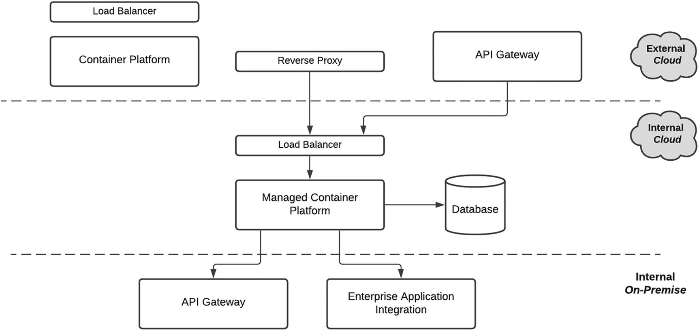

图 5-11 原样配置
对于小型组织的初创公司而言，使用云基础设施或平台服务是一项相对微不足道的任务。本次迭代表明，对于一家成熟的企业来说，这处于困难范围的另一端。有多种考虑因素，例如从本地组件到云并返回到本地的连接性。最终目标是使用云提供商托管的 Kubernetes 服务，该服务将抽象底层基础设施需求，并使我们能够将微服务作为容器来关注。
简而言之，我们将打包一个容器并将其托管在托管容器平台上。托管服务将负责所需的任何安全补丁、升级或基础设施扩展。扩展是一个关键因素，因为我们不必像目前那样维护物理硬件或虚拟机。尽管我们非常期待迁移到云，但我们正在尽最大努力控制我们的期望。如果要经历漫长且有时崎岖的云之旅，那么在新环境中居住和运营可能会带来一系列全新的挑战。我希望学习和成长和我们之前的迭代一样有收获。

## 概括

为 API 市场建立平台架构为我们的团队提供了巨大的学习机会。我们意识到，阅读一篇详细介绍 Netflix 如何部署和操作应用程序的博客文章只是在团队必须自己在一个截然不同的组织环境中完成时才触及皮毛。它让我们能够亲身接触诸如用于容器化的 Docker、用于服务间微服务通信的 gRPC 以及用于容器管理的 Kubernetes 等元素。
我们将入口、服务和 Pod 等深层技术组件视为我们亲手培育和培育的后代。就像有新生儿的父母一样，这段旅程也充满挑战。当我们疲倦地看着对方并想知道我们是否能熬过去时，我们不得不忍受严重的胆汁酸发作。
同样，当我们扩展 pod 副本的数量并轻松通过性能测试时，平台迈出了第一步时，也有一些自豪的时刻。我们的平台，就像一个婴儿，已经成熟，现在正在进入一个新的存在阶段。时间的好处使我们能够更好地了解其运作、优势和劣势。还有很多需要改进和优化，这就是我认为 API 市场是一个活生生的有机体的原因。非洲谚语“养育一个孩子需要一个村庄”总结了我们的经验，因为如果没有企业的帮助和支持，就不可能实现这一目标。
在接下来的章节中，我们将讨论如何使用平台架构来支持市场的 API 产品，从设计到开发再到运营。