# 安全
> 雷内多拉萨米1
> (1)
> 南非豪登省约翰内斯堡

建立 API 市场就像在外国和敌对领土为你的组织建立大使馆。尽管你的意图是崇高的，你的目标是帮助第三方提供商利用你的产品和服务，但它每天都会使企业面临一系列新的攻击媒介。当宝贵的客户和其他敏感数据处于危险之中时，风险非常高。每个人都有责任确保平台的安全和完整性的口头禅不能掉以轻心。任何 API 产品的任何违规行为都可能导致负面的公众情绪，影响其他产品、市场和更大的组织。
安全性不仅仅是 API 的访问机制。从技术、人员和流程的角度来看，将其视为渗透到平台每一层的元素非常重要。幸运的是，有完善的模式和安全标准可以作为指导你的实施的指南。这也是一个很好的平衡行为，因为它必须根据你组织的要求进行定制，而不会影响开发人员的采用。
在接下来的部分中，我将介绍可能适用于 API Marketplace 实施的安全主题，这些主题适用于不同产品、受众和生命周期阶段的 API。正如我们之前关于监管的章节所涵盖的那样，这些标准可能会针对特定行业而有所不同。我们将更详细地研究开放银行的变化。
不断变化的安全环境的动态性使 API 市场更具挑战性和趣味性，因为它需要不断学习和适应以保持安全。我们非常幸运，因为在这方面有大量的文献、产品和观点。知识对于了解景观和保持安全至关重要。

## 跨领域关注
让我们考虑安全性如何影响 API Marketplace 实现中的各个域。

- API：产品的性质决定了API的访问机制。如果需要最终用户同意，则将在企业对消费者 (B2C) 环境中完成。如果目标是允许系统集成，它将在企业对企业 (B2B) 环境中实现。
    网络：当调用遍历平台堆栈中的各种元素时，如何对其进行监视、跟踪和询问？它会在到达后端时保持客户身份，还是会假设一个系统身份？你的平台是否应该与企业的其他部分隔离，这会增加大量的管理开销，但提供细粒度访问控制的好处？
- 应用程序：即使有最好的安全实现，应用程序代码中的漏洞也可能被利用。未经授权访问客户数据和系统的帐户令人毛骨悚然，这些帐户已通过技术团队从未想过的方式受到损害。
- 容器：由于采用模块化方法，这种部署策略非常流行。确定基础映像是否会受到损害非常重要。必须在企业级别明确定义凭证配置和管理策略，以防止临时和松散的实施。应用程序执行的上下文可能看起来微不足道——但是，root 用户或对文件系统的写访问权限可能会在不知不觉中让步给安全后门。适用于传统部署的严格要求也必须适用于容器。
- 基础设施：你的解决方案是在本地硬件上运行还是部署到基础设施即服务 (IasS) 或平台即服务 (PaaS) 公共云解决方案？如果是后者，则必须定义新的安全策略和治理以维护解决方案和平台的完整性。
- 流程：考虑向第三方提供访问 API 的凭据这一看似简单的目标。这是否可以通过电子邮件或受密码保护的文档共享详细信息来实现？这可能会导致喜剧的鸡或蛋场景，因为我们需要确定如何共享包含凭据的文档的密码。如果凭据是通过人为干预生成的，则它已经受到损害。任何体面的安全策略还要求定期更改凭据——这将如何实现——尤其是在与大量第三方提供商打交道时。
- 运营：你的支持人员是否拥有访问后端系统的凭据？如果立即答复是否定的，这是否会妨碍解决支持查询？开发人员可能会通过看似无害的日志语句无意中泄露敏感的客户数据，例如帐号，这些日志语句会波及操作支持工具。

本节的目的不是要吓唬你搁置 API Marketplace 实现的计划，直到你可以完全保证安全的各个方面。目的是突出必须考虑安全性的各个方面。同样，这将根据你企业的技术环境和要求量身定制，并且每个平台在实施方面无疑都是独一无二的。
一种对我们非常有效的方法是积极寻求来自其他领域（信息和网络安全、架构和共享企业服务）的团队进行定期和严格的审查。老实说，反馈并不总是积极的，我们不得不重构我们的解决方案来缓解。我可以向你保证，结果的完整性当然值得付出努力。
在以下部分中，我们将深入探讨冰山一角——API 安全性。这只是我们需要考虑实施 Marketplace 的众多观点之一。了解安全性几乎影响你平台的每个方面将有助于技术团队以正确的方式建立基础元素和核心实践，以防止以后返工。

## API 安全
API 产品的访问机制与消费者类型和解决方案的性质有着内在的联系。它可以被视为与进入你的家大致相同的方式。根据你住的地方，你的门禁社区入口处可能有一名保安，只允许居民进入，你的前门可能有一个重型锁，只有你和你的家人有钥匙，而内部锁门可能从未使用过。在以下部分中，我们将在最适合应用的环境中以及相关受众中审查安全方法。

### 开放 API

这些接口通常提供参考或可公开访问的数据。示例包括服务站的位置、国家/地区代码或指定位置的天气信息。尽管 API 可能根本不需要安全机制，但最好至少使用客户端 ID 和机密，如图 6-1 所示。这有利于了解谁在使用你的 API——通过必需的注册来接收凭证。客户端标识符还可用于提供不同的服务级别，重要的是，可以在不影响其他人的情况下限制对流氓消费者的访问。

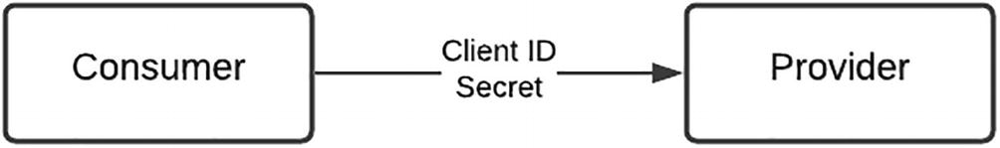

图 6-1Open API 安全模式
这种类型的产品可能有广泛的受众。从学习如何使用 API 的开发人员到寻找可靠参考数据来源的成熟服务提供商。
企业对企业 (B2B)
这些 API 的目的是允许系统到系统的集成。示例包括确定库存可用性、下订单购买产品或与附属公司或合作伙伴共享企业数据的界面。实现此类集成的传统机制需要在消费者和提供商之间以租用线路的形式定制的、专门构建的接口和专用网络基础设施。因此，前期配置对成本和时间产生了重大影响。虽然这可以通过在使用公共网络基础设施的各方之间配置虚拟专用网络 (VPN) 来实现，但也可以通过使用安全证书来简化集成模式，如图 6-2 所示。

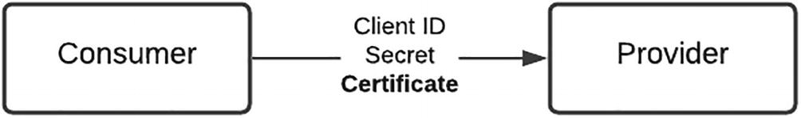

图6-2B2B安全模式
证书和相关密码短语提供了额外的安全层，因为它直接链接到特定的消费者，并且是建立传输层安全 (TLS) 连接的握手中的基本要素。证书可以由 API 主机组织颁发，也可以由要在主机上注册的消费者提供。由于 API 的敏感性，这些类型的解决方案的受众通常是知名合作伙伴或成熟的第三方提供商。

### 企业对消费者 (B2C)

在这种类型的场景中，消费者请求代表最终用户进行交易或访问他们的数据的许可。最终用户向提供商提供允许或拒绝该请求的直接指令。这种交互如图 6-3 所示。一个流行的示例是使用你的社交媒体（Google 或 Facebook）凭据访问合作伙伴网站以建立你的身份。幸运的是，有一个被广泛接受的行业标准，以 OAuth 2.0 的形式提供，它提供了有关最终用户、消费者和提供者之间编排的具体细节。

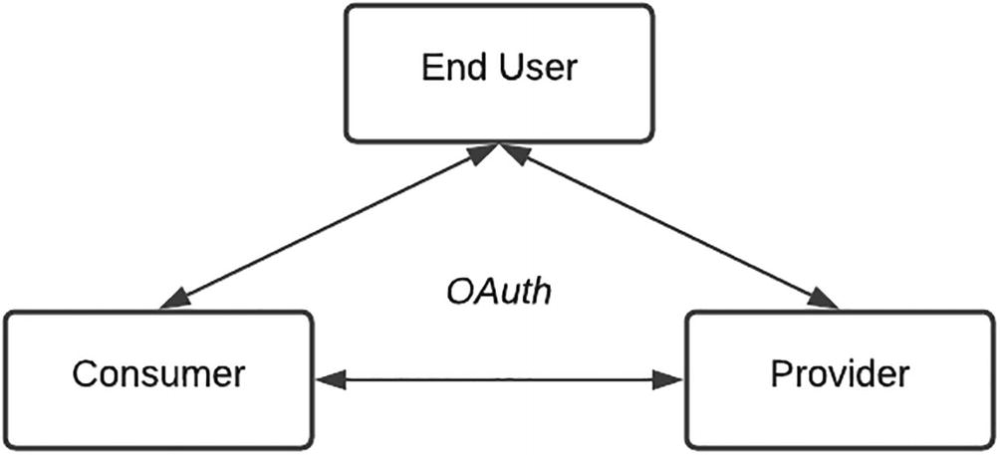

图6-3B2C安全模式
最终用户同意的神奇成分使将这些 API 提供给更广泛的第三方提供商成为可能。即使有严格的安全标准，肆无忌惮的第三方提供商一旦进入你的生态系统，就有机会获取额外的客户数据（一种方法稍后讨论）。对第三方进行筛选和审查以符合你的实施规定的尽职调查标准非常重要。
在下一节中，我们将深入探讨 OAuth 流程的细节，并讨论一些支持的后台流程和变体，以便你更好地了解其操作。

## 身份验证
简而言之，OAuth 是一个开放标准框架，它为应用程序提供保护委托访问的能力。
要了解它的工作原理，请考虑以下场景：
我最喜欢的在线图表服务 Lucidchart 要求我创建一个帐户——如图 6-4 所示。
要创建一个帐户，我本可以通过填写一份提供我的姓名、电子邮件地址和设置密码的在线表格来逐步完成传统的注册过程。然后 Lucidchart 会发送一封带有链接的电子邮件，以确认我是该电子邮件地址的合法所有者。
如果我允许使用 Google 验证我的个人资料，Lucidchart 还允许我使用我的 Google 帐户登录。

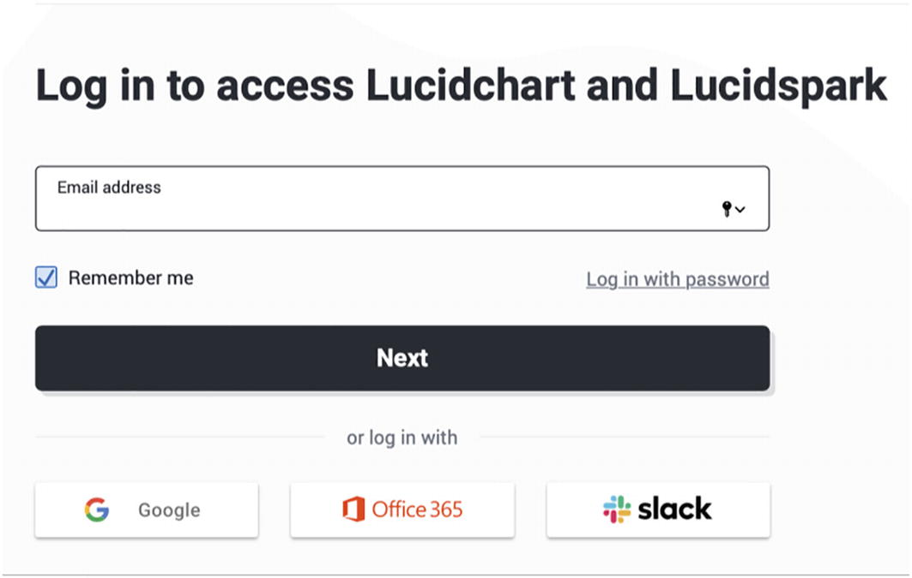

图 6-4Lucidchart 登录
OAuth 是促进此过程的标准，允许最终用户确认身份并为第三方应用程序提供对其数据的受限访问。

### 演员和范围

让我们按照出现的顺序确定这个场景中的演员或参与者：

1. 我是资源所有者，因为我是 Google 帐户的持有人。
2. Lucidchart 是客户端，因为它是需要访问我的个人资料的应用程序。
3. Google 是资源服务器，因为它将我的个人资料存储在其服务器上。

我想谈谈几个关键概念。尽管 Google 在其基础架构上保存了我的个人资料数据，但我是这些数据的所有者。客户数据属于托管组织的传统做法已被逆转，控制权已交还给其合法所有者——最终用户。
范围表示我想与第三方共享的数据范围。在上述场景的上下文中，Lucid 只需要我的姓名、电子邮件地址、语言偏好和 Google 的个人资料图片，如图 6-5 所示。

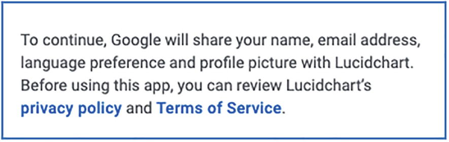

图 6-5 限制访问
虽然我的个人资料图片不是最好的，但我很乐意分享这些信息。如果 Lucidchart 要求完全访问我的 Google 帐户——我会非常不情愿，因为我会提供对我的个人电子邮件、日历和联系人的访问权限。你会注意到，Lucidchart 仅请求访问它特别需要的信息，仅此而已。在 OAuth 上下文中，这是我作为资源所有者很高兴批准的有限范围或许可。
在继续之前，一定要巩固演员、他们扮演的角色和范围的概念。考虑其他场景，例如银行（或与你的行业相关）上下文中的 OAuth，以确定参与者、角色和范围。

### 申请注册

OAuth 文献中经常忽略的一个重要后台过程是客户端和资源服务器之间的交互。资源服务器可能不是我的数据的所有者，而是作为负责任的服务提供商，并且作为其尽职调查过程的一部分，应该只向经过验证的各方发布数据。任何使用 OAuth 访问其 API 的应用程序都必须具有向资源服务器的 OAuth 服务器标识应用程序的授权凭据。客户端将向资源服务器注册一个应用程序，提供有关请求来自何处以及用户应重定向到何处的详细信息。
快速回顾一下这一步：

1. 客户端必须向资源服务器注册一个应用程序。此步骤的目的是建立客户端身份并允许资源服务器跟踪访问请求。
2. 客户端提供有关请求来自何处以及最终用户应重定向到何处的详细信息。这很重要，因为它限制了潜在的中间人攻击。你将注意到，重定向 URI 用于许多交互。
3. 在此过程结束时，资源服务器将以客户端 ID 和客户端密钥的形式向客户端提供凭据。

在一些 API Gateway 产品中，一旦创建了应用程序，就通过订阅的过程来实现对 API 产品的访问。

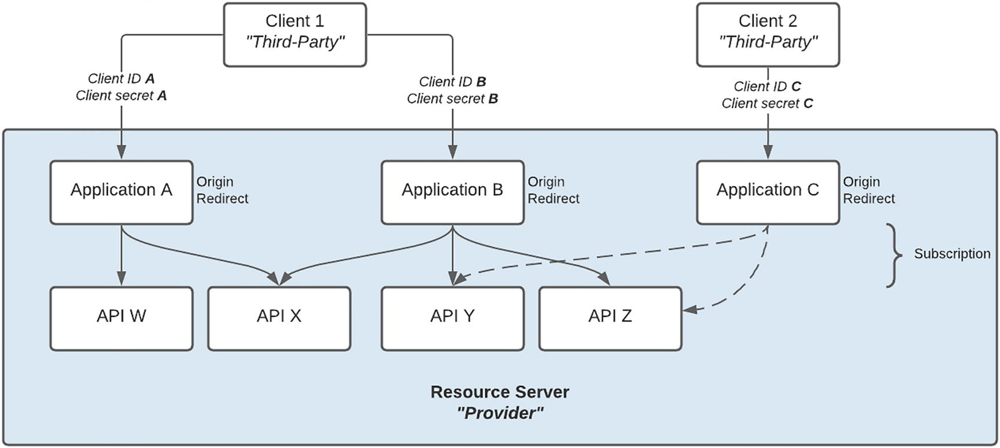

图6-6客户端-资源服务器交互
如图 6-6 所示
一个或多个客户端（第三方）可以向资源服务器（提供商）注册一个或多个应用程序。
每个应用程序都订阅了一个或多个 API。
每个应用程序必须指定（一个或多个）重定向 URI，并且还可以提供（一个或多个）源 URI。
应用程序会以客户端 ID 和客户端密钥的形式发布一组凭据。
根据组织政策，对特定 API 的访问权限可能仅授予授权客户。如图所示，客户端 2 没有订阅（访问）API W 和 X。
图 6-7 概述了应用程序注册过程。

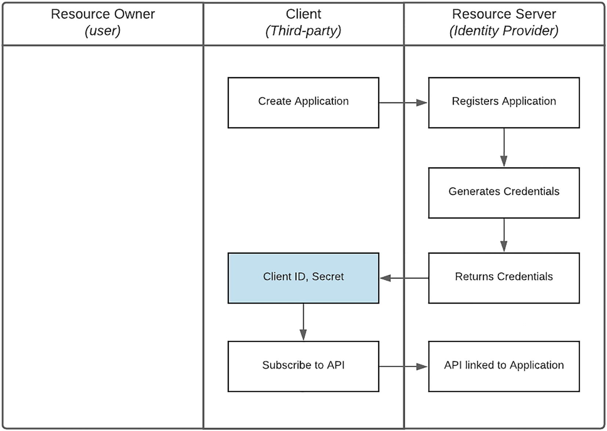

图6-7应用注册流程

1. 客户端创建一个应用程序，提供详细信息（例如电子邮件、所有者和联系人）、元数据（例如解决方案名称、重定向 URI 和客户端证书（如有必要））。
2. 资源服务器使用提供的信息注册应用程序，并生成客户端 ID 和密钥形式的凭据。
3. 凭据返回给第三方。这时候第三方就有了Client ID和Secret。可以更改应用程序的配置数据——例如重定向 URI。但是，客户端 ID 可能是固定的。许多API网关实现只在注册时提供Secret，丢失会重新生成。
4. 此时，客户端将应用程序订阅或链接到资源服务器发布的特定 API 产品。

> 注意上述过程的一部分可以通过自助服务或人工干预来实现。

- 某些 Marketplace 实现可能只向经过验证的消费者提供凭证，即使是沙盒环境也是如此。
- 在 Live 环境中，应用程序的创建和订阅可能由产品所有者完成，以限制第三方使用特定产品。

### 授予类型和访问令牌

既然客户已经注册了一个应用程序并拥有凭据，那么有不同的方法来获得访问权限。在 OAuth 框架中，这称为授权类型。有许多用于不同用例的授权类型，以及用于创建新授权类型的框架。例如，设备代码授权类型可用于从可能受到输入限制的电视机登录到在线服务。
需要强调的是，在开放 API 或 B2B 环境中，客户端 ID 和客户端密钥可能足以访问 API。在 B2C 上下文中，客户端 ID 和机密在由授权类型定义的过程中用于检索访问令牌，这些令牌是用于访问受保护资源的凭据：

#### 客户端凭据（ID/秘密）+ 授权类型 ➤ 访问令牌 ➤ API

典型的访问令牌包含表 6-1 中显示的属性。
表6-1访问令牌属性

| Field         | Presence | 描述                                                         |
| ------------- | -------- | ------------------------------------------------------------ |
| access_token  | Required | 访问令牌字符串                                               |
| token_type    | Required | 这是令牌的类型，通常只是字符串“Bearer”，表示拥有此令牌的任何一方都可以使用它 |
| expires_in    | Optional | 授予令牌的持续时间                                           |
| refresh_token | Optional | 如果访问令牌过期，则用于请求新的访问令牌                     |
| scope         | Optional | 表示授予的访问范围                                           |

在以下部分中，我们将深入研究为以下授权类型检索访问令牌的过程：

- 客户凭证
- 授权码
- 刷新令牌

### 客户凭证

图 6-8 详细说明了客户端凭据流程。

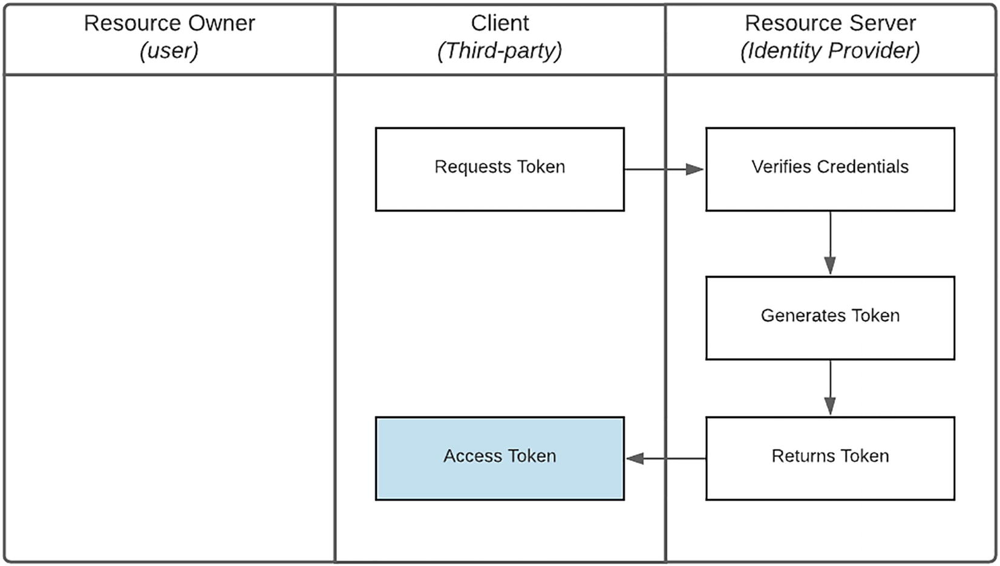

图 6-8Client Credentials 流程

1. 客户端发起访问令牌请求，提供
    1. 凭据：客户端 ID 和密钥
    2. 授予类型的 client_credentials
    3. Scope：Client想要访问的资源
2. 资源服务器将定位客户端 ID 引用的应用程序，验证 Secret 是否匹配，如果订阅了请求的 API（在范围中指定），将返回一个访问令牌。
3. 这时候，第三方就有了一个Access Token。请注意，令牌可能具有指定的有效期，通常为 3,599 秒。

### 授权码

图 6-9 详细说明了授权码流程。

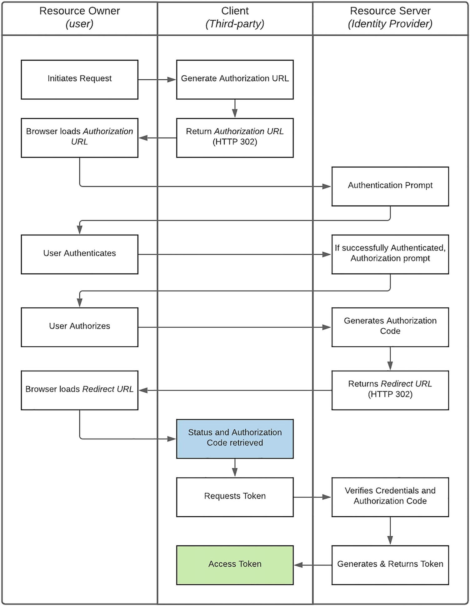

图6-9授权码流程

1. 该请求由资源所有者发起。正如我们之前的场景中所详述的那样，我（资源所有者）使用我的 Google（资源服务器）配置文件请求访问 Lucidchart（客户端）。
2. 客户端构造一个授权 URL，提供
    1. 凭据：客户端 ID（仅限）——指示请求的来源。
    2. 指示需要授权代码的代码的响应类型。
    3. 重定向 URI：确定用户在完成授权流程后应重定向到的位置。 请注意，这必须与为应用程序配置的重定向 URI 匹配。
    4. 范围：识别客户端想要代表用户访问的资源。
    5. 状态：用于维护授权请求和授权服务器响应之间的状态。
3. 然后，客户端通过 HTTP 302 将用户重定向到构造的授权 URL。这是该过程中的关键步骤，因为它需要客户端和资源服务器之间的直接交互。
4. 资源服务器验证客户端 ID、重定向 URI 和请求的范围，如果有效，则提示资源所有者确认身份（身份验证）并提供同意（授权）。
5. 资源所有者对自己进行身份验证并授权客户端访问所请求的资源。在我们的场景中，我将提供我的 Google 用户名和密码，并允许 Lucid 访问我个人资料的特定元素。
6. 在资源所有者成功认证和授权后，资源服务器生成一个授权码。如果不是，则使用指示失败原因的错误代替。
7. 资源服务器将授权代码或错误与状态参数一起附加到重定向 URI，并再次通过 HTTP 302 将用户重定向到客户端。
8. 重定向到客户端后，将确定授权请求的状态——如果成功则为授权代码，否则为错误。
9. 如果成功，客户端发起访问令牌的请求，提供
    1. 凭据：客户端 ID 和密钥
    2. 授权类型的授权_代码
    3. 授权码
    4. 重定向 URI：必须匹配为应用程序配置的内容
10. 资源服务器将定位客户端 ID 引用的应用程序，验证 Secret 和重定向 URI 是否匹配，如果提供了有效的授权代码，则将返回访问令牌。
11. 返回的访问令牌将包含 refresh_token 属性。
12. access_token 可用于调用已注册的应用程序订阅的 API。

### 刷新令牌

由于访问令牌的有效期通常很短，通常为一小时，因此刷新令牌授予类型用于长时间访问资源。这也避免了最终用户在访问令牌过期后必须重新进行身份验证和重新授权的不便。需要注意的是，在一些场景中，比如一次性支付，token 可能只在特定的时间段内（甚至比 expires_in 值更短）并且只能使用一次。
为了防止永久访问，固定刷新令牌的持续时间很重要。例如，令牌最多只能刷新 6 个月，从发布第一个访问令牌开始 - 之后最终用户将不得不重新验证和重新授权访问。
图 6-10 详细说明了刷新令牌流程。

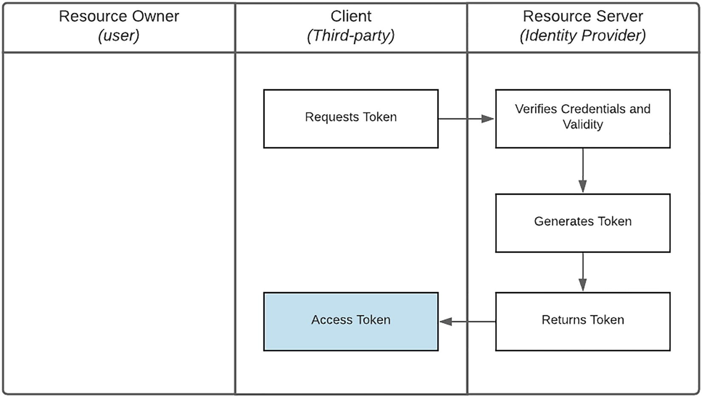

图6-10Refresh Token流程

1. 客户端发起对新访问令牌的请求，提供
    1. 凭据：客户端 ID 和密钥
    2. 授权类型 refresh_token
    3. 重定向 URI：为应用程序配置
    4. 刷新令牌：在最后生成的访问令牌中作为属性返回

2. Resource Server 会定位到Client ID 引用的Application，验证Secret 和redirect URI 是否匹配，如果在刷新有效期内，则返回Access Token。
2. 此时，第三方有一个Access Token。请注意，access_token 可能具有指定的有效期，通常为 3,599 秒。 refresh_token 的有效期更长。
2. 返回的新访问令牌还将包含一个 refresh_token 属性，可用于下一次刷新请求。请注意，这只能使用一次。

### 权限撤销

资源服务器的一个关键职责是为资源所有者提供对先前授予的授权的可见性和控制权。最终用户应该能够轻松查看谁有权访问、何时被授予以及可以访问什么。更重要的是，能够撤销特定客户端的访问权限。这通常是通过用户管理门户实现的。继续 Lucidchart 场景，我可以使用 Google 提供的 Account Administration 页面，查找哪些第三方可以访问我的帐户，并删除该访问权限——如图 6-11 所示。

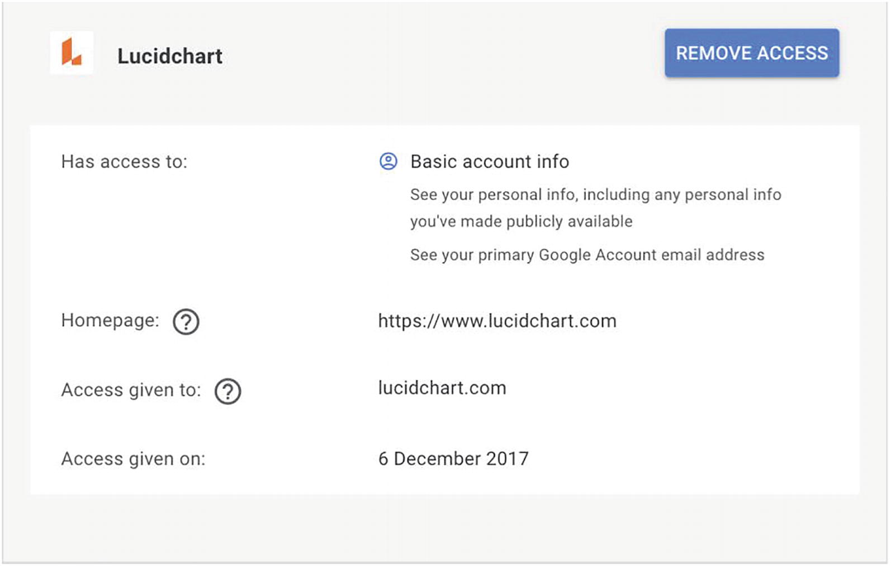

图6-11权限管理
某些第三方还可能为最终用户提供撤销访问权限或取消链接帐户的功能。客户端（第三方）发起对资源服务器的令牌撤销端点的调用作为此事件的通知并使授权和相关令牌无效：

- 凭据：客户端 ID 和密钥
- 刷新令牌：在最后生成的访问令牌中作为属性返回

### 变化：开放银行

OAuth 标准为大多数安全上下文的委派访问提供了很好的基础。由于以下一个或多个原因，在开放银行环境中确认客户同意需要定制或量身定制的方法：

- 它需要对最终用户信息的细粒度访问。例如，客户可能只允许第三方访问特定的银行账户。
- 由于数据的动态特性，需要自定义同意机制。继续上面的例子，一旦客户通过身份验证，他们的帐户可以被检索并显示在自定义视图中以进行授权。
- 两阶段机制对于验证第三方是否执行客户的确切指令或意图至关重要。

这个过程的核心是意图的概念：

1. 客户端向资源服务器注册一个意图，表明他们想要做什么。
2. 资源所有者对意图进行授权，同时还指定意图中记录的可以访问的确切资源。
3. 资源服务器在执行来自客户端的请求之前，确认请求与资源所有者授权的原始意图和资源匹配。

为了实现上述目的，使用了客户端凭据和授权代码 OAuth 授权类型的组合，如图 6-12 所示。这显示了如何为自定义实现组合 OAuth 标准的元素。

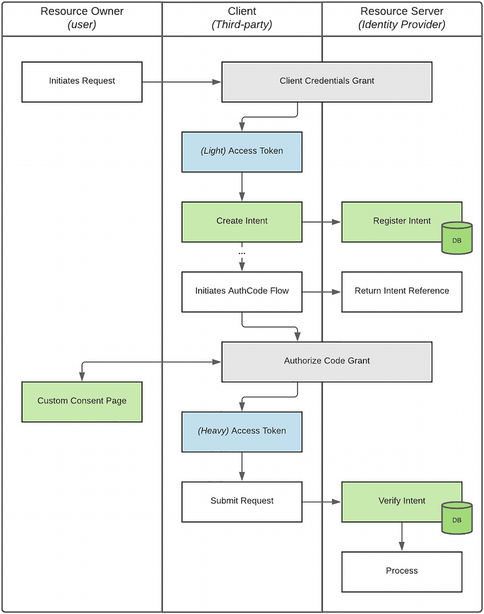

图 6-12OAuth 流程的 Open Banking 变体
该过程的快速概述：

- 客户端使用客户端凭据授权来确认其身份和访问特定 API 产品的能力，并接收访问令牌。我们将此代币称为“轻量级”代币。
- 然后，客户端使用轻令牌向资源服务器注册一个意图，并接收一个意图标识符作为参考。
- 客户端在授权 URL 中包含意图标识符并启动自定义授权代码流。
- 这允许资源服务器在收到来自资源所有者重定向的请求时定位原始意图。
- 可以围绕注册的意图类型构建自定义同意页面，从而允许资源所有者更好地控制共享哪些数据。
- 例如，要付款，可以提供一个帐户列表并选择一个特定的帐户。由于交互直接在资源所有者和资源服务器之间进行，因此客户端无法访问敏感数据。
- 在成功授权、收到代码和授权代码授权的最后一段时，客户端检索一个新的访问令牌，称为“重”令牌。
- “重”分类的原因是令牌本质上与意图绑定。使用此令牌向资源服务器发出的后续请求将使用意图作为参考进行处理。
- 客户端将这个“重”令牌用于对资源服务器的 API 调用。
- 后续刷新令牌（如果允许）也与此意图相关联。

正如你将在上面注意到的，虽然流程中有其他步骤，但使用意图提供了额外的安全性

1. 允许更细粒度的资源控制
2. 当资源服务器在处理客户端请求之前将指令与意图进行比较时，提供第二个策略执行点

### 漏洞
正如你可能已经观察到的，授权代码流由使用 HTTP 302 实现的重定向支持。虽然它的功能很重要，但它提供了攻击的机会，并且是对流程完整性的最大威胁之一。毫无疑问，存在拦截和重定向网络数据包或创建虚假 DNS 记录的复杂机制，经验丰富的黑客可以利用这些机制来利用重定向。由于我的职业主要致力于开发而不是黑客攻击，因此我在图 6-13 中展示了一种简单得多的方法，使不诚实的第三方可以通过网络钓鱼或破坏最终用户的凭据。

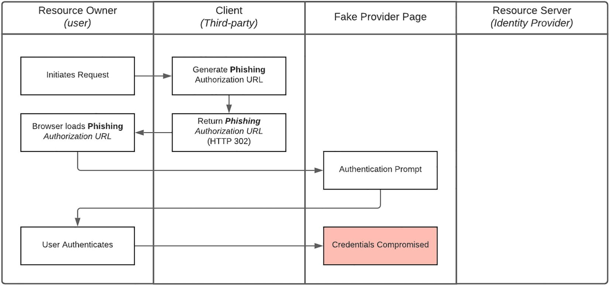

图6-13凭证钓鱼流程
如图所示，作为授权代码流的一部分，客户端可以恶意地将最终用户重定向到一个虚假的提供者页面，该页面可以很容易地构造成看起来像资源服务器的页面——并且还托管在一个与它密切相关的域上。与原版相符。然后，最终用户会将他们的凭据输入到受感染的站点中。实现这一目标所需的技术敏锐度是基本的 Web 开发和托管知识，远低于必须了解 TCP/IP 堆栈或 DNS。重要且有趣的是，这种攻击的潜在补救措施是在允许第三方参与你的生态系统之前验证第三方的完整性的流程更新。

## OWASP

开放 Web 应用程序安全项目 (OWASP) 是一个非营利基金会，致力于通过其社区主导的开源软件项目、全球数百个分会、数万名成员以及托管本地和全球会议。

### 安全 10 强

OWASP [https://owasp.org/www-project-api-security] 确定的 10 大 API 安全风险列出了以下内容：

- 损坏的对象级别授权 (API1)：API 倾向于公开处理对象标识符的端点，从而造成广泛的攻击面级别访问控制问题。在使用用户输入访问数据源的每个函数中都应考虑对象级授权检查。
- 损坏的用户身份验证 (API2)：身份验证机制经常被错误地实现，允许攻击者破坏身份验证令牌或利用实现缺陷来暂时或永久地假设其他用户的身份。损害系统识别客户端/用户的能力会损害 API 的整体安全性。
- 过度数据暴露（API3）：期待通用实现，开发人员倾向于在不考虑个体敏感性的情况下暴露所有对象属性，依赖客户端在将数据显示给用户之前执行数据过滤。
- 缺乏资源和速率限制 (API4)：API 通常不会对客户端/用户可以请求的资源的大小或数量施加任何限制。这不仅会影响 API 服务器的性能，导致拒绝服务 (DoS)，而且还会为诸如蛮力之类的身份验证缺陷敞开大门。
- Broken Function Level Authorization (API5)：具有不同层次结构、组和角色的复杂访问控制策略，以及管理和常规功能之间的不明确分离，往往会导致授权缺陷。通过利用这些问题，攻击者可以访问其他用户的资源和/或管理功能。
- 批量分配 (API6)：将客户端提供的数据（例如 JSON）绑定到数据模型，没有基于允许列表的适当属性过滤，通常会导致批量分配。猜测对象属性、探索其他 API 端点、阅读文档或在请求负载中提供其他对象属性都允许攻击者修改他们不应该修改的对象属性。
- 安全错误配置 (API7)：安全错误配置通常是由于不安全的默认配置、不完整或临时配置、开放云存储、错误配置的 HTTP 标头、不必要的 HTTP 方法、宽松的跨源资源共享 (CORS) 以及包含以下内容的详细错误消息造成的敏感信息。
- 注入 (API8)：注入缺陷，例如 SQL、NoSQL、命令注入等，在将不受信任的数据作为命令或查询的一部分发送到解释器时发生。攻击者的恶意数据可以诱使解释器在未经适当授权的情况下执行意外命令或访问数据。
- 不正确的资产管理 (API9)：API 往往比传统的 Web 应用程序暴露更多的端点，这使得正确和更新的文档变得非常重要。适当的主机和已部署的 API 版本清单在缓解 API 版本已弃用和调试端点暴露等问题方面也发挥着重要作用。
- 日志记录和监控不足 (API10)：日志记录和监控不足，再加上与事件响应的集成缺失或无效，使攻击者可以进一步攻击系统，保持持久性，转向更多系统来篡改、提取或破坏数据。大多数违规研究表明检测违规的时间超过 200 天，通常由外部方而不是内部流程或监控检测到。

### 建议
为了解决过度数据暴露 (API3) 的风险，我们使用以下指南：

- 详细审查来自 API 的响应以确认它包含有效数据。
- 始终过滤服务器上的敏感数据。
- 避免使用通用方法，例如 toJSON() 和 toString()。而是选择要返回的特定属性。
- 实施基于架构的响应验证机制来定义和强制执行 API 方法返回的数据，包括错误。
- 保持界面尽可能简单。仅提供所需的信息。如果需要，使用版本控制来扩展 API。

大多数 API 网关提供开箱即用的功能来启用资源和速率限制，通常对每个消费者的不同服务质量进行细粒度控制。这应该被用来缓解资源不足和速率限制 (API4)。
为了防止注入 (API8)，逻辑编排微服务和集成组件之间的角色有明确的分离，如平台架构中所述。此措施限制了 API 输入直接用于数据库查询的可能性。
接下来将讨论的密集安全审查过程对识别和解决潜在问题有很大帮助。

## 安全审查

应用程序扫描工具生成的安全报告有时会长达数十或数百页。除了必须让紧张的交付线索放心，问题并不像看起来那么严重，通常感觉就像我们正在经历一场挑战。非常有帮助的是，认识到在内部测试期间发现可以修复的问题要好得多，而不是在你最喜欢的技术新闻网站上阅读有关 API 安全漏洞的信息。图 6-14 概述了我们详细且不妥协的过程。

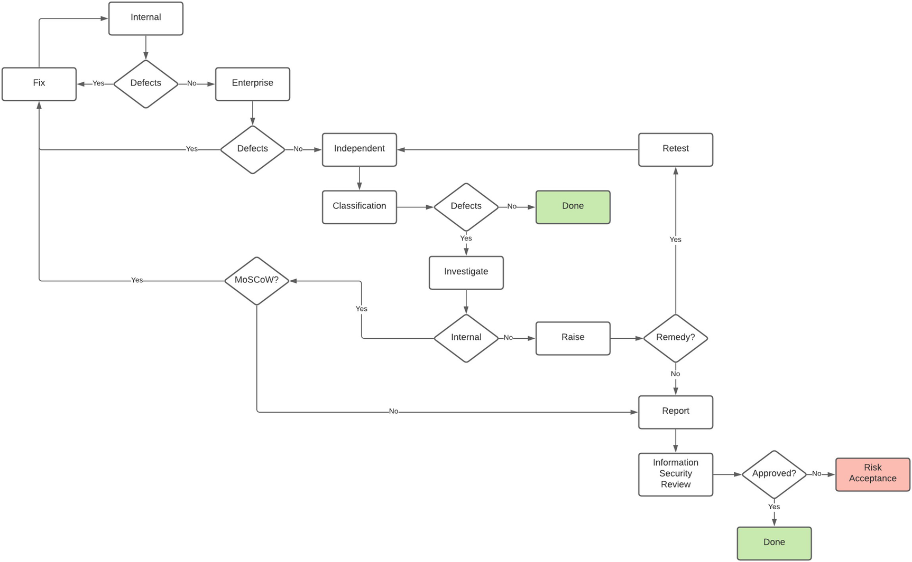

图6-14安全审核流程
一些快速的亮点：

- 安全测试由来自不同能力的三个团队进行。从之前的经验中，我们了解到，使用更严格的输入验证策略，我们可以剪掉 80 多页的安全报告。为了识别此类问题并防止我们的交付主管不必要的焦虑，在我们要求企业安全团队进行审查之前，我们的内部质量保证团队首先会进行安全测试。此后，由独立的外部安全顾问安排测试。
- 外部测试提供的安全报告由信息安全部门审查和重新分类——其严重性通常会提高一个级别。即，中到高，高到临界。
- 为了帮助确定修复的优先级，发现的问题或缺陷使用 MoSCoW（必须有、应该有、可能有或不会有）方法进行分类。
- 确定的问题也可能超出团队的控制范围——例如共享企业组件所需的配置更新。在这些情况下，当外部团队正在调查和解决问题时，我们仍然保留问题的所有权。
- 重新分类的安全报告归 Marketplace 团队所有，内部和外部的解决方案和更新都包含在交付周期中。
- 应用更新后，通常会重新运行安全测试，以确认解决方案并识别修复程序中可能引入的新问题。

## 概括

在本章中，我们首先更广泛地了解安全性在 API 市场实现中的重要性。如前所述，它涉及到每个领域和适当的关注，重要的是尊重这一目的对于你的实施的完整性和寿命至关重要。然后我们缩小了 API 安全性并考虑了三种集成模式。第一个是开放 API，它通常可以访问，但需要凭据来跟踪和控制第三方访问。企业对企业 (B2B) API 用于实现系统到系统的集成，仅限于更小、更熟悉的受众。使用证书作为安全机制可以简化这种集成模式的网络要求。
最后，我们讨论了最流行和最广泛使用的企业对消费者 (B2C) 模式。通过这种模式，最终用户同意第三方代表他们发起请求或访问他们的数据。为了了解如何使用行业标准实现这一点，我们深入研究了 OAuth 流程的重要细节。凭借对参与者、范围、授权类型和访问令牌的深入了解，我们审查了应用程序注册等支持流程，并逐步了解了客户端凭据、授权代码和刷新令牌授权类型。撤销许可的能力极其重要，并且是任何实施的不可协商的要求。
然后，我们介绍了用于开放银行业务的 OAuth 的变体，并观察了意图如何在这种方法中发挥关键作用。还讨论了破坏最终用户凭据的方法，我鼓励你继续积极寻找其他漏洞利用机会。这将使你的团队能够先发制人地解决这些问题——解决方案可能是更新流程而不是技术。
我们检查了开放 Web 应用程序安全项目 (OWASP) 前 10 个 API 风险，并建议如何通过更智能的设计、谨慎的开发和利用我们堆栈中产品的功能来解决其中的一些风险。最后，我们运行了迭代安全审查过程的挑战，这缓慢但肯定有助于识别和解决我们装甲中的漏洞。
在我的职业生涯中，我非常幸运地与对安全和我一样对集成充满热情的高技能人员一起工作。我会鼓励你去寻找这些知识巨著，坐在他们的脚下，认真而谦虚地倾听，同时他们无疑会指出你实施中的缺陷，并使用他们明智的建议让你的平台做好战斗准备。由于 API 市场的性质和运营领域，它将不断受到攻击。