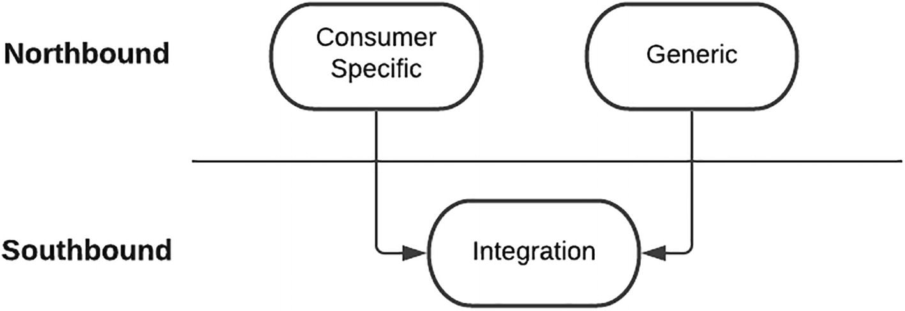
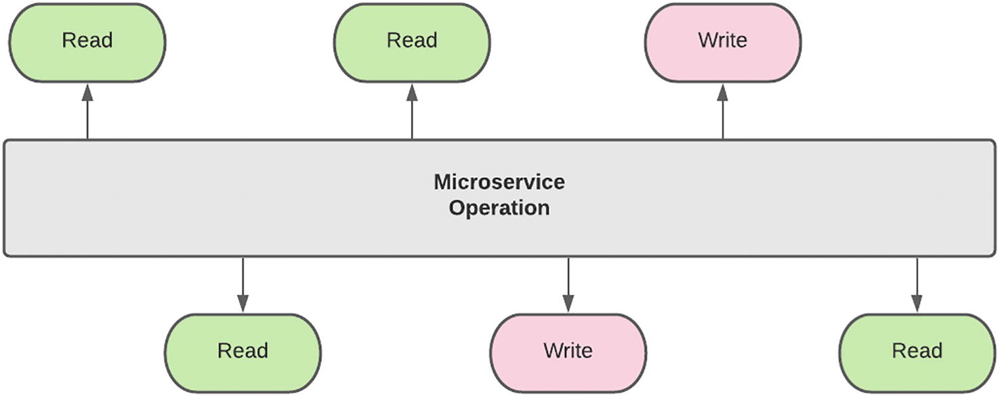
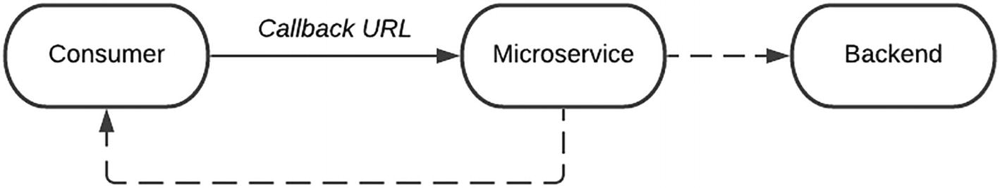
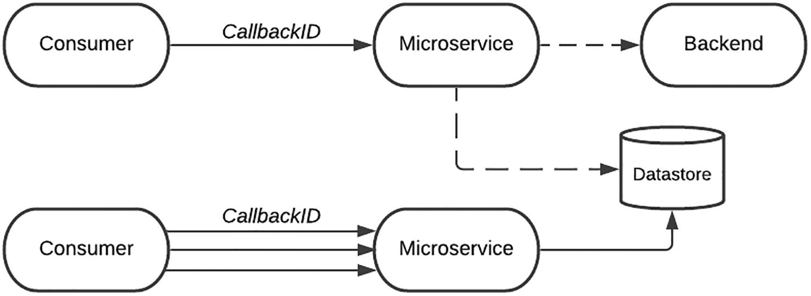
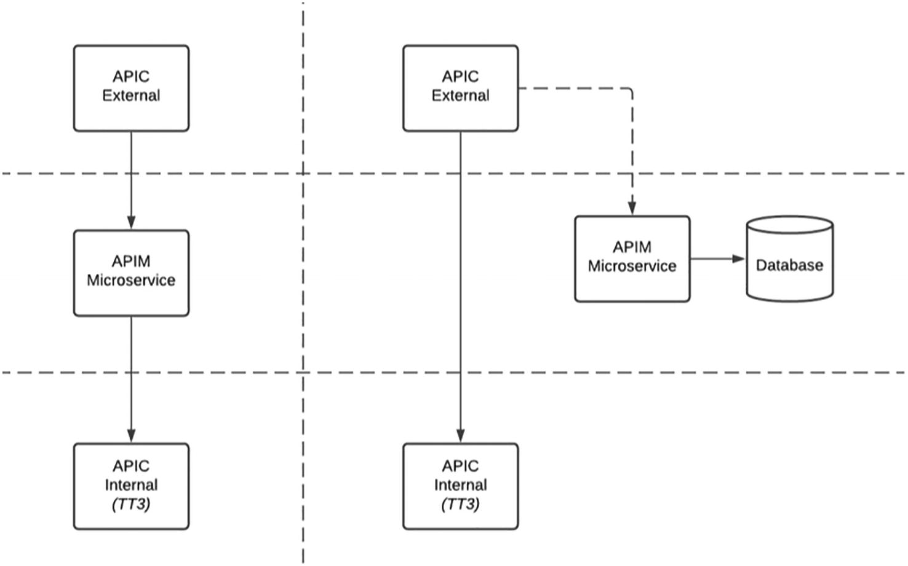

# API设计
> 雷内多拉萨米1
> (1)
> 南非豪登省约翰内斯堡

为 API 设计接口是一项可以从多个角度考虑的活动。对于开发人员来说，这是相当简单的，因为输入和输出的集合是明确定义的，如果没有，可以在流程的后期轻松添加。对于企业架构师来说，这是一个类似于 Atlas 将世界扛在肩上的负担，因为界面应该经过深思熟虑，现在和未来的多个消费者都可以重用，并且应该能够承受来自后端提供商。对于 API 产品负责人来说，界面应该干净、清晰，并且易于第三方使用。监管机构将定义一个界面，以满足广泛的消费者需求，这些消费者需要前美国宇航局阿波罗工程师起草的复杂文档。
一方面，设计是开发生命周期中极其重要的阶段，做出正确决策的严重性可能导致分析瘫痪。当产品将被外部第三方供应商消费时，系统会引入额外的压力，因为无法包含更改或更新。在活跃的 API 生态系统中，设计不当的界面会导致开发人员采用率低，并可能对产品和市场造成声誉损害。
另一方面，API 虽然很重要，但只是达到目的的一种手段，尽快发布规范将减轻来自要求苛刻的消费者的压力。这可能会产生一个只满足一个消费者的自定义界面，但这种不公平可以在以后解决——需要更多的时间和精力。
我们 Marketplace 中的 API 是从多个角度构建的，并且位于上述范围内的各个点。这是一个我们仍在完善和优化的过程。在本章中，我将分享我们的经验、学习和陷阱，让你更深入地了解我们的设计过程。这些可以适应你的 Marketplace 实施。从约定俗成的角度，我将外部方消费的接口称为北向接口，将Marketplace消费的后端接口称为南向接口。

## 设计策略
在我们开始讨论如何定义 API 之前，让我们暂停一下并考虑以下问题：
你的 API 增加了什么价值？
尽量诚实地回答这个问题——没有正确或错误的回答，因为它最终归结为企业的要求。组织是否打算在市场上建立存在感，这只是发布 API 的一个勾选练习？在这种情况下，可以增加的隐含价值是组织满足法规或合规性要求。或者目标是创造比竞争对手更多的 API 产品 - 优先考虑数量以增加吹牛的权利而不是质量。在这种情况下，你的市场看起来更接近热门调查的右上角象限。也许这是一个试点计划，只有一个确认的消费者，要求 API 以后会被更多的受众使用。短期的价值是启用单个消费者，而中长期的价值是启用多个消费者。将你的组织建立为平台提供商，为第三方提供商提供一个新的数字渠道，以利用你企业的能力来构建和启动他们的应用程序和服务，这也可能是一种真正的回应。这可能会为组织带来长期价值，因为它会创造新的收入流。
反思这个问题非常重要，因为它本质上推动了 API 设计背后的策略。例如，监管要求可能迫使你的组织公开 API 供第三方使用。你的 Marketplace 的第一次迭代可能是在监管截止日期前实现这一目标。下面概述的策略将用于构建你的 API 产品，由 API Marketplace 的目标驱动。深入了解必须在何处进行权衡将有助于塑造你的 API 的身份、其采用以及以后迭代的改进领域。

### 自上而下，预定义

这些是所有组织都必须遵守的标准 API。支付服务指令 (PSD2) 就是一个例子。对消费者的好处是集成解决方案构建一次，可以在不同的提供者之间重复使用。提供者的优点是接口是预定义的，只需要添加实现。此类集成的挑战在于北向（面向外部）和南向（后端）接口之间的映射。由于北向接口设计得尽可能通用，通常有广泛的输入和无数的组合。
根据我们实现PSD2接口的经验，我们发现南向接口属于一个小众的大型机应用程序，多年来一直忠实地服务于组织的特定需求。我们不令人羡慕的任务就是将一侧的数百条细光纤束与另一侧的数十条真空管连接起来。在为这种类型的集成桥接两个接口的映射练习结束时，当我在预先打包的产品组装结束时发现额外的组件时，我通常会有同样的感觉。建立映射已正确完成的信心的方法是严格测试解决方案并让后端提供商确认请求已正确接收和处理。
这种类型的界面的另一个缺点是组织失去了其独特的身份。消费者会理所当然地争辩说，每个提供商的独特身份会显着增加他们的开发时间。从供应商的角度来看，标准化很难在人群中脱颖而出。你的 API 产品只是成为提供者目录中的新端点。大型机解决方案虽然陈旧，但可能具有第三方可以利用的一些奇妙功能。不幸的是，这束阳光会被跨越界面的均匀性毯子覆盖。

### 自下而上
大多数北向接口由其南向接口驱动。与预定义的 API 相比，这些是在后端功能的图像中伪造的产品。上一节中提到的独特而美丽的功能性阳光，否则会被标准界面所窒息，却可以为世界所见和所消费。现在面临的挑战是确定要公开哪些功能和数据。此外，必须特别注意避免从南向接口泄漏数据结构。也就是说，外部消费者不应受到后端提供者细微变化的影响。
从对我们的 API 目录的诚实审查来看，有一些我并不完全引以为豪。我们的开发者门户中也没有这些。在你的 Marketplace 之旅中，API 生产线可能会跟不上消费者的需求。尽管我认为这是一个令人羡慕的职位，但这有时会导致短期决策不佳并产生长期后果。
我清楚地记得与产品负责人就关键 Marketplace 消费者迫切需要的 API 进行的讨论。该团队一直在全力以赴，没有能力收集 API，尤其是在规定的时间表内。做出的令人疲倦的决定是我们将发布 API 的 0.00001 版本。这转化为本质上是一个直通接口。我们的条件是让我们在做出如此糟糕的决定时保留一丝自豪感，即该 API 将在稍后进行修订。
大多数交付团队都知道，到达运营环境的大多数解决方案几乎不可能逆转。幸运的是，后端平台的数据模型是我在集成职业中见过的最糟糕的模型之一。从我的平台发布的 API 的使用者可能对我发布给他们的接口的感觉与我对我使用的接口的感觉相同。创建此类 API 产品的挑战在于，在整个生命周期内拥有和维护成为团队的责任。即使创建了新版本，如果新界面稳定，消费者也极不可能将其集成更新到新界面。
为了避免在你的平台上出现这种情况，重要的是要有项目发起人的大力支持，他们可以保护团队免受消费者压力。随着我们的平台越来越成熟，我们已经能够以更好的方式处理这种性质的请求。我们当前的交付过程需要重新确定当前正在开发的解决方案的优先级，或者可能需要稍后安排所需的功能。虽然不受欢迎，但预先说“不”可能会带来更好的长期解决方案。将定义的流程纳入我们的需求管道还可以让消费者更有效地计划，从而显着减少最后一刻的请求。

### 消费者驱动
这种类型的设计策略通常从单个消费者的需求开始，并带有一个关键指令，即接口应该设计为在未来支持多个消费者。我们的平台最近的任务是弥合新的外部托管数字平台与核心内部企业能力之间的鸿沟。在项目开始时，Marketplace 团队庄严宣誓要构建可供其他第三方提供商重复使用的北向接口。我们对这一目标的承诺可以从我们的 API 命名约定和标准中看出。它的设计方式可以让其他各方轻松消费。
这一使命目标提供的推动力导致了与组织中几乎每个后端平台的南向集成。当后端提供商向我们提出挑战时，我们让步，让数字平台巨头的势头超越他们。
我们很快意识到主宰并不是脆弱的生物，因为它们也会影响我们的交付过程。随着我们的团队收到越来越多的消费者特定业务需求，我们努力维护通用、可重用接口的神圣性。我们试图站稳脚跟，并明确表示这些变化会影响 API 的可重用性和可扩展性。我大脑的左侧逻辑同意做出改变的决定，因为当时只有一个消费者。情感的正确一面被摧毁，因为这将导致我们违背我们创造可重复使用产品的承诺。
我们试图通过首先隔离有效载荷，然后隔离特定于消费者的操作来减轻这种传染的传播，以期在稍后的时间点进行康复。不幸的是，我们没有成功，目前的预测是我们目录中特定 API 的截肢。这可能看起来有点戏剧性，我希望你在有类似经历时回忆起这个类比。
我想传达给你的关键信息是——如果你的旅程从一个消费者开始，请谨慎选择你的战斗。如图 7-1 所示，务必将任何关键的后端南向集成抽象为可重用的集成组件。对于你的北向接口，确定哪些可以隔离并将它们拆分为通用接口。例如，参考数据 API 是作为通用接口的主要候选者。与其为可能永远不会出现的未来消费者设计，不如通过发布满足其需求的特定 API 来对你的主要消费者表示必要的尊重。

图 7-1 特定于消费者的集成方法
帮助我得出这个结论的是，如果没有这个特定消费者的需求，我们就没有任何 API 产品可以开始。我想传达一些明智的建议 - 不要试图在第一步就达到目标状态来煮沸海洋。允许你的平台自由地拥有特定于消费者的接口，以便创建通用和可重用的集成组件以供以后使用。也就是说，与其构建单个产品，然后再切片和切块，不如从一开始就构建多个细分的产品。

### 建立你自己的

如果自顶向下策略提供了一个你必须实现的现成界面，消费者驱动的方法是由单个用户的需求驱动的，而自底向上的方法是受后端系统的影响，那么从界面的角度来看就没有多少设计了。 Build Your Own 策略允许 API Marketplace 团队完全自主地定义 API 的愿景和目的。就像艺术家用一块石头创造一个美丽的雕塑，削去粗糙的边缘直到完成成品一样，你也将进行同样的过程。不会有严格的监管机构，要求单一消费者或过时的遗留后端来保护你免受在使用你的 API 时遇到问题的开发人员的愤怒。
话虽如此，创建自己美丽的界面壁画的空白画布是一个难得的机会，应该用双手抓住一个黄铜戒指。作为一个团队，对我们有用的是严格而彻底的审查过程。我们有时将其称为“Apple Design”评论。苹果的粉丝和批评者都同意最终用户产品既实用又优雅。这不是通过渗透实现的，而是无数严格的设计审查和迭代的结果。这同样必须适用于你的 API 产品。一开始就接受将有无数次迭代和大量返工。友谊和联盟应该暂时搁置一旁，目标应该是卓越。
在最近的 API 设计审查中，提出了许多改进建议，并提出了有关功能和可用性的问题。在第一轮审查之后，商定的方向是使用通用、开放的方法，这将允许轻松扩展，但需要更多的开发人员教育。我对这个策略非常满意，因为它很好地映射到已经在构建中的中间件和集成组件。老实说，我们在开发过程中走得很远，API 网关的实现几乎完成，当出现一个关于可用性的问题时。
我不会撒谎——回到绘图板，特别是当你的壁画的颜色开始变干时，很难。想要捍卫现在的位置是很自然的。最终产品的新方向将导致简化方法和更多的开发人员采用，这有助于实现。我很幸运——我们在开发过程中发现了这一点。将有可能推出但需要返回绘图板的 API 产品。这必须在团队文化中根深蒂固——需要返工、改进和优化，直到最终产品完美为止。
还应该强调的是，运行设计审查过程的挑战有助于巩固有关产品定义的原则。当我们收到后端团队关于额外输入元素的挑战时，这些原则被证明是必不可少的支持。尽管 API 可能会发生变化，但请准备好捍卫你创建的产品的身份。总之，如果你坚信某个特定的战略方向，就不要害怕站稳脚跟。

## 注意事项
设计 API 时需要考虑许多因素。一些，在过程的早期被考虑，将用作过滤器以将小麦与谷壳分离。其他人将用于了解形式和功能，以确保交付的结果可以达到所需的能力。阶段可以是显式的，例如详细的性能要求，也可以是隐式的，例如组织架构设计审查的导航。在以下部分中，我们将考虑其中一些因素、我们在设计过程中的经验和方法，以过滤、理解和构建更好的 API。

### 可行性和可行性

在设计过程中，这是最重要但可能是困难的考虑因素之一。其核心是认识到并非所有 API 都是适合 Marketplace 的产品。当出现新产品的机会时，在工程团队的支持下，产品负责人必须在正式开始工作之前通过回答以下一个或多个问题来进行尽职调查。

- 产品是否符合企业风险、安全和数据隐私政策？
- 第三方开发人员是否对此产品有需求，和/或外部供应商是否可以使用该产品？
- 对下游系统的依赖是什么，时间表是什么？
- 构建产品的开发工作量和复杂性如何？
- 预测的显性或隐性收入模型是否会在整个运营生命周期中维持产品？

这个过程的输出不一定是二进制的。作为了解产品的一部分，团队可能会对其进行塑造以实现更好的可行性。通过使用产品的分阶段或迭代推出，可以减轻对下游系统和时间表的依赖。就产品的潜在采用情况聘请第三方来确定需求也可能是谨慎的做法。如果该产品带来未来的潜在机会，则可以从运营的角度考虑长远的眼光，在短期内为其提供资金。
API 产品虽然是数字产品，但与实体产品相似。在构建工作开始之前，团队必须至少对创建和操作它的时间、成本和工作量有一个高层次的看法。

### 要求
敏捷性是我们当前团队的最大优势之一，因为与企业的其他部分相比，我们能够以光速做出响应、旋转和机动。不幸的是，有时这是我们的阿喀琉斯之踵，因为我们不会停下来考虑问题陈述的更广泛的背景。我们通过在运营环境中吸取的一些艰难教训来缓解这种威胁，是通过明确定义 API 要求来支持我们的需求流程。仍然可以保持敏捷方法，但必须清楚地了解竞争环境和参与环境。
这种清晰性可以通过功能和非功能需求来实现。提到这个术语很可能会引起其他开发人员的不寒而栗，因为这与传统的、有时是神圣的企业架构实践同义。在你跳到下一部分之前，如果你为单独骑自行车的人设计和建造一条路径并且 18 轮卡车的大篷车到达，请考虑返工量。相反，请考虑为反向场景浪费的开发工作。
根据我们的经验，以下是我们现在在提供资源、开发、测试和交付时间框架估计之前考虑的一些问题：

- 性能：界面的预期体积是多少？支持系统的响应时间和相关服务级别是多少？这对我们平台基础设施的扩展有直接影响，因为高吞吐量 API 可能需要额外的硬件容量。
- 可用性：在支持系统不可用的情况下，是否应该将请求排队并稍后重试，还是应该向调用者返回错误？如果应该重试请求，API Marketplace 平台需要处理异步请求的能力。
- 可维护性：哪个运营团队将处理最终用户的查询？跨支持团队跟踪运营问题的支持流程是什么？
- 入职：谁来处理想要使用服务的第三方的入职、尽职调查、商业法律协议？
- 报告和历史数据：从发布和历史的角度来看，报告的关键指标、频率和可用性是什么？
- 业务规则：作为进入企业的新渠道，我们努力将业务规则排除在市场之外。理想情况下，这些应该作为后端逻辑集中维护，而不是在通道逻辑中复制。如果无法集中托管，那么业务规则、复杂程度、更改频率和更改所需的时间表是什么？

应该强调的是，这些是我们在构建新 API 时考虑的一些领域。对于某些解决方案，当使用已知后端时，我们只考虑一个子集。本着敏捷的精神，我们还并行开始后端集成，以便在确定需求并制定高级设计后立即开始运行。
在提供交付估算时应谨慎，即使有修订的附带条件，因为任何估算都可能被视为具有约束力——尤其是在高压环境中。在实施的早期阶段可能更容易实现的另一个缓解策略是在“测试版”旗帜的范围内启动 API。如果需要，这为返工提供了一定的灵活性。这个阶段必须有一个明确的时间表，因为长时间的测试阶段可能会吓跑 API 的外部消费者。

### 文档
API 产品成功的关键要素是文档。我怎么强调都不过分。不幸的是，根据多年的开发经验，文档通常是在最后添加的。最好的 API 产品不能也不会在没有必要级别的文档支持的情况下发挥其潜力。正如代码行反映了开发人员的遗产一样，详细说明 API 使用的文档代表了团队将传授给未来消费者的遗产。 API 的定义（也称为 swagger）中应包含有关 API 的详细信息，例如行为和操作、参数、输入和输出。文档和定义之间的关系是共生的，两者都应该发展，最好以相同的速度，重要的是，同时发展。
这是一项描述起来比实现起来更容易的壮举，并且是必须由团队而不是单个个人承担的活动之一。作为一名开发人员，我真的很喜欢编码。编码的一个领域我有时认为是一个沼泽地，因为它会减慢我的速度，那就是命名变量或操作。我焦虑的原因是我希望这个名字有意义，并与我的代码的未来维护者产生共鸣。文档也是如此。定义定义的团队成员可能只能提供几个简洁的词或短语来描述它。在审查定义时，必须对文档进行同行审查、更新，然后将其发送给工程主管和产品负责人审查和反馈。如果团队资源允许，这项任务最好由技术作家来完成。
正如前面关于 API 消费的章节所强调的那样，API 产品有不同类型的消费者。技术文档将满足开发人员的需求。有关 API 产品的商业用途和应用的详细信息和指南对于业务受众而言至关重要。还需要对 API 进行营销和定位，以引起外部消费者的注意。在 API 产品的设计阶段必须考虑各种类型和级别的文档。

### 治理
治理是另一个可能会吓到敏捷开发人员的话题。但是，它对团队将要构建的 API 和市场将托管的 API 具有巨大而广泛的好处。应该在开发生命周期中尽早并持续地考虑它。我相信你会同意，很少有比看到你投入大量时间和精力的项目或计划因不合规而被搁置更令人沮丧的事情了。在我们的组织内，企业架构 (EA) 团队的任务是确保根据企业的特定方向设计和构建解决方案。
我们与 EA 能力的关系经历了蜕变，与平台的成熟度成反比。让我解释一下这个说法。在我们的 MVP 阶段，我们尽最大努力绕过治理和企业架构师。主要原因是 Marketplace 计划，更不用说底层技术，与组织通常所做的相去甚远，以至于我们担心有一天早上上班时会发现办公桌被官僚主义的繁文缛节封锁。我清楚地记得我们在解决方案对齐论坛上的第一次提交，我们获得部分批准的方法是将计划标记为“研究与开发”。也就是说，我们被允许继续，但只能在实验室条件下并严格警告返回以进一步批准。
随着时间的推移，我们发现架构审查过程中的洞察力和建议使我们能够更有效地导航其他交付领域。例如，获得使用基于文档的数据存储的批准使我们能够使用企业服务。
我们学习并继续学习如何更有效地导航设计审查过程。关键原则是尊重和谦逊。尊重流程——对交付团队来说可能看起来很艰巨但可以保护企业的治理结构。尊重企业架构师——有时，问题和反馈似乎完全脱离了上下文，但事后看来，在操作环境中为我们节省了大量时间。谦逊是最重要的品质之一，也是我们治理之旅的核心。处理反馈和进行必要更改的能力最终将产生一个符合企业标准的平台。
通过成熟和意识的过程，该项目现在分配了足够的时间来为设计审查做彻底的准备。此外，我们还获得了首席架构师的帮助，他作为提交的熟练工，在演示日期之前通过关键企业架构师的一些内部更新和审查来简化它。这也帮助我们的项目团队和Marketplace与企业建立了更深层次的联系。

## 访问机制
可以通过多种方式访问 API。 SOAP（简单对象访问协议）和 REST（具象状态传输）都是 Web 服务通信协议。还有一些令人兴奋的选项，如 GraphQL 可用。该方法应由访问 API 的消费者或客户端的类型、编程语言、环境和应用程序要求决定。
你的 Marketplace 将具备多种可用选项，并且能够或灵活地在设计时选择最佳选项。很大一部分公共 API 是 REST API。我建议在你的 Marketplace 中发布的第一个 API 是 RESTful，因为有几个资源和参考站点可以作为基准。在本节中，我们将讨论和对比不同的访问机制。

### SOAP

SOAP 将应用程序逻辑的组件公开为服务而不是数据。它与编程语言、平台和传输无关。作为已建立的万维网联盟 (W3C) 标准，它具有错误处理和自动化形式的预构建可扩展性。它可以通过其他协议和技术进行高度扩展。
除了 WS-Security 之外，它还支持 WS-Addressing、WS-Coordination、WS-Reliable Messaging 和许多其他 Web 服务标准。如果你需要更强大的安全性，对 WS-Security 的支持为数据隐私和完整性提供了额外的保证，并通过中介提供了对身份验证的支持，而不仅仅是 SSL 提供的点对点验证。另一个优点是它提供了内置的重试逻辑来补偿失败的通信。这是有代价的，因为它是 Web 服务访问的重量级选择，并且由于它使用复杂的 XML 格式，因此速度往往较慢。

### REST

RESTful API 是 API 的一种架构风格，它使用 HTTP 请求来访问和使用数据。 REST 中的对象被定义为可寻址的 URI，并使用 HTTP 的内置动词进行交互——具体来说，GET 读取、POST 创建、PUT 更新和 DELETE 删除等。核心概念是一切都是一个资源。由于它与 HTTP 紧密结合而构建，因此它几乎可以在 Web 上的任何地方使用，并且通常用于通过 Internet 公开公共 API。
REST 允许更多种类的数据格式，并与 JavaScript 对象表示法 (JSON) 结合使用，由于学习曲线较小，因此通常被认为更易于使用。它为浏览器客户端提供更好的支持，并且不需要使用昂贵的工具。作为一种更有效的方法，它通常比 SOAP 更快并且使用更少的带宽。

### GraphQL

GraphQL 是一种用于 API 的开源查询语言，由 Facebook 于 2012 年作为数据获取 API 开发。它在 2016 年开源后越来越受欢迎。图表指的是更复杂和相关的资源。获取复杂的图形需要客户端和服务器之间的往返。因此，REST API 通常会导致获取过度/不足。过度获取是指获取的数据比需要的多，而获取不足则相反，即在获取时没有提供足够的数据。
GraphQL 是围绕模式、查询和解析器建立的，而是旨在通过允许客户端请求特定的数据而不只是整个块来改进 REST。无需处理很长的数据流——你只会得到你所需要的。你要求的内容可以从几个不同的 REST API 编译而来。 REST 在瘦客户端环境中运行良好，例如托管在浏览器中的 Web 应用程序，因为处理的主要部分是在服务器上完成的。 GraphQL 利用更强大客户端的功能，例如托管应用程序的移动设备。

## 模式

API 产品类似于冰山，只有 10% 突出在水面之上，而在水面之下则有很大一部分。第三方将只能看到完善的、已发布的界面和相关文档。产品的核心，可能更复杂，在于实现。有多种构建产品的方法，以下绝不是详尽的列表。随着 Marketplace 的成熟和发展，你将添加自己的变体，以满足你组织的独特需求。很容易陷入将产品分类为特定模式的问题。尽量避免这个陷阱。作为数字平台，产品不一定符合经典架构约定。这就是提供平台敏捷性和灵活性的原因。简而言之，让产品在线条之外着色。

### 同步

我们的第一个微服务是使用数字集成框架构建的，该框架旨在集成到单个后端中，如图 7-2 所示。当时，只有一个后端可以集成是完全合理的。毕竟，微服务的纯定义是功能的原子单元。在平台的早期阶段，这种模式完美地满足了我们的大部分需求。对于大多数 API 平台来说，这种方法也是一个很好的起点。

图7-2一个后端
随着消费者驱动方法的需求变得更加复杂，将调用串连到不同的后端变得很有必要。这是在战术方法的旗帜下完成的，其长期目标是将此逻辑转移到专用中间件服务中。为了使项目交付日期非常激进，我们在微服务中添加了更多逻辑，并发现自己具有图 7-3 中详述的实现。基于几年的集成经验，这种类型的实现让我非常眩晕。

图7-3复杂的业务逻辑
如果这个序列流有一个单一的写操作，它可能满足允许继续存在的最低标准。不幸的是，在这个流程中还有更多的写操作。对于更宽容的开发人员或架构师来说，这可能是一种可以接受的方法。我对这种方法的关注是在整个流程中保持事务的一致性。如果第一次写入成功，后续写入失败，则事务或请求处于不一致状态。在传统的中间件平台中，这是消息队列和回滚对于确保事务性至关重要的地方。我的坚定立场是，最好在具有支持它的必要工具和服务的环境中维护这种类型的集成逻辑。
不幸的是，战术方法比战略方法产生了更好的交付时间，并且通过存储瞬态和重放请求实现了伪事务性。我的建议是永远不要让你的微服务在构建纸牌屋时达到这种复杂程度。我将这种类型的微服务称为单体微服务。不惜一切代价避免它。

### 异步
我们最初很幸运，因为我们集成的后端平台可以在几毫秒内做出响应，最糟糕的是几秒。随着我们吸收不同的后端并添加更多的业务逻辑，我们发现请求的延迟在稳步上升。对于一些 API 操作，需要超过一分钟才能完成。不要浪费时间和精力在大型机应用程序上花费几分钟来提供客户记录。虽然几分钟到一个数字平台是一生，但在大型机环境中，它是光速。
这很快成为一个问题，因为 API 网关超时设置为 60 秒。当网关的管理员拒绝允许我们增加超时时，它升级为一个重大问题——这是理所当然的。 API 网关不适用于长时间运行的请求，这些类型的事务会影响其他服务使用者。夹在岩石、后端平台（需要为请求提供服务所需的时间）和困难的地方（允许处理请求的最大时间的 API 网关）之间，我们必须找到一种新的执行方式这些用例。
不幸的是，我们的限制并没有就此结束。就像一个逃生艺术家被束缚，淹没在水下并受到即将到来的鲨鱼袭击的威胁，我们必须处理的另一个参数是网络防火墙限制。如果没有通过 API 网关进行一些精心设计的反向代理，则不允许微服务访问企业网络之外的服务，这会使开发时间加倍。
如果没有这个限制，我们可以简单地实现一个如图 7-4 所示的异步回调模式。调用者发起请求，传递一个返回 URL，该 URL 在进程结束时被调用。如果你的微服务平台未托管在 Alcatraz 中，那么这是一种效率更高的异步处理模式，因为它允许使用事件驱动的架构。

图 7-4Async-回调
最终采用的解决方案是图 7-5 中详述的异步轮询方法。回调标识符在 API 启动时返回给消费者。微服务继续处理请求并在完成后使用响应更新数据存储。同时，消费者使用专用操作轮询微服务，以确定请求是否已完成。虽然不如回调机制那么优雅，但内在的好处是微服务没有负担响应消费者。责任转移到消费者来确定交易状态。

图 7-5 异步轮询
代理与点击辩论
在我们的团队中，实现 API 产品的解决方案设计从来都不是一件乏味的事情。例如，请考虑以下基于最近的 API 产品要求出现的场景，在完全透明的情况下，这是团队内部激烈争论的主题。由于我们的 API 市场现在被视为外部第三方访问组织服务的入口点，因此我们被要求为特定业务需求用例托管 API。这是一个利基功能，只有特定的消费者才能使用。因此，它不会出现在对外发布的 API 产品目录中。此外，交易的性质是它携带对时间高度敏感的客户请求。也就是说，如果请求没有在几毫秒内成功处理，可能会导致使用该接口的商家潜在的收入损失。
图 7-6 对比了实现这一要求的方法。左边是我们目前的方法，我们称之为“中间人”模式，右边是新的“tap-and-go”策略。点按即走的支持者强调，由于市场不是交易中不可或缺的参与者，因此应采取观察者角色。作为观察者，应该只提取监控和洞察所需的信息。传统代理方法的支持者强调，该产品应该按照标准设计理念来实现。

图7-6Proxy vs. tap
在真正的角斗士风格中，团队选择在舞台环境中使用两种解决方案。这使我们能够灵活地选择最佳解决方案，因为 API 的要求已经明确并且性能测试结果可用。
从传统的应用程序开发角度来看，这可能看起来效率极低。我认为这是我们 Marketplace 的最大优势之一。灵活的架构与高度敏捷且能力强的团队相结合，可以构建和测试多个解决方案，以确定要使用的最佳方法。

## 生命周期
设计过程代表 API 产品的萌芽阶段，该产品将成长、变化、老化并最终到期。如果我们以这种方式考虑 API 产品，它使我们能够灵活地对其进行改进并不断使其变得更好。应谨慎更改接口，因为这些更改会影响 API 的使用者。还有其他方面需要考虑，这些方面可以而且应该改变。我们将在以下各节中考虑其中的一些。

### 开发者体验

来自 API 实际使用者的反馈是设计过程中非常重要的输入。由后端团队、法律和合规团队批准并由技术团队交付且最终用户价值很小的 API 产品将留在货架上等待其最佳日期到期。不幸的是，我们的 Marketplace 中有属于此类别的 API 产品。在构建 API 时，很容易陷入“如果你构建它，他们就会来”的陷阱。一个预警信号是很难找到 API 支持的实际用例。站在第三方消费者的角度，批判性地评估它如何帮助你实现特定的结果。如果你在执行此任务时遇到问题，很可能第三方也会遇到问题。
应尽早征求潜在第三方关于需求和采用的反馈。由于开发者社区本身仍在形成，这在 Marketplace 的早期阶段可能是一个挑战。第三方收养也是该过程的第一步，这种关系需要持续关注。在初始阶段，可以使用文档、指南和教程来帮助理解 API 的功能和使用。随着使用量的增加和 API 的吸引力，可以将更多的功能添加到 API 产品中。例如，保险 API 产品可能从提供个人保险报价开始。以后的迭代可能包括报价接受和政策发布。此后，可以添加其他类型的盖子。还可以考虑对日志声明进行修订和更新。
如本示例所示，尝试尽快发布 API 产品的修订版，而不是等待完整的产品集可用。定义特性和功能何时可用的路线图是一个加分项，但可能不是关键的先决条件。也就是说，如果最初的 API 修订版有强大的第三方采用，它可能会产生动力来说服后端企业团队公开更多功能。这可能很棘手，但要尽量保持产品路线图的灵活性——应该允许更受欢迎或请求的功能冒泡到待办事项的顶部。消费一章中强调的一个关键口头禅是——没有第三方消费，就没有流量。没有流量，没有收入。收入维持存在以实现愿景的市场。第三方和开发人员的接收和反馈是设计过程的关键要素。

### 版本控制
API 的最大优势之一是多个版本可以同时存在。我首先要强调的是，这绝不是对糟糕设计的许可。发布 API 时必须始终小心谨慎。版本控制本质上将消费者和提供者解耦，并允许两者继续在自己的发布轨迹上运行。如果特定版本的功能继续满足消费者的要求，则可能无需进行后续更新。较新版本的 API 还允许提供者发布额外的功能，这些功能可以被一部分消费者采用。
大多数 API 网关本身就提供了这种能力，并且不同版本的复杂性在堆栈中的这一级别进行处理。次要修订是对 API 的更新，没有中断的接口更改，并且在每次部署时，所有 API 使用者都会自动订阅更新的产品。如果有需要消费者更新的更改，则会创建一个新产品，该产品将需要订阅和更新端点配置。
在添加新的 API 版本时，考虑对 Developer Portal 和支持文档的更改也很重要。随着平台的成熟度不断提高，应发布详细说明每次更新（从次要到中级到主要）的更改的发行说明。这也是关于 Marketplace 对你的外部开发者社区透明度的一个信号。
一种极大地帮助我们实现的方法是仅向一部分外部消费者提供对新版本的早期访问。这不仅使我们能够确定消费行为，还能够确定覆盖范围的差距——无论是 API 功能、文档还是理解。请注意，这也是一项耗时的活动，因为它通常是多对一的工作。在这种情况下，“许多”是指由于变量拼写错误而无法使用 API 的外部开发人员的交付团队的许多成员。
最后，我想强调一个 API 的身份应该保持不变。版本控制应该像望远镜的不同镜头一样使用，以调整对比度和焦距，使产品更好看。如果产品的方向有显着差异或变化，创建变体或可能的新产品可能是谨慎的，并且对你的消费者负责。

### 生命的尽头
我最近从后端团队的开发经理那里收到的一封邮件让我大吃一惊。内容如下：
主题：停用 \<System> API v1 和 \<System> SOAP v5、v6、v7
信息：
大家好，
我们计划在 \<date – in 10 days> 在 Prod 中停用旧版本的 \<System> SOAP 和 API 版本。
这些目前在 DEV、TST 和 QA 中被禁用了一个多月。
如果你对这些版本的退役有任何疑问，请联系我自己和……
我的第一反应是恐慌，因为我疯狂地检查集成组件中的最新代码以确定我们的平台使用的版本。这很快就让位于，因为我发现我们幸运地分别使用了 API v3 和 SOAP v8。随着肾上腺素的颤动消散，释然被愤怒所取代。虽然我们的平台是安全的，但就目前而言，这是一家主要的南行供应商提供的极差的服务。考虑在生产环境中使用旧版本 API 的应用程序，该应用程序不需要在上个月内进行测试。如果这个应用程序处于没有开发能力的运行模式，他们将在短短 10 天内猛然觉醒！
这是供应商极其冷酷和不负责任的行为。如果迫切需要在短时间内淘汰旧版本的接口，则提供者有责任从 API 订阅或安全访问配置中绘制消费者列表，然后直接联系每个人进行确认旧版本可以退役。发送电子邮件宣布 API 版本在 10 天内停用是不可接受的做法。
这是一个基于袖带构建的 API 的结果示例，可能是为了满足特定的消费者需求，而没有定义的生命周期。 API 的终止支持/停用日期必须在其诞生时、发布时或新版本发布时明确定义。这遵循任何商业软件发布的做法。它表明供应商承诺在该特定时间之前支持产品，并允许消费者计划从该版本迁移。我相信这证明了成熟度并且是信任的基础，信任是 API 市场的关键基础元素。
请记住，第三方消费者正在做出将你的 API 用于其应用程序、产品或服务的重大决定。在他们的旅程开始时，很可能会有发展资金。通过提供有关 API 可用性时间表的明确信息，消费者可以将此信息纳入财务、业务和开发计划。

## 设计指南
与学徒在经验上变得更加熟练和熟练并在导师的指导下变得更加熟练一样，你的团队将在定义 API 方面迅速变得更好。作为此过程的一部分，需要考虑普遍接受的准则和标准。这些与平台和产品无关，几乎可以应用于任何定义。从 Twilio 到 Facebook 再到 Google，有很多很好的 API 平台示例和参考。在为你的市场定义标准和约定时，这些可以用作指南。我们将在以下部分中考虑这些指南的一个子集。

### 错误处理

将错误信息返回给消费者是 API 的一个关键元素。 HTTP 状态代码，如下详述，通常被认为是返回 API 调用执行结果的最佳实践：

- 成功：请求的成功处理由 2xx HTTP 响应代码指示。 200 OK 代码最受欢迎。其他代码如201表示创建了资源，204表示请求处理成功，但没有找到结果。
- 客户端错误：客户端错误由 4xx HTTP 响应代码指示。客户端错误表示客户端请求存在问题，例如缺少必需的参数或身份验证失败。该问题必须在客户端应用程序中修复并再次提交。
- 服务器错误：服务器错误由 5xx HTTP 响应代码指示，需要由提供程序解决。这可能是由于下游系统中断造成的。客户端可以重新提交/重试请求，直到成功。

作为出发点，你可以从以下内容开始，并根据需要添加：

- 200 – 好的
- 400 - 错误请求
- 500内部服务器错误

状态代码旨在供机器使用。还应包括提供有关错误的更多信息的消息。尝试尽可能多地包含有关该问题的详细信息。
例如，如果由于缺少必需参数而无法处理请求，请指定缺少的参数的名称。这不仅可以帮助开发人员确定根本原因，还可以避免你的支持团队处理潜在的帮助请求。
注意不要在响应消息中泄露内部系统信息。例如，在错误消息中包含堆栈跟踪。这会危及你的 API，因为它会暴露内部实现细节，并且也可能是潜在的安全风险。

### 过滤和分页
始终尝试设计接口以提高性能。不断提高的网络和 CPU 速度可能会导致接口的开发，这可能会因返回大型数据集和具有广泛查询的提供程序而给消费者带来负担。从我在操作中间件环境中的时间开始，我了解到服务请求的线程是有限的。当一个请求进来时，一个来自线程池的工作人员被分配来处理它。你需要尽最大努力确保工作线程尽快返回池中，以便能够为更多请求提供服务。如果所有工作人员都忙，则请求开始排队。请记住，消费者从发起请求的那一刻起就认为该请求处于活动状态。如果请求在处理之前已在队列中，则可能导致使用者超时。
团队中的 DevOps 工程师即将提出一个论点，即容器化平台可以轻松扩展以管理高流量条件。这是一个公平的观点，但从后端提供商的角度考虑场景。该提供商可能不具备可扩展的容器化平台，并且还可以为来自其他几个渠道的请求提供服务。来自你的 Marketplace 的大量请求可能会导致高系统负载、失败的交易以及可能的系统中断。作为 API 设计人员，你最重要的职责之一不仅是保护你的平台，还包括支持平台。
实现这一点并提高性能的机制是指定请求过滤器和分页响应。过滤器可以帮助防止广泛的查询到达下游系统。限制和偏移使开发人员可以轻松地对对象进行分页。这也将导致更可预测的执行时间，因为处理与数据集的大小或查询的复杂性无关。

### 软件开发工具包 (SDK)

在处理来自第三方关于我们 API 的请求时，我经常不得不停下来从外部消费者的角度考虑查询。随着我们每天更多地参与技术细节，处理界面的某些方面几乎变得机械化，并且可以假设复杂的概念或功能很容易理解。机械操作的一个示例是在客户端应用程序中配置安全证书。这是该团队多年前克服的挑战，任何开发人员都可以轻松访问我们的代码存储库中的示例。尽管我们希望我们的开发者社区能够自给自足并熟悉 StackOverflow 等资源，但我们的目标是尽可能地改善和加速开发者体验。在进一步支持外部消费者时，请记住技术团队可能只是一个开发人员。
一种方法是提供代码示例和教程，一次一个步骤地煞费苦心地描述该过程。另一种策略是使用 SDK 包装你的 API，可以帮助开发人员显着吸收你的界面，并提供以下好处：
简化集成：SDK 可以抽象化证书配置、超时和异常处理等复杂性。
统一消费：关于 API 使用的政策和规则可以由 SDK 统一执行，因为它是入口点。还可以包括客户端验证，以缓冲格式不正确的请求中的 API。
本地语言支持：可以像添加可以从本地代码中使用的软件包一样轻松地合并 SDK。不需要 HTTP 客户端和请求和响应的编组。 HTTP 状态代码可以作为异常返回。
应该注意的是，SDK 不是灵丹妙药，在采取此措施之前，应该清楚地了解维护客户端代码的支持和持续努力。

## 概括
API 设计是构建市场过程中最令人兴奋但有时势不可挡的领域之一。在本章中，我们讨论了 API 的定义和目标如何受到组织战略的隐式或显式影响。我们强调了筛选、理解和支持设计过程的关键考虑因素。访问机制——传统的、当前的和未来的——SOAP、REST 和 GraphQL 也分别进行了审查。还讨论了有关实现、API 生命周期和指南的模式。设计理念的金线是市场是组织的延伸，其 API 是其身份的反映。
设计阶段的输出是 API 蓝图，它是开发阶段的输入，这是下一章的主题。在传统的瀑布方法软件开发生命周期中，这是两个明确定义和分离的阶段。建筑师将接力棒交给开发商，然后回到他们的象牙塔思考下一个令人困惑的业务需求。在敏捷交付方法中，设计师是交付能力的重要组成部分——在我们的项目中，设计师和开发人员通常是同一个人。这允许使用迭代方法来整体交付 API 产品。