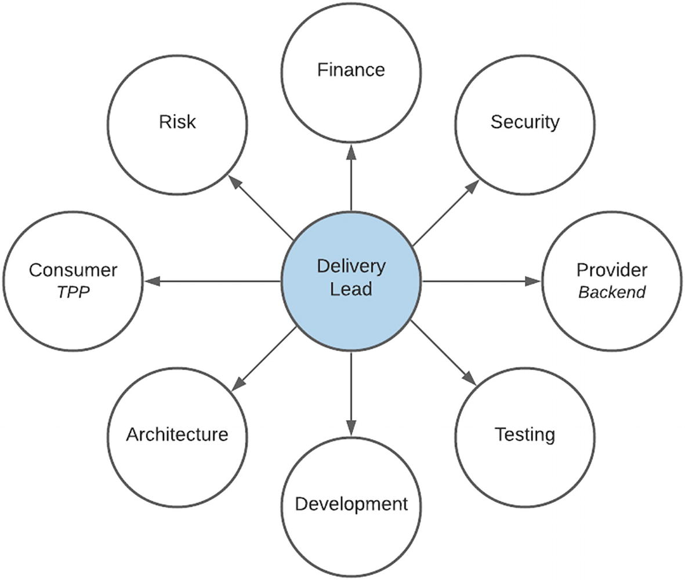
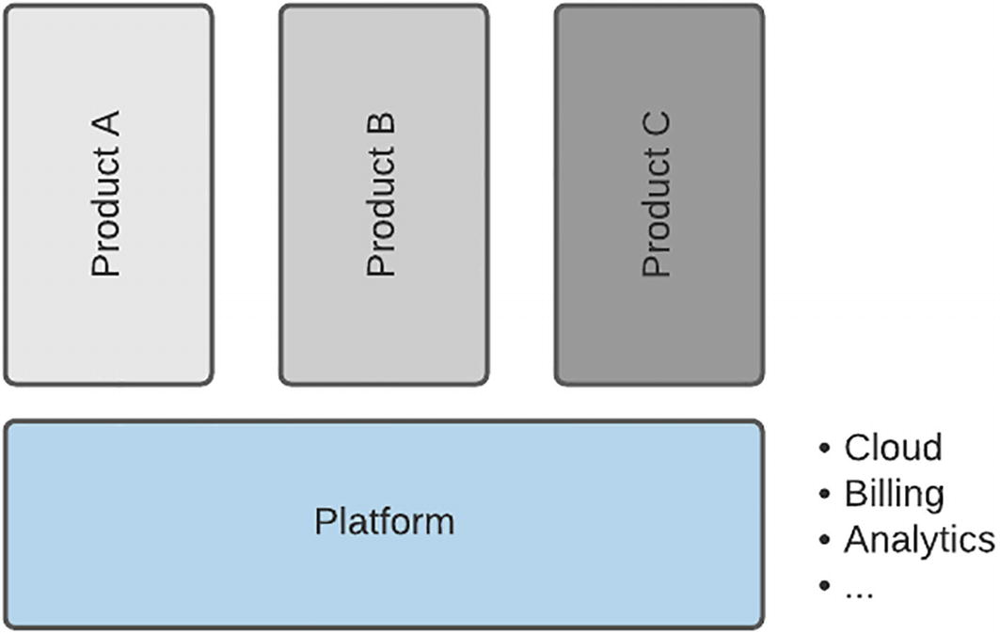
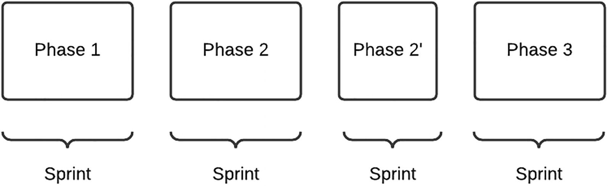
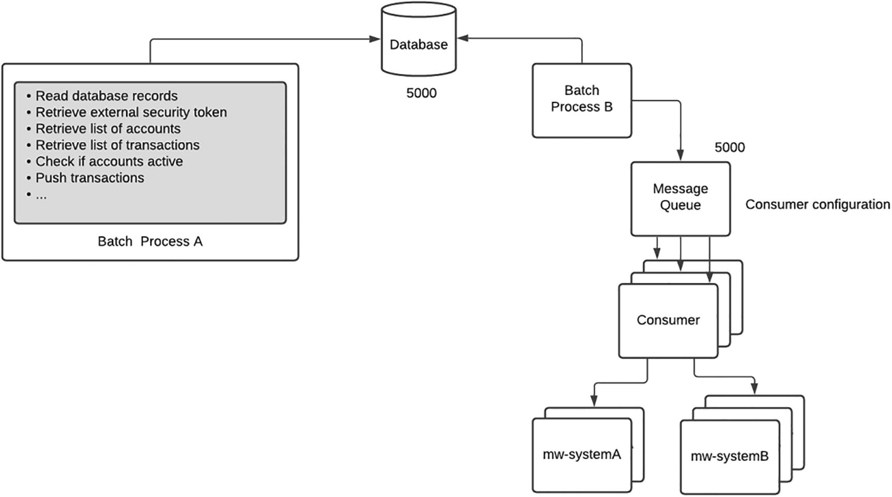
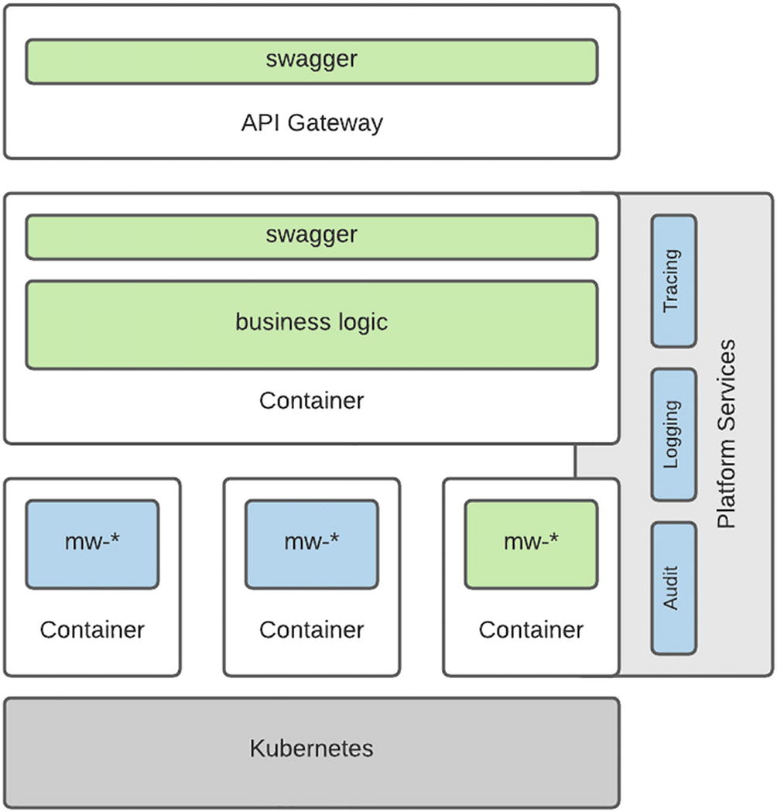
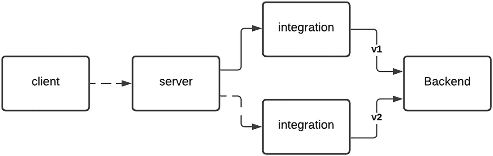
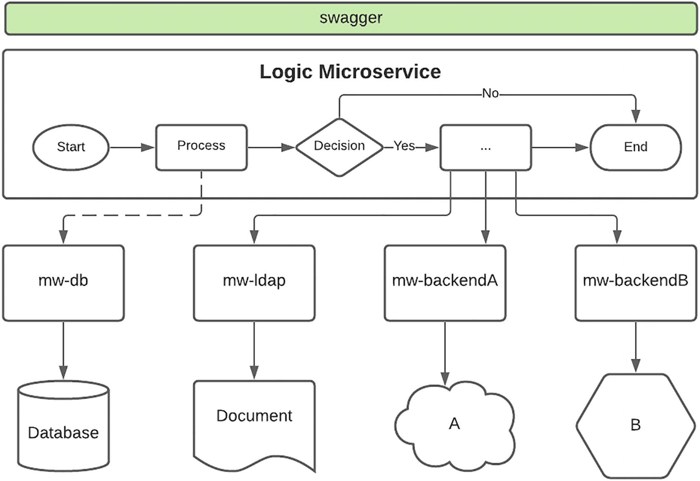

# API开发
> 雷内多拉萨米1
> (1)
> 南非豪登省约翰内斯堡

在软件开发生命周期的所有阶段中，开发是我最喜欢的。这是当生命被注入设计和假设的时候，最终可以测试假设。与其他软件领域不同，API 上下文中实现的复杂性被接口屏蔽。正如任何经验丰富的集成工程师都会确认的那样，该界面允许团队在开发完成水平方面保持扑克脸。在很多情况下，在不同的项目中，我有时会发布一个带有极薄实现的 API，以摆脱疯狂的项目经理的关键路径，或者通过虚张声势来表示已准备好进行集成测试来将压力转移到消费者身上。
这一阶段并非没有挑战。在构建两个系统之间的桥梁的过程中，常常会慢慢意识到集成的复杂性远比预期的要大。任何经验丰富的集成工程师都会证明担心在连接点没有可用的所需信息。这可以与你在完成 10,000 块拼图并发现 3 块丢失的那一刻进行比较。如果这还不够糟糕，这通常会发生在具有超薄实现的那些解决方案之一上！
在我的整个职业生涯中，我发现开发过山车从来不会遵循相同的路线。这可能是我喜欢集成工程的主要原因。从与外部团队代表的最初亲切会面到开发人员之间的技术术语交流，到团队之间为解决问题而进行的激烈交流，再到通过网络安全所需的外交来解除防火墙的封锁，导致第一次系统握手时肾上腺素激增，最后看到它在操作环境中工作时感到欣慰——总有一种变化让它令人兴奋。在本章中，我们深入研究了支持 API 开发的许多关键领域的细节。

## API第一，技术第二
在我职业生涯的早期，我发现自己迷上了 Java。具体来说，Java 企业版 (JEE)。我梦想 bean - Enterprise Java Bean (EJB) - 并欢迎与志同道合的朋友和同事进行长达一小时的讨论，讨论无状态会话 bean 与有状态会话 bean 的优点，并对消息驱动 bean 的并行处理能力感到非常满意。几次角色转换后，我意识到我已将焦点水平设置为最大放大倍数，这使我无法看到更大的图景。
简而言之，集成需求的主要目标不是应该如何完成，而是为什么。对于开发团队来说，这可能是一个艰难的消息——但 API 使用者只是期待对请求的响应。消费者对实施的细节并不真正感兴趣——无论是使用最新的人工智能 (AI) 云产品处理请求还是使用过去几十年的大型机进行处理都没有关系。主要目标是一致且可靠的接口。
由于当今可用的技术选择过多，因此很容易陷入困境，试图找到实施解决方案的最佳且可能是最前沿的方式。在新兴的 API 市场中，尤其是在数字环境中，这个位置很容易成为常态。尽管我喜欢修补新技术，但我强烈建议在解决问题时保持克制。请务必记住，该技术是为实现某个目的而服务的。
一个最喜欢的例子是实现一个接口来检索参考数据。为了让这个看似平凡的任务变得更有趣，热心的开发人员可能会尝试缓存响应。该策略从一个简单的内存缓存开始，它将在单个实例的上下文中运行良好。但是分布在集群中不同节点的多个实例呢？缓存是否应该具有需要 Redis 等技术的数据持久性，还是基于内存的需要 Memcached？由于这是第一个缓存实现，解决方案应该托管在哪里？本地还是云？缓存失效策略怎么样？我们如何以及何时才能清除缓存中的陈旧数据？虽然这是一个有效的目标，但你可以看到 API 的重点如何从参考数据的检索转移到数据的缓存。
我曾多次观察到次要和非必要目标如何影响并减慢了需求的交付，因为这些任务已嵌入到解决方案中。在敏捷环境中，目标是尽快发布一个最小的、功能性的解决方案。请注意与超薄实现的区别，后者本质上是一个带有模拟响应的接口。
回到参考数据的需求，第一次迭代尽快走出去，就是纯粹的数据检索。通过公开响应请求的 API，即使延迟很高，消费者也可以感受到集成——从接口规范到返回的数据。即使在设计时或稍后的性能测试期间指定了提高性能的要求，也应遵循此策略。如果要在更好的性能或更快的开发之间做出选择，那么紧迫的交付时间表下的项目经理很可能会选择后者。性能要求的中间立场可能是在客户端实现缓存。
这一理念大量借鉴了 Facebook 的座右铭：
完成比完美更重要。
抵制在其生命周期早期优化界面的诱惑。从简单开始并迭代。专注于主要任务，例如从源到目标的映射。确定需要改进的领域，例如性能缓存、分页和过滤。还要确保考虑其他领域，这些领域可能不那么令人兴奋，例如安全性、验证和错误处理。借助功能强大的 API，即使在开发环境中，也可以在产品负责人和工程主管的帮助下确定需求的优先级。根据多年的经验，我非常肯定安全性、可靠性和一致性会比性能更重要。确保始终关注 API 的目标。

## 团队结构

与流行的看法相反，开发不仅仅是一个孤独的开发人员在半暗的房间里敲击键盘。借用一句非洲谚语，需要一个村庄来抚养一个孩子，交付 API 需要团队的努力。该产品不仅仅是代码行，而且在从设计到实施的过程中还依赖于以下角色。

### 交付线索

交付负责人负责协调和安排构建产品的活动。这是一项具有挑战性的任务，需要跨多个流进行仔细协调，如图 8-1 所示，以确保能够满足时间表。由于外部团队和系统可能会提供关键的依赖关系，因此需要大量的外交手段，并且必须仔细协调每个元素以最大程度地减少延迟。

图 8-1 编排 API 开发
让我们考虑一些外部实体如何参与开发过程以及交付主管的职责：

- 提供商：将提供现有接口的规范、新接口的开发时间表以及主题专家对现场开发人员查询的可用性。后端的任何延迟都可能影响开发和测试活动。
- 消费者（第三方提供商）：将请求 API 产品的规范和有关可用性的时间表 - 在沙盒（在后面的章节中讨论）或实时容量中，并与产品负责人合作协调入门活动，例如筛选和预先批准行政延误。
- 财务和报告：预测外部团队的产品交付和潜在成本回收的时间表，管理 API 交付和正在构建的产品的运营支持的预算，并向项目利益相关者提供有关交付的定期报告并管理对时间表的期望。
- 开发：通过在开发开始时提供经批准的设计和后端接口规范、访问主题专家以快速解决查询以及访问企业资源，确保为开发人员提供顺畅、不间断的路径。

由于在任何时间点都可能有许多 API 正在开发中，因此交付负责人对多种产品具有洞察力，并且可能会优先交付一种产品而不是另一种产品。例如，如果更紧急的 API 需要额外的开发人员，则可能需要重新平衡团队。
从多年的项目经验中得出的宝贵教训是，你可以解决问题的人数是有限的。也就是说，某些任务需要花费特定的时间，并且无法通过其他团队成员更快地交付。团队管理人员必须理解并欣赏这个概念，因为太多厨师破坏肉汤的格言很容易成为现实，因为时间可能会因时间的流失而浪费，让新成员跟上进度，而拆分任务可能会导致依赖性和预算超限运行。
由于需要处理多个问题，因此对我们的实施非常有效的策略是将交付主管角色分配给具有商业或技术重点的个人。这使我们能够有一个人致力于追求商业目标，例如财务和风险，而另一个人则专注于完成技术目标，例如架构和安全的批准。有一些重叠区域会减少一个人的交付——技术上倾向的 Lead 可以从项目发起人那里获得帮助，同样，如果他的对手不在，商业 Lead 由工程团队支持。正如我喜欢提到的，这个充满活力的二人组确保考虑到交付范围的所有要求，从而使我们的项目保持平衡。

### 开发商

就其本质而言，集成开发通常是快节奏的，因为两个系统之间的接口通常位于整个项目交付的关键路径上。 传统的项目时间表通常长达数月，而我们的交付目标是冲刺，最短可能是一周，最长可能是两周。 驱动因素是，通常在超高速节奏环境中工作的第三方消费者也具有更快的发布周期，这使得上市时间成为关键因素。
我们处理快速交付周期的理念是在每个版本中迭代 API 产品。 也就是说，我们不会等待三个月的大规模部署，而是为每个部署提供基本功能和更新。 这确实给开发增加了一些复杂性，因为在新版本的工作正在进行时可能需要对以前的版本进行修复或更新。
作为开发人员旅程的一部分，有许多方面需要考虑。 让我们考虑一些，我认为这是成功的关键。

- 所有权：我们开发团队的很大一部分是全栈工程师。有时可能需要利基技能开发人员，但开发人员应该有能力解决他们直接专业领域之外的问题。例如，开发人员可能会建议更改 API 定义并提供 swagger 更新以供审核。所有权的关键是及时的沟通。由于开发可能跨越一系列系统和人员，例如 API 网关、微服务和数据存储，因此通信是成功交付的关键。在以周为单位的交付周期中，浪费时间等待在下一次团队会议上报告问题可能会导致错过目标日期。强烈鼓励团队成员在可能的情况下尝试自行解决阻塞问题，如果不能，则升级以寻求帮助。当然，可能存在一些无法克服的挑战，例如后端主题专家的可访问性。在这些情况下，团队文化应该转向——做出假设并继续、暂停活动、转移到非依赖任务或向团队的其他成员发送消息，表明有空协助另一项任务。
- 单元测试：在敏捷、快节奏的交付环境中，良好和适当的单元测试可能是实现积极交付时间表的牺牲之一。我在许多实现中观察到，众所周知的“可以”已被淘汰，开发人员希望在质量保证的后期阶段发现并解决任何问题。重要的是，团队要对单元测试的级别做出全局和有意识的决定。在大多数情况下，减少单元测试是由于交付压力。项目利益相关者必须了解单元测试是开发过程的一个重要元素，并且如果它被短路而不是更快的交付，则承担责任。这也可以通过直面问题而不是忽视它来缓解。也就是说，早期的迭代可能具有基本功能，在测试版的旗帜下发布。在周期后期的计划发布可以明确关注测试和质量保证。这种策略可以减轻交付压力——尽快推出一个版本，但坚定地承诺在全面推出之前强化解决方案。
- 文档：为安抚交付之神而做出的另一项牺牲是推迟适当的文档。老实说，即使是时间的好处也可能无法从开发人员那里得到好的文档。在传统的、瀑布驱动的项目中，在起草技术设计之前不会编写一行代码。在敏捷的数字化交付环境中，原型甚至在需求被完全捕获之前就已启动并运行，并且解决方案和实施一直有可能一直变化到并包括生产部署。因此，开发人员有时不愿意记录他们的开发，因为它是流动的并且可能会在其生命周期内发生变化。一种选择是接受这一立场并采用文档“在代码中”的策略。另一种选择是在团队协作 wiki 上创建一个简单的模板，该模板需要最少但关键的信息，例如源系统和目标系统之间的映射规则。重要的是要相应地调整开发方法以支持所选策略。团队负责人审查和批准文件应该是过渡到下一个交付阶段的关键要求。如果没有必要的检查和平衡，就有可能出现质量低下或没有文件的情况。

每个团队都将有自己的为东道组织量身定制的开发实践变体。非常重要的是，内部和外部的所有利益相关者都保持一致，并且让开发人员在规划会议期间管理对解决方案交付水平和质量的期望。如果时间缩短，团队的所有成员都应该意识到并接受必须重新审视测试和文档等元素。与其忽视这些问题，不如从一开始就解决它并作为一个团队做出相应的计划。我们实施成功的一个关键是开发是一个团队的努力。

### 质量保证
这是我们交付过程中最重要的支持支柱之一。作为重要信号，QA 或测试工程师可以行使否决权来停止发布。由于交付目标是激进的，开发人员倾向于在真空中进行测试，主要是在快乐路径场景中进行测试。集成测试可能是第一次在不同的系统和不同的上下文中测试解决方案。
作为测试工作的一部分，解决方案必须经过各种级别的审查，从标准到错误再到异常情况。可以通过提供一系列有效和无效输入来模拟标准、功能和错误条件。模拟异常场景可能需要关闭后端的连接组件以确定应用程序行为。要测试的场景和条件的重要输入可以由运营团队根据常规产品发布的经验提供。
随着我们的测试能力在一段时间内显着发展，我们现在还考虑以下子域：

- 安全性：在信息安全团队最近进行的应用程序扫描期间，我们收到了近 100 页的惊人报告。通过对报告的审查，我们发现对单个输入字段的改进验证将处理报告的 70 页。之前已针对其他 API 确定并讨论了其余问题。基于这一学习，我们做出了一个团队决定，即安全扫描将在内部运行，作为测试审查和批准过程的一部分。这将使团队能够先发制人地解决任何问题。需要注意的是，这并不是我们安全审查的结束。在新的 API 产品批准发布之前，企业信息安全团队会聘请外部服务提供商进行详细的安全评估，以确定是否存在任何漏洞。
- 性能：部分是玩笑，部分是认真的——集成环境中的压力测试可能会成为一项压力很大的活动，因为它需要下游服务提供商的参与。 API Marketplace 组件的性能测试应在具有模拟后端的环回或环境中定期进行。还应至少每季度安排一次后端测试。这将确保端到端价值链中的所有元素都能承受来自黑色星期五等高峰事件的负载。
- 自动化测试：不幸的是，这为测试团队提供了一个独特的 catch-22。自动化测试无疑会节省大量时间，尤其是对于回归测试活动。在狂热的环境中，随着多项测试工作的进行，自动化测试工作通常会延迟。自动化测试必须成为团队文化的一部分，因为它的执行是持续集成 (CI)/持续交付 (CD) 流程的核心要素。这是 Netflix 等组织可以经常发布到生产环境的主要原因。

## 交付方式
我们的 Marketplace 应运而生，当时组织已做出有意识的决定转向更敏捷的交付方法。一种新的工作方式很快就建立起来了，以前按照更传统的路线运营的业务部门挤在看板周围进行晨会的情况并不少见。我们的交付理念始终基于敏捷原则，并且随着时间的推移，我们已经调整和定制了我们的方法以满足独特的要求。
市场的最初战略更具战术性。该团队的主要目标只是推出一个 API 市场，希望第三方供应商能够加入。因此，交付目标和冲刺目标在技术上是重点，这让团队很忙，但几乎没有为平台建立急需的根基。
一位专门的产品负责人被分配到该计划中，并试图转移重点，但经常被顽固的技术团队所淹没。幸运的是，该平台被确定为更大的组织目标的推动者，该目标要求更多的流程和运营结构以及更多的商业方向和重点。这需要更好地规划和使用时间、开发能力和预算，以实现市场的战略目标。
以下部分详细介绍了我们的流程，该流程仍在发展中，用于在需求进入其生命周期的交付阶段时对其进行处理。

### 定义策略
在每个新季度开始时，项目主管会见团队的高级成员

1. 提供组织范围内的举措和目标的视图。由于有许多正在进行的企业和部门项目，因此可以深入了解 Marketplace 如何适应更大的图景。
2. 回顾上个季度的进展，并衡量该平台在本财政年度计划路线图上的位置。
3. 识别潜在风险和改进领域，以简化解决方案交付和运营能力。
4. 定义未来季度的目标，并根据团队所有领域的投入确定目标的优先级。

这些会议的目的是在高层次上定义与其他外部举措相一致的下一季度的战略目标。它还具有高度的协作性，并寻求找到中间地带，使计划中的举措能够不间断地继续进行，同时也引导市场为未来的机会做好准备。
在随后的计划会议中，这些计划会更频繁地安排并在下一节中描述，这些概述的目标被用作指南针，以确保我们的方位正确并且平台朝着正确的方向前进。如果需要，团队精神还允许更新目标。也就是说，如果组织需要转移重点以提供更多业务或客户价值的需求，团队的领导将重新召集以确定如何实现它。
规划
在实施的早期阶段，规划是一个全天的工作，整个团队都在场。目的是为团队的所有成员提供关于即将到来的需求的可见性，并征求反馈和任务大小。其意图是崇高的，但结果是团队通常在 sprint 中损失了整整一天的时间，并且通常仍然不得不调查会议之外的任务以提供估计。作为我们当前流程的一部分，高级影响评估 (IA) 由设计时的工程主管在团队的临时协助下编制，以解决任何技术问题。 IA 提供所需时间和资源的指示，从中可以确定成本估算。
由于实际开发时间很宝贵，我们通过要求技术团队仅在必要时加入会议来尽量减少使用。为实现这一目标，规划工作分为两轮。
在第一轮中，平台执行官、产品负责人、交付和工程负责人开会讨论即将到来的冲刺的交付目标。这必须与季度战略目标保持一致。需求也有优先级，并且有一个初始指示，表明哪个开发人员将被分配到哪个任务。
有了这个观点，与团队一起安排了第二次会议，以提供下一个冲刺的目标。在大多数情况下，这不是团队第一次接触到要求，因为他们的意见被视为影响评估活动的一部分。会议的重点是明确定义的目标，开发人员不必忍受长时间的优先级和战略辩论。在本次会议期间，工程主管还提供了解决方案的详细分解和完成的明确定义。一个需求很可能被分成多个阶段，并且团队对这个决定有洞察力。团队成员可以表达对目标的担忧，并强调即将开展的工作的风险和可能存在的问题。这使交付负责人能够更好地了解即将交付的可交付成果，并采取措施减轻潜在风险和延迟。
如表 8-1 中详述的那样，在任何给定时间，可能有多个活动处于不同状态。
表 8-1 API Marketplace 中的持续交付

| Stream     | A       | B       | ..     | N      |
| ---------- | ------- | ------- | ------ | ------ |
| 设计       | 完毕    | 完毕    | 被封锁 | 进行中 |
| 架构       | 完毕    | 完毕    | 被封锁 | 进行中 |
| API网关    | 完毕    | 完毕    |        |        |
| 微服务     | 进行中  | 进行中  |        |        |
| 质量保证   | On hold | On hold |        |        |
| DevOps     |         |         |        |        |
| 更换管理层 |         |         |        |        |
| 发布后支持 |         |         |        |        |

任务的并发性由交付负责人仔细管理，尽管这可能会增加管理的复杂性，但如果由于设计批准或后端准备工作的延迟而导致一条通道被阻塞，则团队可以灵活地转向新的流。这是发布管理的祸根，因为市场无法提前几个月预测将部署到生产的内容，但这是我们团队最强大的功能之一。

### 小队

在我们 Marketplace 的整个生命周期中，有一些更大的举措不适合这种快速交付模式。最初将这些举措捆绑在一起的尝试导致团队规模接近 30。 因此，计划、站立和回顾等冲刺仪式花费了大量时间，并且对团队宝贵时间的利用效率低下。从亚马逊的“双披萨团队”规则中汲取灵感，该规则规定团队的规模不应超过两个披萨所能满足的规模，我们将团队分成小队。
小队的定义是一个自组织、跨职能的团队，具有端到端交付产品的技能，而其他人的投入有限。该小组应该由能够设计、开发、测试和部署产品的人员组成。
我们还咨询了其他经历过类似增长轨迹的团队，并利用了他们的洞察力和经验。吸取的一个关键教训是组建了一个平台小组，该小组专注于提高基础市场的能力和成熟度，并支持正在进行的产品开发。
如图 8-2 所示，平台小组旨在通过专注于诸如迁移到云、构建部署到市场的产品所利用的计费和分析功能等举措来发展市场。平台小队也长期运行但更精简，而产品小队根据需要上下旋转，团队规模更大。当团队按需组装时，这还允许更有效地调度资源。此外，平台小队由运营支出 (OPEX) 预算资助，产品小队由资本支出 (CAPEX) 资助。

图8-2API Marketplace小队

### 敏捷方法论

交付是在冲刺期间实现的——这是一个短的、有时间限制的时期，最少一周，最多两周。如图 8-3 中详述，功能是分阶段发布的。分阶段方法基于“经常发布”原则。我们发现，随着从各种需求到共享组件的更改，在开发中长期停留的解决方案往往会变得更加复杂。这种情况的一个明显迹象是生产和测试版本是否开始显着偏离。例如，生产版本为 2.04，测试版本为 2.17。分歧越大，应用的更改就越多，这会增加发布风险。

图 8-3Sprint 方法
从发布的角度来看，我们在每个冲刺结束时部署到生产环境。由于可能有许多正在进行的计划，因此团队的目标是至少每月调整一次生产和 QA 环境。还如图所示，可以缩短冲刺持续时间以解决更新的业务或第三方需求。更快的交付周期也巩固了我们的“向前修正”战略。如果在部署新版本后的操作环境中遇到问题，我们会尝试尽快解决问题，而不是回滚。 API 的版本控制为我们提供了这种奢侈，因为操作环境可能有几个活动版本。

## DevOps

多年前我第一次遇到“DevOps”这个词时，我开玩笑地评论说，我工作过的许多项目团队都这样做了一段时间——开发人员在生产中编写代码来解决问题。现在，凭借与专家合作的经验，我理解并欣赏这是软件开发生命周期的一个新的关键领域。 DevOps 的实践现在是我们 Marketplace 持续成功的基础。
在实施之初，这是一个雄心勃勃的目标，因为交付团队利用了手动部署过程。正如前几章所讨论的那样，该项目非常幸运地拥有经验丰富的 DevOps 工程师的技能，这显着加快了我们的进度。通过观察这些大师的技艺，我现在将 DevOps 工程视为基础设施魔法，它允许创建新世界，在我们的例子中 - 环境，具有神奇的咒语，也称为 Terraform 脚本。详细介绍了这种范式的实践和好处。在以下部分中，我将特别关注 DevOps 如何支持我们的开发过程。

### 持续集成 (CI)

在实施之初，Marketplace 由一些微服务组成 - 可以一方面计算。每个人都非常熟悉它们，并且每一个都是由特定的开发人员编写的。到了进行集成测试的时候，我们分布在各地的团队的所有成员都加入了音频电话会议，有时会持续一整天。团队将紧张地观看屏幕共享会话，因为指定的“部署”工程师将运行一系列神秘的命令，将所需的代码元素部署到测试环境中，当我们发现丢失的配置参数时，我们感到沮丧，最后喘口气当测试工程师给出一个完全清晰的信号时，松了一口气。这是我们（手动）持续集成过程的第一次迭代。
随着本地容器平台的重建，这个过程几乎在一夜之间发生了变化。作为重建的一部分，部署过程也发生了巨大变化。突然，管道在代码提交时被触发，这些代码自动构建并部署到下一个测试环境。一旦功能在较低的测试环境中得到确认，开发人员将发起一个拉取请求，在将代码更改合并到主分支之前，必须对其进行审查和批准。此操作还会触发更高功能的流程，该流程会将组件部署到临时环境。部署过程不会将其设置为活动版本。必须将即时消息 (IM) 发送给中土精灵 Gandalf，一个聊天机器人，然后他会神奇地更新 Kubernetes 集群中的配置，以将请求路由到新版本。甘道夫只接受团队中特定霍比特人的指示，他们维护了发布过程的神圣性，并且在遇到问题时随时通过恢复到以前的版本来提供帮助。
部署过程非常简单，使开发团队免受后端复杂性的影响，并引入了一个明确的、可重复的和可靠的过程，用于在环境之间迁移代码。如果部署或测试由于缺少配置参数或代码错误而失败，它会强制在源头解决——这会触发管道和流程来解决它。我们的实施非常幸运能够被来自未来的时间旅行 DevOps 工程师访问。当他们突然离开时，任何时候都失去了好处，团队不得不支持和更新一个看似复杂的发布过程。
从这次经历中，我想传授的关键教训是迭代地构建你的 CI 管道。以没有手动部署的基本原则为基础。然后放入一个简单的过程并迭代。有很棒的开源 CI 工具，例如 Jenkins 和 Cloud 产品，它们可以部署到本地基础设施。
一旦你建立了一个简单、稳定、可重复的过程，慢慢地逐步引入版本控制、聊天机器人和自动化测试等元素。自动化测试对于持续交付至关重要，这将在下一节中讨论。
### 持续交付 (CD)
在我们的旅程中，一位过于热情的工程师在管道中添加了几个额外的验证，这使流程停滞不前。开发人员是一群勤奋的人，团队找到了一种回避验证的方法。添加额外验证的目标是崇高的，如果遵守法律条文，将会在目标环境中产生更高质量的代码元素。不幸的是，老实说，团队开发的成熟度没有达到要求的水平。
任何阅读过详细介绍 Netflix 发布过程的博客的人都希望为他们的开发环境重现相同的内容。坦率地说，签入代码并在 16 分钟后将其部署到生产中的想法是我们仍在努力的乌托邦。重要的是要记住，这个过程可能需要时间来实现，由于 Netflix 系统架构是可能的，并且可能得到整个企业的支持。拥有简化的持续交付 (CD) 流程一直是我们的主要理想目标之一，但要了解你组织的背景。作为老牌企业，我们必须在每个发布阶段坚持严格的治理门。还有一些我们依赖的外部系统使用传统机制，即手动部署。此外，公平地说，金融机构所需的服务水平可能比 Netflix 严格得多。
在这方面，我的建议是关注和优化你可以控制的 CD 流程的各个阶段。任何到生产环境的部署，更不用说自动化了，都是一项巨大的责任，应该非常小心和考虑地完成。只有在整个交付团队的承诺下才能实现自动化部署过程。当开发人员使用新的外部代码包时，企业安全扫描应作为构建管道的一部分运行，以确定任何漏洞。开发人员还必须将详细的单元测试作为提交的一部分，作为管道的一部分运行。必须包含代码覆盖工具以确认足够的单元测试。质量保证团队必须根据业务需求场景创建新的自动化测试脚本，而不是简单地重复开发人员的单元测试。成功完成自动化单元和功能测试后，整个团队应该有足够的信心批准组件进行部署。 CD 更关乎人员和流程，而不是启用技术。

### 微服务

最近对批处理同步解决方案进行了事后审查，该解决方案已经发展成为解决运营问题的单体，提供了一个很好的例子，说明微服务方法如何支持 DevOps。图 8-4 提供了左侧的 As-Is 方法和右侧的提议的 To-Be 设计的视图。

图 8-4 单体与微服务
将解决方案分解为更小的组件有几个好处。从设计的角度来看，它允许通过添加消息传递平台将流程执行从同步更改为异步。更重要的是，从 DevOps 的角度来看，它将运营控制和权力从开发人员转移到运营部门。在早期的过程中，解决方案的原始开发人员总是需要讨论性能问题。新方法允许 DevOps 团队在不进行任何开发更改的情况下扩展运行时解决方案。通过指定消息队列的消费者数量，可以通过配置来控制并发性。通过添加更多基于定义的服务级别的中间件微服务 pod 副本，还可以独立扩展与源和目标系统的连接。因此，DevOps 不仅限于基础设施和 CI/CD 管道的自动配置——它是详细解决方案设计的一个重要考虑因素。
DevOps 是一种实践，必须成为团队精神和文化的一部分。它是旅程每一步的一部分——我们将在后面的章节中讨论监控和日志，这是操作域的另一个关键支持元素。从团队资源的角度来看，一定要包括一个，可能两个，专门的 DevOps 工程师角色。建立和迭代 CI/CD 流程是一个重要的基础元素，并且必须在开发生命周期中尽早提供一个简单的基本流程，以防止手动部署的可能性。

## 应用开发

正如在详细介绍我们的平台架构的章节中所讨论的，我们已经在微服务的组装方式方面进行了多次迭代。随着我们寻找新的和改进的方法来实现目标，这仍然是一项持续的活动。以下部分详细介绍了我们构建支持 Marketplace 产品的实现的过程和技术方法。

### 发展指导

从几个已经到达运行环境的解决方案的经验来看，我想强调在整个开发过程中与开发人员保持持续联系的重要性。敏捷环境速度很快，这有时可能会导致混乱。一旦 API 设计完成并定义了集成方法，就会将其交给开发团队进行构建。
在这一点上，工程主管的愿景必须清楚地传达给开发人员，以确保根据正确的模式构建解决方案。我喜欢把这个过程看作是“绘制目标”。它遵循一个步兵在战场上的军事方法，将激光照射到一个目标上，从数百英里外发射的导弹可以追踪该目标。由于团队很可能在地理上分散，有时跨越大洲和时区，所以没有什么是理所当然的。开发人员可以以多种方式解释组件图中两个框之间的线。例如，连接可以同步或异步进行；它可以通过 HTTP 或 gRPC 完成。
开发人员可能不知道另一个团队刚刚构建的可用下游集成，并且可能会无误地重复工作。确保在一开始就概述完成的定义，并在开发过程开始时和冲刺期间的定期检查点花时间进行详细的解决方案实施会议。
对于我最具挑战性的项目之一，即使是初级团队，一种非常有效的方法是四次站立，然后坐下。在本周末，在 sprint 的中途，我们与团队进行了详细的审查，以确定交付是否在正确的轨道上。这些详细的审查甚至可能会深入到代码级别。定期检查点确保可以更早地发现问题，并有足够的时间来解决。如果没有定期审查，问题很可能会在操作环境中发现。这是一个关键过程，必须在团队的交付方法中根深蒂固。请注意，这不是微观管理或对开发人员的不信任，而是要求团队的高级成员对最终交付承担更多责任。

### API网关

我认为这个元素与国际机场的护照控制功能大致相同。来自不同软件供应商的每个 API Gateway 产品实现可能具有一组独特的特性和功能。对于我们的实施，我们已做出一致决定，以利用标准的普通功能，以便在未来轻松迁移。这一决定背后的一个重要驱动因素是网关基础设施是一种共享的企业服务，定制可能会影响未来的升级或其他租户。我们API网关开发的关键原则如下：

1. 无转换或协议转换：网关的主要目标是代理 REST API。发布给第三方消费者的 swagger 定义与微服务的定义相匹配——直接映射。
2. 定义明确的请求：根据我使用 SOAP 的经验，我试图潜入 <any> 类型的请求以加快开发速度。事实证明，通用有效负载与 <any> XML 请求的负面看法非常相似，我的建议提高了 API 网关技术所有者的警报级别，并导致对未来请求的审查更加严格。
3. 轻量级：API 网关不是 ESB 或流程引擎，并且没有相同的时间容限。没有长时间运行的进程。应尽快处理请求。企业超时标准是 60 秒，考虑到流行的云提供商 API 网关 PaaS 产品是不可协商的 30 秒，这是相当宽松的。请务必记住，API 最有可能支持客户的数字体验，并且需要毫秒响应时间来留住观众。
4. 安全性：可以通过控制订阅来授予特定第三方访问某些 API 的权限。只有在第三方获得批准后才能提供对“实时”API 的访问。有多种访问机制，从客户端标识符和机密到基于令牌的访问。客户端证书和 jws-signatures 等其他控制也可以应用于更敏感的 API。对开发过程的最大好处是，这种复杂性可以由网关产品处理，并且对下游组件进行屏蔽。
5. 速率限制：一个很棒的功能，对于有许多新的第三方开发人员的环境来说很关键，是能够限制请求。第三方可能会意外或故意触发大量请求——这可能导致拒绝服务、影响其他 API 使用者或淹没下游系统。这可以通过在设定的时间范围内指定并发请求数和请求数来防止。这是开箱即用的功能，可以通过配置更新而不是自定义开发来实现。

### 微服务
图 8-5 展示了我们平台中的关键微服务类型、它们的交互模式以及平台服务的使用。为了更深入地了解内部微服务操作，我更详细地讨论了这些组件。

图8-5微服务架构
中间件组件用于集成到后端系统。这些是用作通往南行平台的网关的专用组件。该组件封装了集成逻辑和复杂性，并公开了一个简单的业务接口供消费。一个中间件组件只能连接到一个后端。一个关键原则是不允许组件之间的交叉通信。也就是说，一个中间件组件不能调用另一个。图 8-6 详细说明了中间件组件的内部架构。

图8-6中间件组件剖析
从左到右工作，这些元素的功能是

- 客户端：用于发起对组件的 gRPC 调用。它在开发和单元测试期间使用。使用端口转发，客户端可用于直接启动对部署在其他环境中的组件的调用。例如，客户端可用于发起请求以验证与测试环境中下游系统的连接性。
- 服务器：此元素包含为 gRPC 请求提供服务的“管道”。负责解组、转换请求、调用集成组件、转换和编组响应。在开发过程中，如果后端不可用，可以模拟来自该组件的响应。服务器组件还可用于将请求路由到不同的集成组件。我们已经成功地使用这种方法来实现不同提供者接口之间的迁移策略。简单的方法是使用环境变量在运行时重新配置路由。
- 集成：此元素的目标只是与后端系统接口。由于抽象的原因，本次开发中没有 gRPC 引用，可以直接从命令行进行测试，无需任何上游依赖。该组件负责处理请求期间可能出现的各种类型的响应和错误条件。特定于应用程序的规则（例如错误代码映射或设置默认值）也在此组件中制定，作为整合和隔离的手段。通常建议为特定接口使用专用集成组件。这使代码元素保持干净并易于维护。

逻辑组件编排流程以实现 API 产品实现，如图 8-7 所示。例如，用于检索客户资料的 API 产品可以利用许多中间件组件来组合响应。可以询问和转换来自一个系统的响应以构建对另一个系统的请求。区分应用程序和业务逻辑非常重要。将请求路由到中间件服务以创建客户是应用程序逻辑的一个示例。创建客户记录的过程是业务逻辑的一个示例。由于市场是企业的新渠道，它应该利用集中拥有和控制的业务流程。

图8-7逻辑微服务编排
此组件的北向接口通常是发布在 API 网关上的 swagger 定义。这简化了 API Gateway 和微服务之间的集成。该组件的另一个关键功能是策略实施。根据 API 产品的性质，微服务可能会在完成请求之前执行验证和验证，例如确认最终用户同意。为了简化流程执行，可以同时发起对中间件组件的请求。 gRPC 流也可用于优化请求的处理。例如，对于文档的光学字符识别 (OCR)，我们发起对中间件组件的调用，然后该组件向本地企业服务和云视觉服务发起请求。处理完请求后，将在流中返回响应。如果收到的第一个响应不成功，组件会以尽力而为的方式等待第二个响应来处理请求。如果第一个响应表明处理成功，则无需等待，继续执行。

### 平台服务
所有微服务都利用平台服务，这些服务被打包为企业库并在构建期间导入。正如平台架构中所讨论的，这提供了一个统一的“实用服务”层，允许对微服务进行一致的支持和管理。

### 门户应用程序

API Marketplace 上下文中的用户界面可能看起来自相矛盾。从实施经验来看，Web 应用程序是平台的支柱之一，前端开发人员是强制性的人员配备要求。我们的实现为以下用例构建了自定义应用程序：

- 授权：呈现给用户的同意页面会发布成功的身份验证，并且作为 OAuth 流程的一部分是自定义门户应用程序。这用于检索用户信息，例如个人资料和帐户数据，并显示更丰富的同意屏幕。例如，我们没有提供一个简单的权限屏幕来授予对所有帐户信息的访问权限，而是提供了一个详细的帐户列表，并允许用户选择第三方可能访问的特定帐户。
- 第三方入职：作为数字渠道，我们实施的一个理想目标是确保完整体验尽可能自动化和简化。如第 3 章所述，平台必须扩展以处理大量外部消费者。为了实现这一目标，需要一个自定义门户来促进入职流程，从请求公司注册文件到接受条款和条件，再到提供银行信息——基于 API 产品。需要注意的是，Web 应用程序是一种访问机制，实现这一目标的关键是定义明确的业务流程。
- 管理：这允许支持团队的界面更改运行时配置数据，例如属性值和端点配置数据。提供 UI 的好处是它确保一致、统一的访问，这是安全的、审计的和版本控制的——因此可以在必要时跟踪和回滚更改。更重要的是，在 Kubernetes 集群的情况下，它最大限度地减少了对数据库和配置映射等支持系统的访问要求。
- 托管应用程序：这当然是一个独特的用例，但也是该平台的重要收入来源。这也是团队保持交付势头的一个例子。提供一套战略性 API 产品的小组了解到，试点消费者无法在黑色星期五之前及时完成开发。由于延迟基本上会导致错过这一关键事件，因此该小组代表第三方做出了构建和托管应用程序元素的战术决定，该第三方利用了新的 API。第三方所需的开发工作显着减少，并且通过适当的重定向，用户体验也得以保留。这种方法非常成功，以至于产生了一种新的部署模式。好处是托管的应用程序可以被多个第三方重复使用，由于集成更简单而扩大了受众，还可以利用可能未在外部发布的内部服务，允许我们的企业塑造和定制用户体验，并增加用户信心，因为最终用户直接与企业交互。

## 概括

在本章中，我们讨论了一个关键的开发理念，即技术用于支持 API 的交付。我们还确定了有助于此活动的角色，隐式地通过清除交付路径上的阻塞物并通过编写代码显式地确定，并检查了我们规划和管理并发活动的方法。建立 DevOps 实践并采用持续集成/持续部署原则有助于简化开发过程，增加更多稳定性和可预测性，并支持现有和新的开发资源。最后，我们深入研究应用程序开发，强烈要求在此过程中进行更多的沟通和指导，并考虑我们平台的核心元素，并最终审查门户应用程序的类型和目标。
需要注意的是，这些方法和流程需要时间来定义和完善，并且仍在不断发展。它已根据我们的实施要求量身定制，例如地理上分散的团队和共享企业功能的使用。客户痴迷、宽肩项目发起人的个性特征，不断支持团队，设置高标准和讨厌错过最后期限的交付领导，不会妥协的顽固产品负责人，以及关于在代码中留下遗产的迂腐工程领导也有在打造强大的交付能力方面发挥了重要作用。在下一章中，我们将讨论沙盒环境、它在 API Marketplace 生态系统中扮演的角色，以及有关如何实施它的策略。