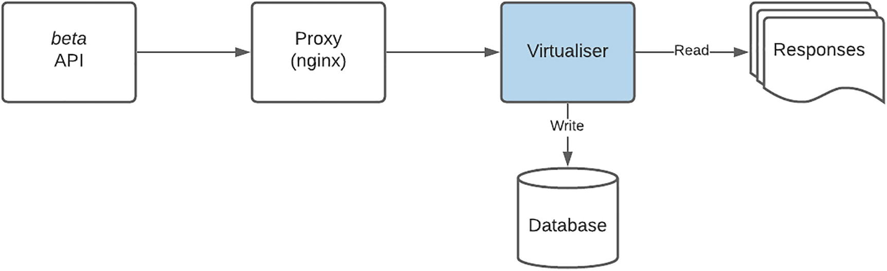
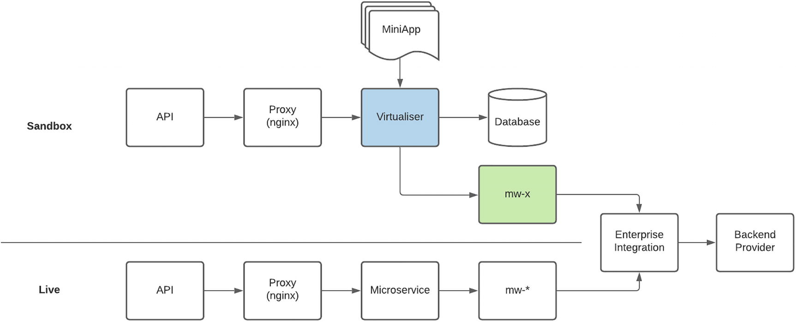
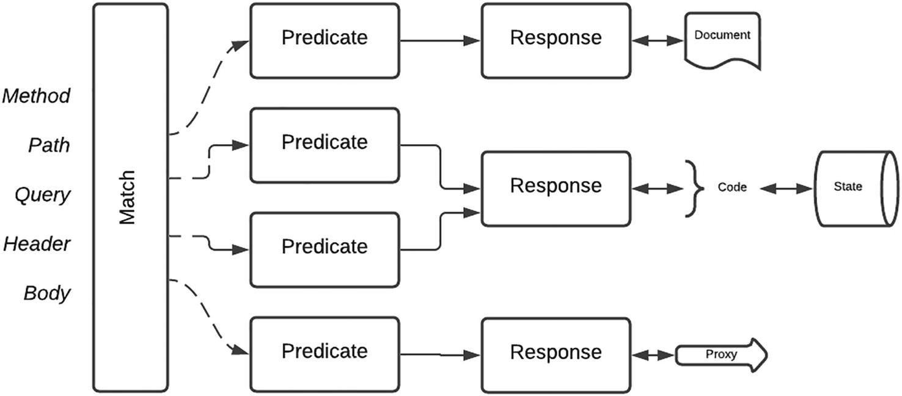

# 沙盒
> 雷内多拉萨米1
> (1)
> 南非豪登省约翰内斯堡

沙盒是一个划定的、仔细封锁的空间，它允许消费者测试和使用你的 API，以了解它们的功能。在 API Marketplace 生命周期内的所有技术挑战、成就和突破中，对不起眼的 Sandbox 进行了改造，这证明是我写这本书的转折点。我们最初的沙盒策略相对简单，适合特定范围的 API 产品。随着平台的成长、成熟和演变，这种结构和方法保持不变。就像 Jitterbug 或 Charleston 舞步在今天的舞蹈时代可能起作用一样，它似乎不合适。一段时间以来，该团队已经意识到该方法需要彻底改革，但优先级总是被降低，以支持其他“更重要”的可交付成果。
由于 API 产品和第三方消费者在平台生态系统中的独特组合，这是可能的 - 正如你将从下面概述的策略中注意到的那样。然而，一场完美的风暴正在酝酿，它要求在关键消费者推出他们的产品之前测试和签署特定场景。正如命运所愿，这种情况彻底破坏了我们的沙盒策略，不仅威胁要从壁橱中取出我们最古老的技术债务骨架之一，而且还要求它进行月球漫步。商业团队将解决方案推向市场的压力转化为动力和推动力，这不仅带来了我们沙盒的重新设计，也带来了我们平台对其目的和功能的重新构想。
正是这种工程和想象力之间的独特协同作用是我们实施的核心——希望也是你的。观察到这一独特的特征再次在我们的市场中和整个市场发挥其魔力，至少试图在本书中捕捉其本质的呼声变得太大而无法忽视。在以下部分中，我将分享我对 Sandbox 目的、过程、策略和实施方式的想法。

## 目的

我认为以下比喻最能描述沙箱的目的——踢轮胎，允许用剪刀跑来跑去，先试后买。正如你想象的那样，对特定 API 提供商进行投资或相关承诺是一项重大决定。对于组织内部项目，风险因素是最小的——集成需求双方的项目团队几乎没有选择，必须进行集成。对于具有预定义接口的 API Marketplace 实现，消费者可能会担心期望使用三针插头并找到两脚欧式插座——这是理所当然的。
沙箱的功能之一就是减轻这种担忧。根据作为集成开发人员的经验，我可以向你保证，查看接口规范，即使是文档齐全的规范，与从代码向端点发起请求并接收响应大不相同。开发人员获得了将规范映射到功能的切实机会，重要的是，可以验证 API 是否适合用例。 “适合”也需要从多方面来理解。
考虑以下缩写的接口定义：

```sh
...
paths:
 /customer
...
 parameters:
  -in: customerID
...
 responses:
  200:
...
```

虽然接口可能满足第三方的要求，但接口的行为也是一个关键因素。假设上述函数由对后端提供程序的多个查询组成，以编译响应，因此调用的整体延迟大于 30 秒。这种延迟可能会对最终用户的体验产生重大影响，并可能影响使用操作的决定。这也可能导致对提供具有更快响应时间的数据子集的操作的特征请求。
沙盒为这些讨论提供了一个参与点。它与“实时”环境相关的上下文、关系和功能如图 9-1 所示。如图所示，遍历“Live”路由的请求最终会到达后端提供程序。在“沙盒”上下文中处理的请求由我称为“虚拟化器”的元素提供服务。


图 9-1 沙盒和实时上下文
从战术上讲，沙盒为 Marketplace 团队提供了一个独特的机会来发布 API 产品，而该产品的实现并不存在。这可能有几个原因：

1. 它可用于确定消费者对 API 产品的需求水平和程度。在与第三方提供商的接触中，我们了解到意图和实施之间通常存在差距——也就是说，消费者表示对 API 感兴趣，但没有遵循。产品负责人可以使用沙盒产品来确定实际消耗，作为第三方承诺的指标。
2. 此外，热点或主要消耗的功能可以帮助塑造产品。困难或复杂的操作自然会吸引较少的消耗，并且可以轻松识别以进行简化或可能的终止。
3. 交付团队也可以使用它来分阶段发布 API - 更早提供更流行的操作。这有助于减轻开发团队的压力，并在计划发布时允许进行更多的定量分析。也就是说——产品负责人可以清楚地显示热点，这些热点可以转化为特定功能的需求。

非常谨慎地使用这种方法是非常重要的。正如我之前提到的 - 开发人员具有非凡的感知诡计的能力，一旦信任被打破，就很难重新获得。话虽如此，该方法是保持领先消费者一步，最好多走一步。对 API 的阶段和目标持开放态度——如果开发人员围绕产品构建解决方案并决定不继续，请考虑失望。另外，要明确时间表。对于第三方开发人员来说，对于 Live 环境中特定产品或功能的可用性有模糊或不明确的日期，没有什么比这更令人沮丧的了。
同样重要的是要注意，“沙箱”构造是在开发、测试、登台和生产环境中维护的，如图 9-2 所示。这一决定加强了我们的承诺，即确保在部署更改供外部使用之前，在内部对 Sandbox 进行全面测试和验证。此外，生产沙盒环境被认为是一个成熟的操作环境。更改和更新受相同的治理约束，并且在类似的操作级别上提供任何支持。


图 9-2 跨所有环境的沙箱

## 过程

沙盒对主办组织和第三方供应商同样重要。它在我们的入职流程中起着关键作用，并被用作许多评论的质量门。第一个审核是让第三方展示将使用 API 的应用程序。这为将要推向市场的用例提供了切实的指示。它还将展示 API 的成功使用及其在应用程序中的作用。
第二次审核是针对第三方应用的功能测试。来自消费者的呼叫通过沙箱进行跟踪，以确认请求有效负载和目的地的准确性。因此，从操作的角度来看，我们的 Sandbox 环境完全代表了 Live 环境，因为它也具有相同的支持工具和流程。
请务必注意沙盒环境的支持要求和上下文。虽然服务级别可能不像 Live 那样严格，而且我们对服务中断的容忍度可能稍高一些，但要支持的受众是开发人员。这通常是开发人员将编写的第一个应用程序的第一个调用端口，尽管文档中可能提供了详细信息，但将尝试各种类型的请求和方法作为 API 使用过程的一部分。必须为开发人员支持明确定义流程，并且沙盒环境必须能够承受大量格式错误的请求，而不会陷入困境并需要支持干预。鉴于用例，自动重启失败的组件或卡住的进程以确保服务可用性可能是一种可接受的做法。
随着你的 Marketplace 实施的成熟，请考虑实施自助服务功能以促进沙盒访问。注册和注册应该是无缝的，以便尽快开始开发。务必还要向潜在消费者强调入职流程和沙盒环境的使用，以符合预期并提供时间表指示。

### 沙盒策略
由于自平台推出以来，我们对沙箱的初始方法没有改变，因此我们选择利用重新设计的机会获得最大的影响。很公平——有一个必须紧急解决的紧迫需求。但是还有相当多的其他骷髅我们保存在沙盒壁橱中，它们不喜欢任何舞步。话虽如此，我们也小心地控制范围以专注于任务。鉴于我们市场中的 API 产品集，第一个目标是确定潜在的用例：

- 测试版：正在考虑进一步开发或在开发过程中定义不断变化的产品；跟踪消费使用模式很重要。
- 后端模拟：相对简单的“ping-ack”API，本质上是原子的；最好是只读操作；以明确定义的标准响应进行响应。
- 浅层：API 产品的早期拦截模式，具有跨多个后端系统的编排功能；跨一种 API 产品的调用可能会影响其他产品。
- 半实时：允许对实时后端系统进行受控和有限访问的 API 产品。
- QA：访问组织的内部质量保证测试环境。

在接下来的部分中，我们将通过检查它打算实现的目的、方法、将推动其使用的利弊，以及最终如何在技术上实现它来深入了解每个沙盒策略的更多细节。我特别想了解你可能为你的平台实施的任何新方法或混合方法。

### 测试版

出于以下原因之一，可能会使用此策略：

- 回答这个问题——如果我们建造它，他们会来吗？由于交付团队可能倾向于保持较低的成本和管理费用，因此为合适的受众构建合适的产品是平台整体成功的关键。必须花时间并专注于需要和将在发布时消费的产品。
- 定义和塑造 API 产品。从长远来看，测试和改进某些功能的能力可以提高采用率和消费率。这也可以用于在编写一行实现代码之前解决接口的复杂性。
- 在保持领先一步的猫捉老鼠游戏中，从强劲的消费者需求中缓冲后端交付。简单地说，API 的实现可能会落后——可能是由于内部开发或外部后端提供程序的延迟。这种方法可用于在实现赶上时发布工作接口。

### 方法
跟踪和记录第三方消费对于这种方法至关重要，因为价值在于对数据的分析和洞察。使用模式应该清楚地表明消费者、API 和操作。解释的指标可以构成与 API 用户讨论的基础，以确定哪些有效，哪些无效。
由于这些 API 可能仍处于“初始”阶段，因此可能无法获得后端调用延迟等性能数据。这必须被视为 API 设计的一部分——例如，使用异步回调方法来补偿可能的长时间运行的事务可能是谨慎的。
根据 API 的性质，可能需要限制对封闭用户组的访问。对于敏感的或战略性的 API，只有特定的第三方才能被允许访问以保留机构知识产权和可能的竞争优势。
表 9-1 说明了这种方法的优缺点。
表 9-1 Beta 沙盒策略的优缺点

| 优点                                                | 缺点                                                    |
| --------------------------------------------------- | ------------------------------------------------------- |
| 从构思到实施的快速响应                              | 不代表实际后端行为                                      |
| 确定第三方消费的量化措施                            | 由于 API 的波动性或动态性，第三方的兴趣可能较低         |
| 通过第三方的积极反馈，以交互方式定义和完善 API 产品 | 从 Sandbox 到 Live 实施的延长时间可能会失去第三方的信任 |
| 能够测试和验证设计方法和假设                        |                                                         |
| 用于缓冲实现延迟                                    |                                                         |

### 用例

该策略通常用于 API 产品开发的早期构思和构思阶段。还可用于了解消费模式和塑造 API 产品。相应地管理第三方的期望很重要，因为 API 是一项正在进行的工作，可能会发生变化和可能终止。还可用作通过“仅限邀请”访问策略与选定第三方建立信任的机制。

### 设计注意事项

如图 9-3 所示

- 可能没有 Live 实现。
- 静态响应可以存储在文件中。
- 交互记录在数据库中以进行分析和洞察。



图 9-3 “beta”沙盒环境的设计

### 后端模拟

这最适用于满足以下所有条件的简单 API：

- 由单个后端提供程序提供服务的 API。
- API 操作通常是一个读取函数。提供程序没有状态更改，操作是隐式原子的。例如，返回客户数据的 API。
- 来自后端提供商的响应是固定的或明确定义的。继续上述示例，后端以 (i) 客户数据，或 (ii) 指示未找到客户的业务错误或 (iii) 指示技术故障的系统错误进行响应。

### 方法

为这些简单的 API 创建沙箱的方法可能是最复杂的，因为它是通过模拟后端提供程序来实现的。 API 调用遍历平台堆栈的所有元素，完全不知道它是在沙盒上下文中执行的。当它到达与后端提供者交互的中间件组件时，会调用“系统虚拟器”，如果它可以匹配请求中的特定值，它会返回一个预定义的响应。通过改变输入数据，可以从模拟后端引出不同的响应和行为。还可以模拟系统故障和变化的延迟以获得更具代表性的行为。
表 9-2 说明了这种方法的优缺点。
表9-2浅沙盒策略的优缺点

| 优点                                           | 缺点                                                |
| ---------------------------------------------- | --------------------------------------------------- |
| 调用遍历整个应用程序堆栈以获得更具代表性的行为 | 将所有组件全部部署到 Sandbox 环境具有更高的资源占用 |
| 响应可以根据特定的请求数据进行配置或参数化     | 只适合简单的只读操作                                |
| API 产品的性质允许快速的实施和更新周转时间     | 所有第三方消费者都使用静态响应——没有定制或有限定制  |
|                                                | 刚性或固定响应可能会限制额外的使用                  |

### 用例
这种方法最适合由单一提供商支持的 API 产品，用于数据检索或读取操作。它还在支持跨多个消费者的静态响应的上下文中运行良好。在我们的案例中，系统虚拟器的更新最初需要开发工作。由于测试团队延迟等待开发人员的可用性，测试主管花时间了解框架并自此拥有了此功能的所有权。通过修改和创建新数据文件来更新和添加场景。在最后一次检查时，我发现测试团队编写代码来更准确地模拟后端。

### 设计

如图 9-4 所示
系统虚拟器配置为根据请求中的特定值返回定义的响应。
中间件组件的端点配置被更新以路由到系统虚拟器。
这需要一个专用的操作环境来执行。它确实需要类似的部署策略，但不需要与 Live 环境类似的扩展，因为性能要求会更低。


图9-4后端模拟沙盒环境设计

### 表层

你可能还记得，有一个特定的场景导致了沙盒的更新。我们平台的早期产品相对简单。也就是说，通常有一个后端提供程序可以由后端模拟策略提供服务。随着时间的推移，随着越来越多的中间件组件可用于集成到后端系统，微服务编排逻辑逐渐变得越来越复杂以满足业务需求。这很快就成为一个无法因交付目标和目标而停止的主宰。在我们知道之前，我们的一些 API 是通过复杂的流程实现的，如图 9-5 所示。


图9-5 复杂编排逻辑流程图
不幸的是，在我们兑现简化编排逻辑的郑重承诺之前，创建沙盒版本的请求就已经到来。使用已建立的后端模拟方法的挑战在于它需要将复杂的数据设置为跨越多个系统的单个事务。增加复杂性的是某些步骤的写入操作。经过多次尝试，该团队很快意识到系统虚拟器的自定义使其几乎无法支持，并且将成为更新的噩梦。
在典型的“跳出框框思考”方法中，我们发现的解决方案离问题的根源最远。通过退后一步，从消费者的角度提出问题，沙盒集成的主要目标是更好地熟悉我们的 API。本质上，第三方只是在给定请求时寻找具有代表性的响应。如何在接口提供的抽象背后实现这一点不是沙箱问题。通过重构问题陈述并从不同的上下文考虑它，这种沙箱策略的目的是允许第三方测试具有复杂编排逻辑的 API 产品，这些产品跨越许多后端系统，潜在的写入操作会导致状态更改。

### 方法

答案是在请求进入具有复杂逻辑的微服务之前尽早拦截请求，并以并行但浅层的实现方式处理请求，而不是教骷髅月球漫步。这种模式可能看起来与 beta 方法非常相似。然而，关键的区别在于，这是一个 API 产品，其中包含我们需要维护的定义合同，我们必须满足由第三方管理的状态更改要求。本章稍后将进一步详细讨论该技术解决方案。
这种方法的优缺点如表 9-3 所示。
表9-3浅沙盒策略的优缺点

| 优点                                           | 缺点                                             |
| ---------------------------------------------- | ------------------------------------------------ |
| 迎合具有跨越多个后端系统的复杂业务流程的 API   | 不完全代表实时解决方案，因为它是在并行流中处理的 |
| 能够管理每个第三方的状态                       | 需要维护和支持的其他软件组件                     |
| 定制解决方案允许轻松配置和更新以处理新要求     |                                                  |
| 由于未部署微服务和中间件组件，因此资源占用更小 |                                                  |

### 用例

这种方法提供了一种简洁优雅的解决方案，可以使沙盒 API 与 Live 实现保持一致。 它还允许每个第三方维护状态以满足更详细的集成场景。 详细说明 - 浅层方法将以 ping-ack 方式提供相同的响应。 使用此策略，第三方将根据执行的操作接收更新的数据集。 对于跨越两个或多个后端系统的中到高复杂度的解决方案，应考虑使用它。

### 设计

如图 9-6 所示
请求在并行流中处理。
本章稍后将提供此方法的技术设计的详细信息。


图9-6浅沙盒环境设计

### 半直播

这种方法的本质是将 Sandbox 环境连接到定义的 Live 接口。正如本章稍后讨论的分布图所示，这不是常见的沙盒策略。我观察到两个高度依赖 Live 接口的用例。
第一个是 Twilio Messaging 环境。开发人员可以发送在用户设备上终止的消息。 Twilio 巧妙地允许测试 WhatsApp API，方法是将特定关键字发送到共享的 WhatsApp 目的地，该目的地将手机号码链接到开发人员的测试帐户。最初提供价值 20 美元的免费积分，可以添加额外积分以进行进一步测试。这是从沙盒环境中赚取收入的绝佳示例。
在第二个实例中，我们发现有必要连接到 Live 安全服务以生成一个令牌，该令牌将用于 Sandbox 环境中的后续调用。

### 方法

尽管我喜欢这种策略，但我也同样谨慎。我认为这是潘多拉魔盒的打开，并强烈建议谨慎使用它和潜在的滥用。该方法可以通过简单地更新端点配置并将请求路由到实时后端来实现。沙盒 API 请求的限制至关重要，因为第三方可能会通过发起大量请求而在不知不觉中导致拒绝服务。有了更成熟的生态系统，就有可能向消费者收取交易费用。
这种方法的优缺点如表 9-4 所示。
表9-4 半直播沙盒策略的优缺点

| 优点                                                   | 缺点                                                       |
| ------------------------------------------------------ | ---------------------------------------------------------- |
| 更具代表性的 API 请求行为                              | 向开发受众开放 Live 环境                                   |
| 混合功能可节省模拟后端服务的时间                       | 需要额外的支持元素来规范和监控使用                         |
| 通过对 Live 平台的受控或受限访问收费而产生的潜在收入流 | 引入了安全风险，因为沙箱现在是对 Live 元素和服务的访问机制 |

### 用例
调用实时服务的能力提供了一种灵活的混合沙箱功能，必须谨慎使用和管理，因为它代表着潜在的安全风险。它应该用于例外，而不是规范。有很多用例可以支持它的采用——例如前面提到的 Twilio 消息传递服务。重要的是相关系统和控制措施到位以管理和监控其使用。最好用于提供参考数据，这些数据通常是只读的，可以公开共享。
设计
如图 9-7 所示
配置到 Live 后端提供程序的特定中间件组件被部署到 Sandbox 环境。
Virtualiser 可以访问这些中间件组件。
本章稍后将提供此方法的技术设计的详细信息。



图9-7 半直播沙盒环境设计

### 质量保证直播

我们发现这是最不常用的策略。它具有特殊功能并迎合特定受众和用例。
如前所述，我们平台的基本消费者是内部开发的应用程序，该应用程序在外部托管并使用 Marketplace 访问关键的企业服务。由于此消费者的性质和快速的开发速度，已授予对质量保证 (QA) 测试环境的访问权限，以在产品发布之前验证端到端功能。
尽管该模式与此特定用例隔离，但我们发现对于某些 API，非常需要在“实时”上下文中进行测试。老实说，模拟后端或浅层拦截策略可能不足以涵盖后端提供者的所有响应和用例。在这些场景中，获得真实表示的唯一方法是直接集成到后端以进行完整交易。

### 方法

内部基础消费者帮助开辟了允许从外部托管系统访问的道路。特定规则被添加到防火墙以允许来自定义的源 IP 的流量。目标设置为 QA Live，而不是连接到生产沙盒端点。由于消费应用程序的性质和高知名度，网络和信息安全允许访问。老实说，由于测试环境的敏感性和性质，很少允许其他第三方提供商访问。
表 9-5 描述了这种方法的优缺点。
表 9-5 QA-Live 沙盒策略的优缺点

| 优点                                           | 缺点                                           |
| ---------------------------------------------- | ---------------------------------------------- |
| 在所有方法中，最能代表生产环境中的应用程序行为 | 受 QA 环境中系统和数据可用性的影响             |
| 无需创建沙盒版本的 API – 节省人力              | 向内部域中的共享组件添加额外的负载和流量       |
|                                                | 开发——新版本或补丁可能会影响测试，需要仔细安排 |

### 用例

这种方法有非常具体的用例。第一种适用于组织内部的消费者，他们可以洞察组织流程和信息，并且可以容忍不同服务级别的可用性和性能。第二种情况适用于无法创建 API 的沙盒版本以及在测试期间消费应用程序获得完整的代表性行为和响应至关重要的情况。在这种情况下，访问策略应该只允许临时访问。

### 设计

如图 9-8 所示
该请求在质量保证 (QA) 环境中进行处理。
这是生产的并行实现。
该方法满足对端到端解决方案进行功能测试的要求。重要的是要注意 QA 环境可能不像生产那样扩展——行为可能会有所不同。


图 9-8 详细说明将 QA 用作沙盒环境的设计

### 第三方沙盒访问

图 9-9 显示了详细说明第三方到我们平台的 Sandbox 访问关系的示例分布。影响这种价差的关键因素是，并非所有第三方都出于以下一个或多个原因消费相同的 API 产品：
测试版 API 产品的受众可能较少——如果只允许一部分第三方访问，或者潜在消费者的兴趣很低。许多第三方可能只关注稳定的、可用于生产的 API。
许多人将使用使用后端模拟策略的更简单的 API 产品。
如果编排跨越多个后端提供者并且是浅层方法的理想候选者，则 API 被归类为复杂的。这些 API 产品通常填补了一个小众功能，导致第三方吸引力和消费量较低。
只有少数选定的第三方可以访问由更复杂的沙盒策略支持的 API 产品，例如半实时和 QA。


图9-9第三方沙箱分布
我喜欢以与实体银行分行大致相同的方式来考虑访问 Sandbox API。任何人都可以进入分行。只有银行人员才能进入大楼的员工许可区域。在银行人员中，只有高级和授权成员才能进入敏感空间，例如银行金库。
同样，也有 API 和相关的沙盒环境，只有经过选择和授权的第三方才能访问。这种策略似乎与最大化第三方消费的方法背道而驰。我想到了“课程马”的格言，你的马厩中会有适合特定消费者的 API 产品。尽管可以授予每个第三方访问每个 API 产品的权限，但由于客户数据的敏感性和安全限制，组织可能没有气质或胃口让任何第三方访问关键区域或服务。
我在图 9-10 中以类似飞镖的方式描述了我们的访问策略，从最低安全性和最开放的外部开始，到最高和最受限制的董事会核心或靶心。请务必注意，你的访问策略可能会因组织的 API 产品和治理策略而异——你可以选择添加、删除甚至重新排序层的顺序。


图9-10第三方沙箱接入

## 构建虚拟化器

在重新设计之前，我们的第一个也是唯一的沙盒策略是后端模拟。为了实现这一目标，该团队利用了 Mountebank 开源项目，该项目允许在给定特定请求的情况下返回预定义的响应。自定义应用程序已部署到我们的托管容器平台。应用程序侦听特定端口上的请求，只需更改集成组件的端点配置即可路由到此服务。对于要模拟的每个新后端，应用程序已更新为

1. 根据一组规则（包括路径、操作、参数和有效负载）将传入请求路由到特定的嵌入式 JavaScript 函数。
2. 在已知函数上下文的情况下，函数使用专为该集成解决方案构建的自定义逻辑从请求中提取出更多信息。
3. 然后，该函数使用收集到的信息来定位与应用程序一起部署的数据文件——json 或 xml 格式。
4. 检索文件后，更新了一些元素，例如日期和时间，以提供更具代表性的响应。
5. 然后返回更新的响应。

这种方法利用开源解决方案的能力来处理请求和自定义代码来编译响应。

### 要求
使用此实现作为基线，我们为 Virtualiser 的下一次迭代制定了以下要求：

- 无代码更新或部署：为了应对任何变化——请求或响应处理或附加数据文件，必须更新和重新部署自定义应用程序。由于部署必须在维护窗口内完成，这导致了长时间的延迟。我们的目标是将更新实现为配置。
- 运行时配置：由于 Mountebank 配置存在于应用程序内的文件中，因此无法在运行时进行更改。我们需要改变以立即反映。
- 可访问性和易于更新：鉴于规则和嵌入式 JavaScript 的复杂性，初始设置只能由开发人员完成，然后再进行更改，或者更新只能由对框架有很好理解的技术熟练的团队成员完成。我们的要求是团队中的任何成员都可以轻松进行更改。
- 第三方特定：由于第三方标识符通常包含在对后端提供程序的调用中，因此返回了通用响应。我们希望能够返回特定于消费者的响应。
- 应用程序感知：自定义应用程序在其自己的上下文中执行，与我们的应用程序架构没有任何联系。作为重新设计的一部分，团队提出了新版本应该了解内部结构并能够利用这些结构来路由和处理请求的要求。

### 实施选项

凭借多年软件开发经验带来的谦逊和成熟，我们明白这不是一个新问题，许多 API 平台都会面临类似的挑战。有很多现成的商业 (COTS) 产品，例如 Computer Associate 的服务虚拟化产品。不幸的是，这不仅会产生许可成本，而且还需要导航新软件采购的治理流程——这会导致时间过长。
该团队评估并测试了两个令人印象深刻的开源项目：

- Hoverfly 是一个轻量级的 API 模拟工具。使用 Hoverfly，你可以创建应用程序依赖的 API 的真实模拟。
- Mountebank 是第一个通过网络提供跨平台、多协议测试“双重”的开源工具。这是支撑我们后端模拟策略的工具。

经过深思熟虑和辩论，我们根据本地配置做出最终决定，这是这两个工具的核心。一个关键要求是无需代码更新或部署即可进行更改。分叉项目并使其服从我们的意愿也是一种选择——这需要大量的定制和维护。鉴于我们的限制和要求，我们最终确定的路线是定制开发。这将导致最快且可能最有效的解决方案。

### 设计理念

我们以 Mountebank 为参考，确定了两个基本要素：
谓词，它是基于输入参数组合的条件，包括 HTTP 请求和外部配置的元素，列在表 9-6 中。
表9-6谓词参数

| 元素      | 例子                                    |
| --------- | --------------------------------------- |
| Method    | GET/POST/PUT/...                        |
| Path      | /customer                               |
| Query     | ?x=1&y=2                                |
| Header    | x-subscription-id                       |
| Body      | { name: ‘Tom Sawyer’ }                  |
| DB Config | 使用 x-subscription-id 检索的数据库记录 |

请注意以下自定义：
x-subscription-id 的特定标头值用于检索数据库配置记录，该记录用作谓词评估的参数。
匹配键或键和参数值的模糊逻辑——例如，如果查询包含键 x 或表达式 x=1。
由于可以匹配许多谓词，因此使用匹配数最多的谓词。
响应是要执行以生成结果的操作。根据模拟的场景配置响应，如表 9-7 中所列。
表 9-7 虚拟化器响应

| 类型   | 描述                                                         |
| ------ | ------------------------------------------------------------ |
| Static | 不变的、不改变的预定义数据                                   |
| Random | 使用配置的变量（例如当前日期时间或输入请求的元素）更新响应的特定元素的正则表达式 |
| Code   | 动态执行的迷你应用程序（脚本）                               |
| Proxy  | 将请求路由到配置的端点进行处理                               |

动态执行的“迷你应用程序”使我们能够响应复杂的 API 请求。它通过写入持久存储（磁盘或数据库）来维护存储来实现浅虚拟化。它还通过调用实时服务来构建响应来允许半实时。应用程序存储为脚本，在运行时进行解释。无需部署即可更新脚本。代理功能提供了一种优雅的机制，可以在运行时动态路由请求以进行处理。
样品流
图 9-11 和后面的示例配置提供了对该过程的更多了解。



图 9-11 虚拟化进程

- 当收到请求时，我们尝试找到所有匹配的谓词。
- 特定请求可能有多个匹配项。使用匹配数最多的谓词。
- 然后检索链接的响应。许多谓词可以映射到单个响应。这允许分离请求识别和处理。
- 可以使用静态数据、代码执行或代理到配置的端点进行处理来生成响应。
- 代码执行元素或“迷你应用程序”可以保持状态。这允许基于定义状态的动态响应。

下面的摘录是示例配置

- http://server/sport/catalogue?categoryID=nnn
- 如果未指定 categoryID 的值，则任何值 nnn 都将匹配。
- 如果存在另一个 Predicate 配置而未指定查询参数的条件，则将使用该配置，因为会有更多匹配项。
    ```html
    {
      "method": "GET",
      "path": "/sport/catalogue",
      "api": "SPORT",
      "operation": "GetCatalogue",
      "response": {
        "query": [
          {
            "key": "product",
            "source": "query",
            "query": "categoryID"
          }
        ]
      },
      "query": {
        "categoryID": ""
      }
    }
    ```

下面的摘录是示例配置
- http://server/sport/catalogue?categoryID=11329
- 一旦找到 Predicate，就可以使用响应数据找到它所链接的响应。从上面的配置来看，它指定了搜索条件的来源是categoryID参数——{"product":"11329"}
- Response 的 action 参数表示要返回的负载是上下文变量中的 JSON 对象。
- 此策略允许为各种 categoryID 值返回不同的有效负载。它还允许在运行时进行更新。

```html
{
  "product": "11329",
  "response": {
    "action": "data",
    "context": { .. },
    "ErrorDescription": "OK",
    "TxID": "0c772fd1-4203-4390-bc51-8c74edf0e979"
  }
}
```

此 Virtualiser 设计经过专门定制，以满足我们市场实施的要求。我们添加了其他扩展，以使用标头或查询参数的值从指定的集合中检索数据库记录，并使用这些值进行其他匹配。此解决方案概述了一个示例设计。你可以为自己的 Marketplace 申请许多更新和优化。如果你有任何想法想分享，请随时告诉我。

## 概括

在本章中，我们介绍了沙盒——它是任何 API 市场的基本元素。我们强调了它的目的以及它在第三方提供商了解你的 API 并让你更好地了解消费应用程序方面发挥的重要作用。详细讨论了几种沙盒策略，描述了方法、优点和缺点、每种策略最适合的用例以及高级设计。
我还提供了一个样本分布，显示了最常使用的策略以及提供访问的策略。我们最终深入研究了自定义 Virtualiser 的详细信息和定义的要求，可用于实现两个沙盒策略。从需求出发，我们考虑了实现选项，从商业到开源，但最终选择构建自定义解决方案以获得最大的灵活性。我们最终概述了自定义解决方案的核心元素，并处理了一个示例请求，以更好地了解其工作原理。
实施沙盒环境的过程可能是企业软件开发中为数不多的场合之一，它为创造力和开箱即用的思维提供了更大的自由度。它甚至可以是你的 Marketplace 实施的试点阶段，以衡量市场需求。
在下一章中，我们将深入探讨操作领域，这可能是你的 API 驻留时间最长的领域。