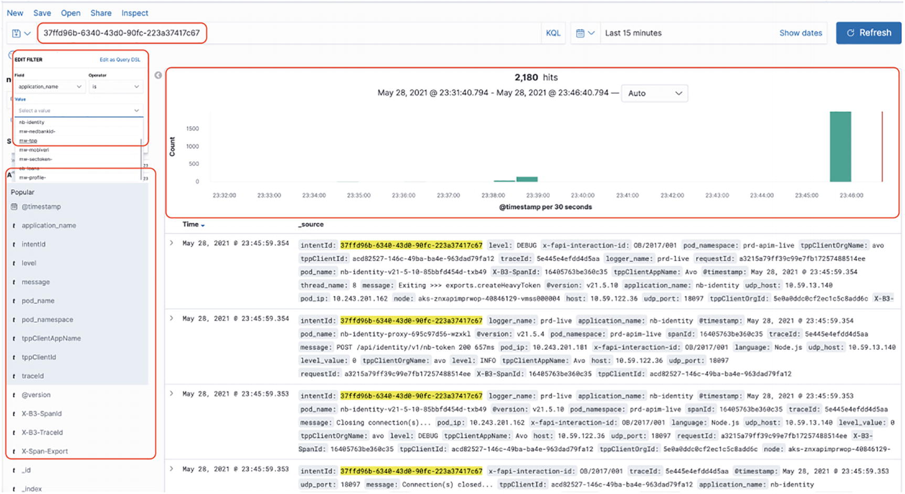

# API 操作
> 雷内多拉萨米1
> (1)
> 南非豪登省约翰内斯堡

与 API Marketplace 中的其他领域相比，这些领域非常灵活，能够立即调整或改变方向，我们的运营领域更加结构化、组织化和集中化。团队按照严格的流程和结构运行，是平台的基础。任何其他方法都会导致快速陷入混乱，并且实施将很快归类为原型。由于平台是更大的第三方应用的使能成分，任何内部或支持系统故障都可能引发连锁反应，最终造成更大的影响，导致第三方消费者对面向客户的产品或服务的感知不佳.
由于该领域通常属于运营支出 (OPEX) 预算，下意识的反应可能是降低成本。尽管我们的 Marketplace 可能不是面向最终客户的，但如果发现服务水平不稳定，可能会对声誉和行业认知产生重大影响。如前几章所述，一个很大的努力是吸引外部开发人员使用该平台。维持这种关系并留住这些消费者需要更多的努力。
从经验来看，集成支持一直是一个具有挑战性但有益的角色。毫无疑问，我从设计到开发再到真正理解解决方案及其基本要素的最大学习都是在运营中获得的。开发过程中明确定义的参数和条件。即使有广泛的测试场景和繁重的负载测试，环境也可能相当孤立。在我职业生涯早期的一个项目中，我清楚地记得一位高级工程师兴奋地报告说，他整夜在笔记本上运行了数百万笔交易，没有出现任何问题。当我们的解决方案最终投入生产时，我们在接下来的两年中花了无数个夜晚试图解决运营问题。原因是生产环境差异很大，不应低估流量负载、支持系统可用性和不可预测的客户行为。正是出于这个原因，我坚信解决方案架构师必须花时间担任运营角色，以学习如何设计更强大的解决方案。
不幸的是，在快速移动、高流量、混乱的操作环境中使用松散的战术方法来灭火，很可能会导致失败，从而危及平台的成功和寿命。在本章中，我将讨论我们以前、当前和理想的运营标准、流程和成功运行 Marketplace 的方法。

## 操作宇宙

老实说，稳定我们的支持能力一直是我们面临的最大挑战之一，并且是一项持续的努力。项目发起人多年前就预见到了该平台的重要性。不幸的是，当团队竞相构建和部署平台时，他的明智建议无人理会，口号是“当我们到达那里时，我们将越过那座桥。”由于 Marketplace 突然被确定为允许新的、外部托管的数字体验以及利用内部企业能力的关键元素，该团队发现自己几乎在一夜之间就被推到了运营的聚光灯下。
就像训练中的消防员一样，在紧急情况下通常会被要求拯救被困在树上的猫，当被召集来处理跨越多个下游系统的高流量和高价值交易的地狱时，团队准备不足，而我们没有之前在操作上处理过。提到这种情况的一个术语是“支持手术”，每天都会打电话检查建议的策略是否已经生效，如果没有就进行调整。通过平台监控能力的提升，事件管理流程的定义，以及与后端支持系统更好的理解和操作关系，团队付出了时间和努力，建立了坚实的支持基础。
从这一经验中得出的一个关键结论是，尽可能在项目生命周期的早期，将足够的、重要的、诚实的重点放在支持市场的运营上。在以下各节中，我们将讨论启用操作域并确定构建它的基础元素的关键概念和方法——如图 10-1 所示。

图 10-1 Operations 子域
## 变更和发布管理
传统上，运营团队通常不喜欢更新，因为它们会给环境带来风险。对我们的实施非常有效的是频繁但小规模发布的理念。正如在详细介绍开发的章节中所指出的，在冲刺中可能有许多并发流在运行，这些流将在冲刺结束时部署到生产环境中。
对于新 API 产品等重大更新，通常会在任何第三方消费之前提前发布到生产环境，如图 10-2 所示。通过在发布和使用之间提供缓冲，它使团队有机会以相对无压力的能力验证功能，并在需要时进行任何更新或修订。从启动新功能开始，我们经常发现，在部署之夜，需要额外的配置，而且通常在我们的控制范围之外（例如防火墙或网络访问）。通过更快地部署，它使我们的团队能够在我们发现自己处于关键路径之前识别并解决依赖关系。

图10-2 API 产品首次发布
对于较小的产品迭代，如图 10-3 所示，API 版本控制是一个关键元素。由于不同版本的 API 产品可以共存，因此何时迁移由第三方消费者决定。这样做的条件是特定版本具有明确定义的生命周期。通过提供详细说明更高版本更改的明确定义的发行说明，我们还向我们的消费者提供了一个明确的信号，即迁移到新版本可能符合他们的最大利益 - 出于提高安全性或稳定性或可能的附加功能的原因。

图 10-3 API 产品的更新
如图 10-4 所示，对内部支持元素（例如微服务）的更新通常是次要的和迭代的。如果更新出现问题，团队将评估原因、影响和可能的解决方案。从文化的角度来看，我们倾向于通过不要过多地关注原因来减少责备。我们发现责备会导致恐惧，从而抑制团队的敏捷性。如果可以在测试期间发现问题，则将其视为未来的学习。更常见的是，该问题与无法在测试期间复制的生产环境特有的数据或场景有关。如果影响是显着的服务降级，则更改会立即回滚。强大的 DevOps 功能允许在几分钟内实现这一目标。这也是一种解放能力，支持团队快速交付的能力。如果能够以最小的风险（最好是零风险）快速实现解决方案，则交付负责人与工程团队协商后，可能会做出“向前修复”的决定。

图10-4内部更新
这不是一个轻率的决定，如果不加以控制，这种做法可能会导致“生产中编码”的大罪。必须特别小心，以确保进行中的开发不会意外包含在更新中。具有发布标签和分支的明确定义的代码版本控制策略对于支持这一点至关重要。如果明智而谨慎地使用，向前修复的内在好处是无需回滚发布即可节省时间，这将使发布管道保持畅通。根据问题的性质、影响、频率和解决时间范围，可能会在更长的时间内实施修复——这将最大限度地减少通过最后一分钟更新而潜入的额外错误。
我们的组织已经认识到对敏捷数字解决方案的更灵活的变更和发布策略的要求，并且已经投入了大量努力来尝试适应它。该声明必须完全合格，因为质量门槛并未降低——流程已被简化以允许更快的过渡。它仍在进行中，在我们达到 Netflix 的持续部署必杀技之前还有一段路要走——但话虽如此，金融机构的服务水平和潜在影响将远高于视频流服务.
图 10-5 提供了我们发布“漏斗”的高级视图。我喜欢把它想象成原子在一个逐渐变小的空间中弹跳，直到它们最终弹开或必须有序排列才能向前移动。在任何给定的时间，都有大量的需求、修复或原型正在开发中。一些原型可能会演变成完全成熟的解决方案；其他人可能会退休。支持后端平台的准备情况还将决定哪些需求将过渡到测试。由交付负责人领导的规划会议将确定特定解决方案的潜在实施日期，这些解决方案捆绑到生产版本中。目标是至少每两周发布一次。一旦确定了视图，就会组装必要的变更控制工件，并通知发布管理人员部署的意图和日期。

图 10-5 发布漏斗
发布过程所需的工件包括：
实施指南：这些是用于部署操作环境中所需的代码资产和配置的指令集。有了经过充分优化的 DevOps 管道，本文档仅详细介绍了要部署的组件和版本。可能还需要记录防火墙规则的配置更新和对后端系统的安全访问。对于跨越不同系统的更复杂的部署，本指南将详细说明发布的时间线和事件顺序。
测试证据和 QA 签核：质量保证团队记录的测试执行和验收是发布解决方案之前的关键输入。这是目前的文件形式，以满足现有标准。作为团队持续部署 (CD) 意图的一部分，一个理想的目标是提供自动回归、功能和性能测试结果，从而确保解决方案的完整性。
发行说明：对要部署到环境的更改的描述——无论是新功能、更新或对现有解决方案的优化、修复或补丁，以解决操作问题。

## DevOps 实践

就像在埃及建造金字塔期间用来运送大而重的物体的不起眼的雪橇一样，DevOps 的实践是支撑我们运营环境的关键要素，如图 10-6 所示。凭借在运营领域的多年经验，通过调整应用程序服务器配置或熟练地手动重建系统，定期将平台从灾难性消亡中拉回来，并因此负责创建“雪花环境”，这既是一次谦卑而富有洞察力的经历。

图 10-6DevOps 基础
甚至在编写第一行代码之前，一个经过良好检测的运维 DevOps 流程就开始了。代码存储库、构建管道、持续集成 (CI) 和迁移过程（在前面的章节中有详细介绍）都构成了从开发到实现 DevOps 实践并最终渗透到操作领域的过程的一部分。老实说，作为目睹了前 DevOps 时代的开发人员，有时会感到沮丧，因为定义的发布流程将调整和快速更新的机会降至最低。作为一名工程主管，我观察了一个运行良好、定义明确、可重复且可靠的过程，几乎没有调整和快速更新的机会，我非常感激。
可重复的流程是关键，尤其是在敏捷、快速变化的环境中更是如此，因为它可以实现快速交付，并且能够在需要时回滚。在操作环境中可靠且快速回滚的能力不应掉以轻心。在过去的几年里，我仍然清楚地记得不仅回滚版本的失望和尴尬，而且还记得当使用备份来恢复系统并且我们等待验证重新水化过程时的担忧。微服务结构也有很大帮助，因为它允许细粒度的控制来回滚或前滚有问题的组件。这种能力为我们的平台提供了一个安全网，它提供了一定程度的信心，就像它允许高线行为进一步推动信封一样。
由于我们的平台架构中存在遗留元素，并非所有系统都具有 DevOps 功能。组织非常清楚这一点，每个系统都定义了最终实现这一目标的路线图。对于新的实现，例如我们最近迁移到的云容器平台，这是没有商量余地的。环境被“零接触”策略锁定，唯一可用于进行更改的机制是通过 DevOps 管道，如图 10-7 所示。坚定不移的承诺可能是实现这一目标的唯一途径。如果有可用的漏洞或后门，交付团队会发现并利用它。

图 10-7DevOps 流水线
## 记录
在集成环境中度过的多年，我认为日志是任何中间件解决方案的命脉。日志是我在开发和支持过程中使用的主要机制，用于深入了解请求的执行路径。使用调试工具来观察堆栈上的值可能有更优雅的方法，但就我个人而言，一个定位良好的 console.log 或 logger.debug 语句作为告密者，可能会让犯罪策划者感到困惑“whodunnit”追踪挑战。
如图 10-8 所示，日志可能存在于各种上下文中。在开发过程中，通常会有一个文件或标准输出 (stdout) 流到尾部。在集群环境中，日志的数量等于参与节点的数量。在面向容器的微服务平台中，日志呈爆炸式增长，单个请求可以遍历多个 Pod，每个 Pod 分布在集群中的各个节点上。

图 10-8 记录上下文
追踪交易就像试图在许多不同的大海捞针中寻找针头。这是我在操作领域学到的经验之一，我在平台设计过程中始终牢记这一点。一个关键的平台架构原则是拥有一个唯一标识符，该标识符从入口点开始附加到事务，并用于每个日志记录语句在环境中的旅程。这个看似简单的策略在分布式集成环境中实现了我所说的“圣杯”——跨各种组件跟踪事务的能力。使用可追踪标识符记录每个组件，就赢了一半。重要的是要始终牢记容器是瞬态的——可以创建更多来处理负载，然后随着负载消散或容器可能由于应用程序异常而重新启动时销毁。由于日志通常写入标准输出，这可能会导致随着容器实例关闭或重新启动而丢失日志。
有一些选项可以减少日志的丢失，例如挂载容器可以访问的持久存储。为了最大限度地降低容器环境的复杂性，该团队使用图 10-9 中详述的解决方案解决了应用程序级别的需求。所有应用程序都使用平台日志服务，该服务可以访问应用程序上下文。上下文填充了广泛的元数据，例如唯一的事务标识符、主机应用程序的名称以及发起请求的客户端的详细信息。使用日志记录请求，从上下文、容器和运行时检索补充数据，打包成一个简单的 JSON 对象，然后通过 UDP 将其发送到负载平衡的端点，从而最大限度地减少对应用程序的任何性能影响，因为它是一个火灾-忘记请求。这是 Enterprise Elasticsearch、Logstash 和 Kibana (ELK) 服务的入口点。

图10-9日志策略
系统特定的 Kafka 主题用于缓冲请求并防止消息丢失，因为该功能被整个企业的不同平台使用。这是我们决定利用企业服务来最小化运营开销的另一个例子，这使团队能够最大程度地专注于创造 API 价值。然后将日志记录事件摄取到 ELK 堆栈中，下一节将对此进行更详细的描述。

### ELK 堆栈
ELK 是三个开源项目的首字母缩写词：Elasticsearch、Logstash 和 Kibana。 Elasticsearch 是一个搜索和分析引擎。 Logstash 是一个服务器端数据处理管道，它同时从多个来源获取数据，对其进行转换，然后将其发送到像 Elasticsearch 这样的“stash”。 Kibana 允许用户在 Elasticsearch 中使用图表和图形来可视化数据。
优秀应用程序的一个特点是易于被广泛的用户采用和操作，而 Kibana 控制台，本质上是 ELK 堆栈的用户界面，如图 10-10 所示，不仅满足了这个目标，而且在我看来，它超越了它特别好。

图10-10Kibana 控制台
我观察到支持工程师，有时对团队来说相对较新，并且已经参加了一些知识共享会议，他们熟练地导航 Kibana 控制台以追踪请求失败的原因。通过提供唯一标识符，Elasticsearch 消除了扫描多个日志的困难，并且几乎立即显示包含该引用的所有条目，并带有可用于钻取特定时间范围的时间序列图。
Kibana 更进一步，允许用户仅查看字段的子集。可以指定其他过滤器以缩小特定组件的范围。 Kibana 查询，以 Kibana 查询语言 (KQL) 的形式，也可以执行来扩大或缩小搜索半径。 ELK 堆栈可能是我们运营环境中最重要的元素，如果团队的所有成员都投入时间和精力来掌握其能力，那么它肯定会在开发和支持方面产生巨大的成果。

## 监控

这一行动领域遵循冰山原则。从表面上看，它看起来比较简单。仔细检查后，发现的远不止这些。这是一个持续的旅程，在我们实施的第一天，我们只有今天拥有的能力的一小部分。对于我们的大部分监控功能，我们利用了企业功能，从软件许可的角度来看，这降低了成本，并且随着变更管理委员会对现有操作流程和工具的使用感到满意，我们的版本过渡更加顺畅。在以下部分中，我们将检查监控领域并讨论如何将各个部分的总和形成一个更大的整体，从而使我们的运营团队能够采取先发制人的方法来管理平台。

### 环境监测

几乎每个网络运营或指挥中心环境都有成排的屏幕显示令人印象深刻的表盘和仪表，这些表盘和仪表不断移动。在我看来，这是监控环境的传统机制。折线图，如图 10-11 所示，一般表示 CPU 利用率或内存消耗。当达到预定义的阈值时，通常会有支持人员的一系列活动，并且随着图表低于阈值而松了一口气。

图10-11基础设施监控
这些指标的信息来源通常是安装在物理或虚拟主机上的代理。这是监控的基本级别，用于确定物理基础设施是否存在任何问题。它的使用很像检查病人的体温。如果温度或 CPU 高，则用作指示出现问题的指示器。这通常是它可以提供的信息范围。
在 API 或集成环境中，下一级监控是服务或端点监控，如图 10-12 所示。这有时称为综合监控。定期探测测试服务的可用性。我们的团队通常包括一个 isUp 操作，它只返回一个 HTTP 200。可以通过定义警报激活规则来消除误报，例如连续三个失败。由于请求通常会遍历到端点的完整网络基础设施路由，因此还可以识别负载平衡器或防火墙配置的问题，这些问题可能不会在基础设施监控仪表板中报告。

图10-12服务监控
由于网络环境复杂，出现了外部系统更改或更新的情况，影响了我们的服务可用性。定期的、计划的执行可以用作问题发生时间的无可争议的证据，另一个好处是它可以在问题被外部消费者发现和报告之前提醒团队注意问题。如果这是对患者进行的分类，这将是检查血压或氧饱和度水平。较低的流速可能表明系统中存在潜在的阻塞。就其本身而言，它并不表明原因——但有助于缩小需要进一步调查的领域。
应用程序性能监控
从多年前我第一次接触应用程序性能监控 (APM) 开始，我就对软件工程的这一壮举印象深刻。 APM 顾问检测了我们应用程序的 Java 虚拟机，借助字节码注入的魔力，我们能够查看流经我们平台的事务。乍一看，这就是我一直追寻的事务追踪的圣杯。经过更多的接触和检查，我发现 APM 在软件开发生命周期中具有特定的作用，我对稍微“圣杯”的追求并没有结束。
虽然 APM 可以在操作环境中每天使用，但它提供的洞察力（如图 10-13 所示）通常在负载测试和性能工程期间考虑。就像注入患者血液中的染料一样，它显示了请求到达目的地的确切路径。某些 APM 产品还会显示准确的数据库请求，这些请求会显示未索引的、性能不佳的查询。

图10-13APM事务追踪
APM 解析路径可用于通过识别系统架构中的高延迟区域和潜在瓶颈来优化解决方案。老实说，这很可能是运营人员可以用作交易执行信息的单一预言机的圣杯。但目前，根据我个人的经验和对我们目前的运作流程和程序的观察，我们还没有得出这个结论。

### 功能监控
功能监控的目标是进行更深入的探索，而不是简单地验证 API 端点的可用性，而是测试和确认其完整操作。对于未来的技术团队成员，我最喜欢的面试问题之一是询问他们会倾向于哪个项目流——项目管理、设计、开发、测试或支持。仅供参考 - 项目管理是一个“加载”选项，对于选择它的不幸的少数人来说，这是该行的结尾。由于许多人都喜欢编写代码，因此最受欢迎的回应是开发，几乎没有投票支持。图 10-14 显示了我相信可以编写大量代码以执行操作的证据——我开发的一个应用程序，绰号为“Homer Knows”，用于对我们的平台进行内部监控。

图 10-14 荷马知道
我们 Marketplace 的一个关键元素是 OAuth 流程。这由一系列 API 调用组成，重定向到 Web 用户界面 (UI)，提示用户对请求进行身份验证和授权。我们只能验证早期的 API 调用，但只能在第三方表示中断时发现 UI 和后续调用的问题。从操作的角度来看，我们的方法是被动的，这让我感到困扰，我以此为动机构建了一个自定义应用程序，可通过桌面或移动设备访问，模拟用户 (Homer Simpson) 定期在流程中运行一个简单的 cron 脚本。如果这个过程成功或失败，荷马就会知道。除了学习新的移动应用程序框架之外，这个练习还让我有机会以与第三方几乎相同的方式使用 API。继续我们的医学类比，它允许运营团队在潜在事件期间观察患者，从而实时揭示根本原因。

### 遥测

对我特别有吸引力的监控维度是遥测。我第一次看到这个概念是在观看一级方程式 (F1) 比赛时。当赛车在赛道上行驶时，赛车工程师能够获得有关机器各个方面的详细信息。这可能为维修站工作人员提供了对赛车操作的难以置信的洞察力，如果使用得当，可以战略性地使用以获得额外的竞争优势，最终赢得比赛。
从这一启示开始，首先是不断涌入的数据量——从轮胎压力水平和温度到剩余燃料、油温再到气流，可能有数十个甚至数百个或数千个指标需要搜索。遥测的真正美妙之处在于它提供了对源的远程控制。现在的 F1 规则可能不允许，但在前几年，赛车工程师可以远程更改赛车的配置。例如，如果他们发现发动机温度高到危险的程度，比赛工程师（与车手协商）可以降低每个档位的最大转数，以保护发动机直到比赛结束。
从软件工程的角度来看，这非常令人兴奋，因为它允许运营团队对解决方案进行“运行时”配置更改，以优化性能或可能保持应用程序可用性。更改示例包括添加更多副本或容器实例以处理预期流量、使用环境变量策略动态更改端点配置或在更改窗口期间显示和删除维护页面。应该指出的是，遥测的目标不是对作战领域进行大规模改变，而是提供“远程控制”的能力，以进行细微的航向修正或更新。在无法承受停机时间的操作环境中，这无疑是你武器库中的一种用途广泛的武器。

### 警报
吸取的一个重要教训是，糟糕的警报策略会很快导致操作流程失败。随着平台数量的增加，发出的警报数量让支持团队不堪重负。详细调查显示，大多数警报是由于数据问题或下游问题引起的，Marketplace 支持团队对此几乎无能为力。在大量不可操作的项目（噪音）中是真正的系统问题，它们越来越多地被遗漏，导致问题解决出现不必要的延迟。
考虑到高流量，我们此后采用的实时警报方法是，警报不是根据“噪音”发送，而是通过对发现的错误进行分类。最初，所有新错误都会收到警报。协商后，如果团队无法立即采取行动，错误将重新分类以进行警报。操作服务台仍会记录和跟踪错误，以便纠正数据或下游系统进行更改。此外，所有错误也会在操作仪表板中报告，所有错误的每日报告都会发送给关键利益相关者，这有助于跟踪与下游系统相关的数量。
为了与我们尽可能利用企业服务的战略保持一致，该平台最初配置为利用组织的警报功能，允许通过电子邮件和短信 (SMS) 等各种渠道将警报发送给备用工程师。电子邮件的一个挑战，即使对通讯组而言，是在大量消息中遗漏了重要警报，有关特定线程的调查或解决方案的回复导致更多消息，而查找或追踪以前的事件意味着必须翻阅电子邮件档案。使用 SMS 的缺点是由于移动网络收费而造成的成本。很快就很明显，传统的机制不是一个理想的选择，需要一种替代方法。
一个诱人的解决方案是与 Slack 等流行通信平台的集成，数字领域的其他团队正在使用该平台。这有可能将我们的警报推向能力范围的另一端。在对这种方法进行更深入的思考后，我们发现了一些潜在的缺点。使用非企业标准会导致与组织战略、Slack 服务的集成连接挑战以及团队的每个成员都需要安装和配置额外软件的要求——有时在个人设备上，而不是在个人设备上的显着差异提到管理服务的开销。
我们发现一个很棒的中间立场是使用组织通信软件标准 Microsoft Teams。 Teams 有一个很棒的“频道”功能，其中警报作为消息路由到。支持工程师可以针对特定消息启动一个线程，如果需要帮助，开发人员可以关注和回复。作为组织标准，我们还利用移动应用程序的安全功能和分发策略。主要的好处是我们再次与我们通过使用企业服务来利用组织的能力和实力的战略保持一致。

## 支持

在本节中，我们将讨论我们支持能力的“人”要素。最好的解决方案是在考虑和了解人员、流程和技术的情况下构建的。作为人员要素，支持团队的成员利用日志记录和监控等技术以及事件管理等流程来维护 Marketplace 的健康和稳定。由于 Marketplace 需要 24x7 全天候关注，我们非常感谢我们团队中的这些支持工程师。我们通过讨论支持团队的结构、我们将解决方案从开发过渡到运营的方法以及我们的内部和外部沟通策略来深入研究更多细节。

### 角色
我们组织的数字手册的一个基本原则是“你构建它，你运行它”的实践。乍一看，这似乎是敏捷解决方案交付的一种无情的“严厉的爱”方法。从第一手观察来看，这可能是构建负责任和可靠解决方案的最大推动因素之一。根据之前的项目经验，我观察到解决方案交付和运营之间存在明确的界限——跨部门和部门，每个部门都有自己的员工和组织结构。尽管这种划分允许明确的重点、关注点的分离和明确的责任领域，但它不可避免地导致了“我们和他们”的文化。开发团队可能会无情地将解决方案部署到生产中，而运营团队可能不愿意接受所有权，除非满足繁重的条件。
在详细介绍开发的章节中讨论的全栈团队还包括负责解决方案日常运营的支持人员。这种方法确保 API 产品的责任和义务，从开始到退役，始终由团队承担。例如，如果解决方案设计不佳或没有必要的日志记录或错误处理量，则操作和开发之间的循环很短并且很快关闭。解决方案的开发人员将负责 30 天的发布后支持，这也是一项常规规则。在此期间，开发人员将在操作人员的监督下执行 1 级支持。在此期间还将安排知识共享会议，为支持团队提供操作和管理解决方案的信息和技能。对于更复杂的解决方案交付，运营团队的成员可能会被分配到项目团队，以便更深入地了解内部执行和无缝过渡到支持。
以下列表详细说明了支持团队中的角色：

- 运营主管：首先负责平台的整体健康并协调团队的活动——从支持人员的安排到待命名册。需要足够的技术敏锐度来理解问题和由此产生的影响，可能需要深入了解细节的能力，还需要克制以确定何时进入战场以及何时指挥部队。不幸的是，有技术头脑的人更喜欢细节而不是过程。好处是 Lead 可以帮助解决问题。我个人可以证明的风险是，个人承担太多，成为单点故障并且可能是最大的威胁，没有时间投入或支持必要的流程和程序来管理团队。正是因为这个原因，这个角色最好由一个平衡的技术和面向过程的个人来担任。
- 1/2 级支持：如上所述，此角色通常由开发人员在发布后支持期间担任。根据你的 Marketplace 的性质，该平台需要 24x7 的支持，这组工程师站在第一线识别和分类问题并维护 API 产品的完整性。本章稍后将讨论的定义明确的仪表板和警报机制是帮助该团队识别问题的关键。分类对支持工程师来说是一项极其重要的功能，确定问题根本原因的能力是我们试图灌输的关键特征。工程师保留问题的所有权，直到问题得到解决或缓解，即使它超出了平台的边界。如果需要额外的帮助，则会创建详细说明问题、受影响的域、分析、日志和可能的怀疑区域的支持请求。然后将其分配给下一个级别的调查支持。
- 级别 3（开发）支持：对于较小的团队，级别 1/2 无法解决的问题会直接发送给开发人员寻求帮助。好处是它允许问题检测和解决之间的循环更短。缺点是它可能会影响宝贵的开发时间。为了与团队的“你构建它，你运行它”的精神保持一致，它让开发人员对他们的交付负责。从本质上讲，编写良好的代码和关注与运营团队共享解决方案知识将最大限度地减少对未来开发的干扰。如有必要，可能需要更新代码。根据问题的严重程度，这可能会包含在下一个版本中，或者在立即部署的过程中进行快速跟踪。

### 过渡
鉴于交付速度，市场中来自多个流的 API 产品不断交付和更新，以满足产品负责人的要求和消费者的需求。操作功能作为共享服务运行，以实现最高效率。也就是说，一个团队支持跨各种流的所有 API 产品。这使团队可以有一名支持工程师提供 1/2 级支持，通常是 24x7 计划，这也降低了成本。
随着生产环境的新更新，交付团队主要负责特定时期的发布后支持。在此期间，运营团队的成员将提供影子支持，以观察可能出现的问题以及如何补救。这可以被视为“在职培训”或隐性知识共享。交付团队还运行知识共享会议，其数量与发布的复杂程度成正比。交付团队从“让我帮助你帮助我”的角度看待这段过渡时期。也就是说，支持请求升级为开发支持的概率与支持工程师的知识和技能成反比。简而言之——授权的支持工程师可能能够在不需要开发人员帮助的情况下解决操作问题。
根据个人经验，我发现在开发过程中必须现场支持查询需要上下文切换，这会严重影响我的交付能力。除了为在生产中拥有可靠、可靠的解决方案而感到自豪之外，这对于任何开发人员来说都是足够的理由来确保运营团队得到适当的授权来支持他们的解决方案。

### 沟通策略

任何作战能力的一个关键要素是有效的沟通策略。凭借组织内外的大量集成点，保持所有利益相关者的一致性绝非易事。以下是我们当前机制的示例：

- 定期更新：每 2 小时由待命的支持工程师通过 WhatsApp 发送一次更新，详细说明：i) 生产 Live 和 Sandbox 环境的稳定性； ii) 内部消费应用程序的商业统计数据，例如访客和注册； iii) 以当前流量与一周前的比较形式对 API 调用进行分析。
- 第三方沟通：通知第三方计划维护会影响 API 产品的可用性。这通常会在 Marketplace 团队收到来自支持企业系统或下游服务提供商的计划更新通知后立即完成。由于我们有一个管理良好的组织变革管理流程，这通常在活动开始前至少 3 天完成。如果发生内部或下游系统故障，事件和紧急中断通知也会发送给第三方运营团队。由于企业中有大量的平台和系统，将我们的平台注册为我们没有直接集成的系统的“受影响/感兴趣”方确实需要时间。例如，Marketplace 不直接集成到大型机，但在发生中断时会受到重大影响。
- 作战室：此措施通常在企业内部出现严重中断时激活。它通常由备用支持工程师触发，该工程师观察到与收入相关的关键 API 产品在一段时间内的失败请求数量超过了定义的阈值。来自支持团队的反馈，无论是企业服务支持还是下游供应商，都会传递给更大的 Marketplace 团队。
- 焦点呼叫：由于长时间停电，将召开焦点呼叫，所有支持团队都必须参与。由于这可能会导致许多工程师和系统所有者的参与，因此目的是让所有利益相关者尽快解决问题。

## 过程

为了采用统一的方法处理操作事件，图 10-15 所示的轻量级流程是 Marketplace 支持团队的主要参考。它为问题修复提供了不同的途径——如有必要，会提出“事件”，这是跨系统沟通问题的组织标准。正如读者会注意到的那样，该流程明确定义了通知策略，以保持所有利益相关者保持一致。

图10-15事件管理流程

### 问题跟踪和报告

在我们的 Marketplace 推出时，API 产品很少，消费者甚至更少。就像维护法律和秩序的小镇警长一样，我们的做法非常随意。在餐巾纸的背面跟踪问题并及时解决。就像一个小镇随着黄金的发现而出现爆炸式增长一样，平台随着许多同时工作的交付流构建的新 API 产品的增加而发展，铁路正在建设新的后端供应商和第三方供应商蜂拥而至以使用 API。问题堆积如山，警长维护环境的方法很快成为单点故障。
支持环境的一个关键要素是实施服务台来记录、跟踪和报告问题。支持工程师得到了明确的指示，需要认真记录需要超过几分钟才能解决的请求。捕获问题所花费的时间，即使与从第三方提供商处进行开发查询一样微不足道，已被证明是无价的，因为它为团队提供了明确定义的时间表和事件记录。随着作战环境可见性的提高，作战管理团队可以清楚地了解战场。可以将部队转移到最关键的问题和项目，这些问题和项目的可见度不会随着时间的推移而增加。
与开发团队每日站会讨论当前 sprint 的任务一样，运维团队也有每日电话会议。这是在平台团队站起来之前战略性地安排的，因为它允许与更多观众讨论需要更多技术支持的任何项目。本次会议讨论了过去 24 小时内的问题、中断、错误和补救活动。在团队高级成员的代表下，这提供了对平台稳定性的洞察、关于未来处理类似情况的指导、解决未决项目的下一步决策，以及运营团队请求额外援助的机会通过开发支持、进一步调查的时间或升级来说服外部依赖者做出响应。
每日会议的另一个目标是回报可见性的礼物，并让支持团队了解跨交付流即将发布的版本。随着开发冲刺接近完成，由于测试延迟或外部依赖关系，某些元素可能无法发布。让支持工程师了解发布时间表的最新情况，让团队有足够的时间来准备，潜在地提醒交付负责人计划维护或外部系统的潜在稳定性问题，这些问题对发布至关重要，更重要的是，这是一种明确的赞赏和尊重的信号给运营团队以保持平台平稳运行。
凭借一支技术精湛的团队，以及对 API 的热爱，我们已经吸收了服务台软件提供的接口，它已成为每天以编程方式挖掘的关键数据来源之一。各个生命周期阶段的动态问题汇总并显示在自定义仪表板上，该仪表板用于快速识别平台中的热点。例如，报告间歇性网络问题的大量第三方提供商支持请求可能会突出防火墙的问题，而该问题可以被主动解决。历史项目也很重要，用于在定期审查会议上向外部利益相关者报告，如图 10-16-1 和 10-16-2 所示。这些报告提供了对平台稳定性、解决问题的平均时间和流量的洞察，这些数据可用于激励为平台的额外基础设施和人员提供资金。它提供了关于要解决的关键支持重点领域的清晰、明确且有数据支持的证据，以使平台具有更高的稳定性。

图10-16-1Reporting——工单趋势和严重性分析

图10-16-2应用域上报工单
服务等级协定
事件由支持工程师根据问题的严重性和优先级分为不同的类别。定义和严重性映射遵循表 10-1 中定义的矩阵。
表 10-1 严重性-响应映射

| 严重程度分类                     | 严重性标签        | 标准响应时间 |
| -------------------------------- | ----------------- | ------------ |
| 功能完全不可用(所有用户都受影响) | 危急(showstopper) | < 30 minutes |
| 部分功能不可用(许多用户受到影响) | High              | < 2 hours    |
| 部分功能受到影响(可用的解决方法) | 中等的            | < 24 小时    |
| 受影响的部分功能(低用户数)       | Low               | < 48 hours   |
| 支持团队被阻止(后端依赖)         | 阻塞              | 在服务台跟踪 |

## 配套系统

我们的平台有两个主要依赖项——一个是内部的，另一个是外部的。内部组件是市场的组装块，在详细介绍我们的平台架构的章节中进行了讨论。内部组件的问题可能会导致整个平台不可用。外部元素是后端系统，它们是 API 产品的服务提供商。根据提供者接口的性质，一个或多个 API 产品可能会受到影响。在下面的部分中，我将更详细地讨论内部和外部支持元素。

### 平台即服务战略

正如在详细介绍平台架构的章节中所讨论的以及图 10-17 所示，该策略是尽可能多地利用企业功能。几乎从 Marketplace 一开始，我们就意识到并接受了该组织拥有高技能、专注和敬业的人员，通常具有多年管理特定系统的运营经验。考虑到这一点，我们采取了尽可能利用企业能力的策略。

图10-17托管平台服务
外包的“托管服务”方法有其缺点，因为它将我们与企业紧密耦合，我们可能需要等待更长时间才能进行系统升级，并且必须与其他租户共享资源。但是，我们发现加速平台成熟度、专门的技术支持和显着降低的运营支出预算的好处使其成为一个有吸引力的选择。
如果支持系统出现问题，Marketplace 支持工程师将通过联系管理该系统的对应人员来遵循事件管理流程。如果无法建立直接联系，则需要运营指挥中心的协助，该中心将启动定义的升级流程以追踪相关系统所有者。在中断得到解决之前，问题的所有权仍归 API Marketplace 支持团队所有。由于每个系统都有自己的依赖关系，根本原因可能在堆栈的更下方。例如，数据库中断可能是由于与存储区域网络 (SAN) 的连接丢失而导致的，这是更新防火墙规则的结果。根据多年支持复杂、相互依赖的系统的经验，我们的组织采取了严肃的方法，对于严重性、影响服务的中断，在所有支持团队的强制参与下，迅速召集了“焦点电话”。这种方法可以快速确定根本原因并进行补救。正是在这些时候，当观察到企业为解决中断而采取的全部力量时，我们感谢我们的平台即服务战略。

### 后端依赖
如图 10-18 所示，一个 API Marketplace 有多个消费者，每个消费者使用一个或多个 API，一个 API 集成到一个或多个提供者系统中。按照我们的方式返回树，可以观察到单个提供商的故障可能会影响一个或多个 API，并产生影响一个或多个消费者的连锁反应。

图10-18Consumer、API、Provider链接
我们管理这个由消费者、API 和提供者组成的复杂网络的方法如下：

- 清楚地了解哪些后端系统是每个 API 产品的提供者。这是一个“实时”视图，因为每个版本都可能会看到产品和后端之间的新连接。
- 从API的性质，确定后端的关键程度。例如，如果安全服务提供商不可用，则会影响身份验证，用户将无法登录；如果参考数据提供者不可用，则可以临时使用缓存数据。
- API 网关可用于确定消费者已订阅的 API 产品。
- 制定服务矩阵，使运营团队能够快速确定后端提供商接口丢失的影响。消费应用程序还可能需要其他措施，例如显示维护页面或封锁关键提供者依赖的特定功能。
- 我们平台积压工作中的一个重要项目是发布 API 的状态。供应商系统的可用性将是这一观点的关键输入。

## 概括

在本章中，我们深入研究了运营环境中的不同领域。根据我们构建和启动 API 平台的经验，以及对大量要考虑的领域的观察，要吸取的一个关键教训是在平台生命周期的早期就对操作化有看法。我们还强调了我们的变更和发布管理方法，该方法已经过量身定制，并且非常重要，可以在已经建立的组织中发挥作用。再一次，DevOps 实践被视为一个关键的推动因素，它允许一致且可靠地实现敏捷交付。
始终从人员、流程和技术的角度考虑运营环境的运行至关重要。尽管这听起来有些陈旧，但这些元素本质上是相互交织、相互支持的，最终形成了一个更加高效和可靠的平台。所讨论的日志记录和监控方法提供了技术能力，并允许深入了解解决方案的执行情况。突出显示的支持团队角色、授权和沟通策略显示了人员元素如何适应。明确定义的流程是运行良好、可预测且稳定的市场的关键。
我们的市场，也可能是你的，依赖于许多内部支持元素和后端服务提供商。最后，我们深入研究了利用企业托管服务并有效地与供应商系统合作的方法。老实说，这一章比预期的更长，更详细。我将此归因于操作环境的广阔性以及解决方案将在执行上下文中花费其生命周期的大部分时间这一简单事实。